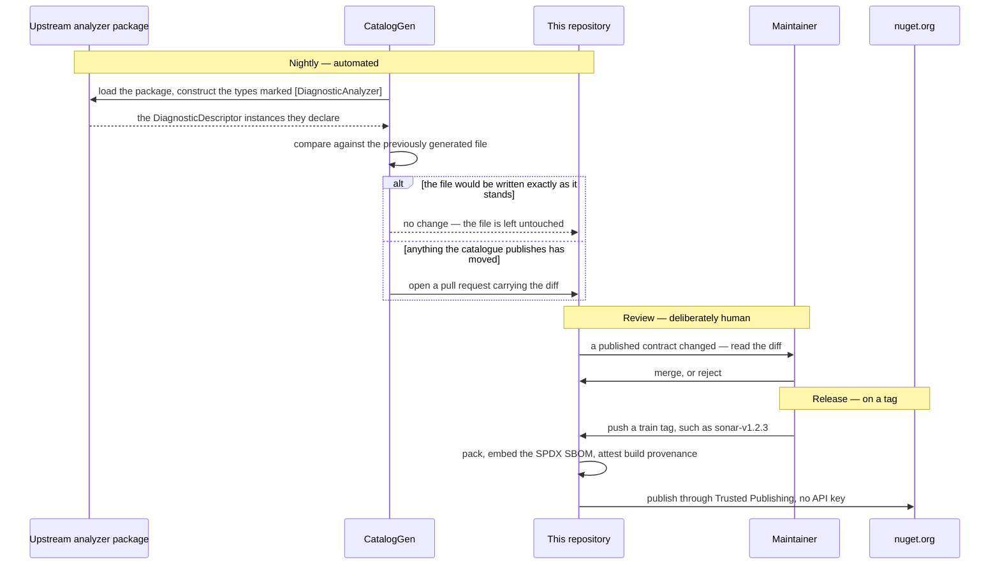

<p align="center">
  
</p>

# DiagnosticCatalog

🌍 **Languages:**  
🇬🇧 English (this file) | 🇫🇷 [Français](doc/README.fr.md)

<!-- dcat-doc:missing SonarRule.S1145 the reference the reader is asked to break on purpose; the compile error is the point -->

|  |  |
| :-- | :-- |
| **Build** | [](https://github.com/Reefact/diagnostic-catalog/actions/workflows/ci.yml) |
| **Quality** | [](https://sonarcloud.io/summary/new_code?id=reefact_diagnostic-catalog) [](https://sonarcloud.io/summary/new_code?id=reefact_diagnostic-catalog) |
| **Security** | [](https://github.com/Reefact/diagnostic-catalog/actions/workflows/codeql.yml) [](https://securityscorecards.dev/viewer/?uri=github.com/Reefact/diagnostic-catalog) |
| **Package** | [](https://www.nuget.org/packages/DiagnosticCatalog)  |
| **Project** | [](LICENSE) [](https://www.conventionalcommits.org) |

---

**Stop writing analyzer suppressions as magic 🪄 strings.**

## 🚨 The problem

**Both** arguments of `SuppressMessageAttribute` are magic strings, and nothing validates
either one:

```csharp
[SuppressMessage("Major Code Smell", "S1144", Justification = "...")]
```

They differ only in how they fail.

Get the **id** wrong — a typo, or a rule the vendor later renamed — and the suppression
silently does nothing: the warning simply stays, with nothing pointing at the cause.

Get the **category** wrong and *nothing happens at all, ever*: the .NET platform never
reads that argument, so no compiler, analyzer, test or tool can tell you. And you would
not guess it — `S1144`'s category is `"Major Code Smell"`, not `"Code Smell"` and not
`"Maintainability"`. StyleCop makes the point harder still: `SA1000` lives in
`"StyleCop.CSharp.SpacingRules"`.

## 💡 The approach

Declare each rule once, as a static class of compile-time constants, and reference those
constants everywhere else:

```csharp
// Misspell this and the compiler says so, instead of the suppression going quiet.
[SuppressMessage(SonarRule.S1144.Category, SonarRule.S1144.Id, Justification = "...")]
```

A mistyped reference stops the build, where a mistyped string compiles happily into a
suppression that does nothing. A rule the vendor retires is kept and marked `[Obsolete]`,
so an upgrade warns you to drop the suppression rather than breaking recompilation
([ADR-0010](doc/adr/0010-carry-a-retired-rule-forward-as-obsolete.en.md)). And the category
has exactly one published source of truth, read from the analyzer's own
`DiagnosticDescriptor` rather than retyped from memory.

## 📦 The ready-made catalogues

You almost certainly do not need to write one. Reference the catalogue that matches an
analyzer you already run:

<!-- catalogue-index:begin -->

| Package | Catalogues the rules of | Ids |
| --- | --- | --- |
| **`DiagnosticCatalog.Sonar`** | [SonarAnalyzer.CSharp](https://github.com/SonarSource/sonar-dotnet) | `Sxxxx` |
| **`DiagnosticCatalog.NetAnalyzers`** | .NET code analysis, the rules the SDK ships | `CAxxxx` |
| **`DiagnosticCatalog.StyleCop`** | [StyleCop.Analyzers](https://github.com/DotNetAnalyzers/StyleCopAnalyzers) | `SAxxxx` |
| **`DiagnosticCatalog.CodeStyle`** | Roslyn's IDE code style — what `.editorconfig` configures and `EnforceCodeStyleInBuild` turns on | `IDExxxx` |
| **`DiagnosticCatalog.Xunit`** | [xunit.analyzers](https://github.com/xunit/xunit.analyzers), which every xUnit test project already runs since `xunit` depends on them | `xUnitxxxx` |
| **`DiagnosticCatalog.NUnit`** | [NUnit.Analyzers](https://github.com/nunit/nunit.analyzers), which `dotnet new nunit` writes into the project file it generates | `NUnitxxxx` |
| **`DiagnosticCatalog.MSTest`** | [MSTest.Analyzers](https://github.com/microsoft/testfx), which every MSTest project already runs since `MSTest.TestFramework` depends on them | `MSTESTxxxx` |
| **`DiagnosticCatalog.Trimming`** | The trimming, Native AOT and single-file warnings, which Blazor WebAssembly, MAUI and `PublishAot` turn on for every build | `ILxxxx` |
| **`DiagnosticCatalog.AspNetCore`** | ASP.NET Core and Blazor, which every web project runs and none can uninstall since they ship inside the shared framework | `ASPxxxx`, `BLxxxx` |
| **`DiagnosticCatalog.Syslib`** | The .NET runtime source generators — `LibraryImport`, the COM and regex generators, JSON source generation | `SYSLIB1xxx` |
| **`DiagnosticCatalog.Roslyn`** | Analyzer authoring, which arrives with `Microsoft.CodeAnalysis.CSharp` for anyone writing an analyzer or a code fix | `RS1xxx`, `RS2xxx` |
| **`DiagnosticCatalog.PublicApi`** | [PublicApiAnalyzers](https://github.com/dotnet/roslyn-analyzers), for a library tracking its surface in `PublicAPI.Shipped.txt` | `RS00xx` |
| **`DiagnosticCatalog.BannedApi`** | [BannedApiAnalyzers](https://github.com/dotnet/roslyn-analyzers), for a codebase banning an API in `BannedSymbols.txt` | `RS0030`, `RS0031`, `RS0035` |

<!-- catalogue-index:end -->

Every one of them is **generated**, never hand-written, and carries ids, categories, help links
and the rule's own title — the last as a documentation comment, so that hovering a constant says
what the rule is about. Rule descriptions and message formats are the vendors' documentation
and are deliberately left out
([ADR-0014](doc/adr/0014-ship-the-vendors-rule-title-as-a-catalogues-documentation.en.md)).
Each package's own page states which upstream release it currently mirrors, how many rules it
carries, and what that vendor does that nothing else does.

These catalogues are unofficial. They are not affiliated with, endorsed by, or supported
by SonarSource, Microsoft, the StyleCop.Analyzers project, xUnit.net, or the NUnit
project. "Sonar" and "SonarQube" are trademarks of SonarSource S.A.

## 🏁 Reference one and rewrite a suppression

Reference the catalogue for an analyzer you already run:

```xml
<PackageReference Include="DiagnosticCatalog.Sonar" Version="1.0.0" />
```

Then write the suppression against its constants instead of strings:

```csharp
using System.Diagnostics.CodeAnalysis;
using DiagnosticCatalog.Sonar;

public sealed class ReportSerializer
{
    [SuppressMessage(
        SonarRule.S1144.Category,
        SonarRule.S1144.Id,
        Justification = "Invoked by the serializer through reflection.")]
    private ReportSerializer()
    {
    }
}
```

That is the whole of it. Break the reference on purpose — `SonarRule.S1145` — and the build
stops, where the string it replaced would have compiled into a suppression that quietly did
nothing.

**One reference, checks included.** Every catalogue depends on `DiagnosticCatalog`, which carries
the `DCAT` analyzers and their code fixes beside the marker attributes, so a catalogue reference is
what turns the checking on and there is no second package to add
([ADR-0037](doc/adr/0037-ship-the-analyzers-inside-the-foundation-package.en.md)). Reference
`DiagnosticCatalog` on its own if you want the checks and no catalogue.

The analyzers run inside the compiler and nowhere else, so at runtime a catalogue is still
constants and nothing else: no behaviour, and no assembly for your application to load.
`tools/packaging/verify-consumption.sh` restores the package as a consumer would and asserts that
the analyzer assemblies stay out of the output folder that `DiagnosticCatalog.dll` reaches.
[The zero-footprint guarantee](doc/guide/zero-footprint.en.md) states what reaches the assembly you
ship, and what the test actually asserts.

Ten minutes end to end, with the reference broken on purpose, is
[Getting started](doc/guide/getting-started.en.md).

## 📈 Adopting it where suppressions already exist

A codebase that already suppresses rules does not rewrite them by hand — and there is nothing more
to reference: the catalogue above carried the analyzers in with it.

`DCAT0006` reports a suppression written as literals when a catalogue in the compilation
declares that rule, and offers the correction. *Fix all occurrences* then applies it across a
document, a project or the whole solution in one pass, adding each rule's `using` as it goes.

Three more things make the migration survivable:

* **Ramp the severity.** `DCAT0006` ships as an error
  ([ADR-0027](doc/adr/0027-ship-the-use-site-diagnostics-as-errors.en.md)), so the build that adds
  the catalogue meets every literal suppression it can match at once. Turn it down to a suggestion
  in `.editorconfig`, then back up folder by folder as you convert —
  [Adopting a catalogue](doc/guide/adopting-a-catalogue.en.md) has the order to convert in.
* **Ask what a rule is.** `dcat explain <catalogue.dll> S1144` prints the rule's category, its
  help link, and the exact `[SuppressMessage]` line to paste — fully qualified, so it compiles
  wherever it lands.
* **Nothing to keep to yourself if you ship a library.** A catalogue you reference checks *you*
  and stops there: an application referencing your library is not analysed by a catalogue it never
  chose, and you write nothing to get that
  ([ADR-0038](doc/adr/0038-stop-the-analyzers-at-the-project-that-references-a-catalogue.en.md)).
  Measured by `tools/packaging/verify-consumption.sh` as "the analyzer does NOT reach a consumer two
  hops out". A project that *wants* the checks from further out sets
  `EnableDiagnosticCatalogAnalyzers` to `true`.

## 🧭 What it does not do

* It cannot check a rule **no catalogue in your compilation declares**. A suppression naming an
  analyzer you have no catalogue for stays a pair of strings, and nothing reports it.
* It changes **nothing about which of your analyzers' rules fire**. A catalogue is constants; the
  `DCAT` checks it brings along are the only diagnostics added, and every severity stays in
  `.editorconfig` — see [Configuration](doc/guide/configuration.en.md).
* A handful of suppressions in one project does not need any of this.
  [When not to use this](doc/guide/when-not-to-use.en.md) is written to talk you out of it where
  it should, and [the alternatives](doc/guide/alternatives.en.md) covers what else there is.

When something is not behaving, [Troubleshooting](doc/guide/troubleshooting.en.md) is organised
by symptom — nothing reported, `CS0117`, `CS0618`, `DCAT0006` on every file at once.

## 📖 Guides

Organised by what you are trying to do rather than by how the code is arranged. Each track is a
short reading order of its own, and the pages carry previous/next within their track:

| If you… | Track | Starts at |
| --- | --- | --- |
| write `[SuppressMessage(...)]` and want it checked | **Using a catalogue** | [Why magic strings fail](doc/guide/the-problem.en.md) |
| have suppressions already and want them migrated | **Adopting the analyzers** | [Adopting a catalogue](doc/guide/adopting-a-catalogue.en.md) |
| ship an analyzer, or own rules nobody else publishes | **Publishing a catalogue** | [Publishing a catalogue](doc/guide/authoring-a-catalogue.en.md) |
| would rather generate a catalogue than write one | **Generating with `dcat`** | [The `dcat` tool](doc/guide/dcat.en.md) |
| need an exact answer, or hit a symptom | **Reference and troubleshooting** | [The rule contract](doc/guide/rule-contract.en.md) |
| are contributing here | **Contributing** | [Repository architecture](doc/guide/architecture.en.md) |

The [documentation map](doc/guide/README.en.md) ([français](doc/guide/README.fr.md)) lists every
page of every track. Each exists in English and in French — the banner at the top of a page
switches between them.

Per-project pages:
[`DiagnosticCatalog`](src/DiagnosticCatalog/README.en.md) ·
[`.Self`](src/DiagnosticCatalog.Self/README.en.md) ·
[`.Sonar`](src/DiagnosticCatalog.Sonar/README.en.md) ·
[`.NetAnalyzers`](src/DiagnosticCatalog.NetAnalyzers/README.en.md) ·
[`.StyleCop`](src/DiagnosticCatalog.StyleCop/README.en.md) ·
[`.CodeStyle`](src/DiagnosticCatalog.CodeStyle/README.en.md) ·
[`.Xunit`](src/DiagnosticCatalog.Xunit/README.en.md) ·
[`.NUnit`](src/DiagnosticCatalog.NUnit/README.en.md) ·
[`.MSTest`](src/DiagnosticCatalog.MSTest/README.en.md) ·
[`.Trimming`](src/DiagnosticCatalog.Trimming/README.en.md) ·
[`.AspNetCore`](src/DiagnosticCatalog.AspNetCore/README.en.md) ·
[`.Syslib`](src/DiagnosticCatalog.Syslib/README.en.md) ·
[`.Roslyn`](src/DiagnosticCatalog.Roslyn/README.en.md) ·
[`.PublicApi`](src/DiagnosticCatalog.PublicApi/README.en.md) ·
[`.BannedApi`](src/DiagnosticCatalog.BannedApi/README.en.md) ·
[`.Cli`](src/DiagnosticCatalog.Cli/README.en.md)

## 🧰 The packages

Beside the vendor catalogues above, three packages make up the toolkit. Each rides a
[release train](CONTRIBUTING.md) of its own and versions at its own pace:

| Package | What it is for | Train |
| --- | --- | --- |
| **`DiagnosticCatalog`** | The `[DiagnosticRule]`, `[DiagnosticCategory]` and `[assembly: CatalogSource]` markers, and the checking that goes with them: diagnostics that read a rule declaration against the structural contract, and a suppression against the rule it names, with the code fixes that turn a literal into a catalogue reference. Reference it to declare a catalogue **of your own** — for your analyzers, or for an internal ruleset — or on its own for the checks with no catalogue. Every catalogue depends on it, so referencing any of them brings the checking along ([ADR-0037](doc/adr/0037-ship-the-analyzers-inside-the-foundation-package.en.md)). The analyzer assemblies are build-time only and never reach your runtime. | `lib` |
| **`DiagnosticCatalog.Self`** | The `DCATxxxx` rules those analyzers report, catalogued the same way — so that suppressing one of *this* library's own diagnostics is a checked reference rather than the magic string everything here exists to remove. | `lib` |
| **`DiagnosticCatalog.Cli`**, the `dcat` tool | The generator, as a .NET tool. Point it at an analyzer package or at assemblies on disk and it writes a catalogue the same way this repository writes the ones above. | `cli` |

`DiagnosticCatalog.Self` comes off that same generator, pointed at this repository's own
analyzers. It is the shortest answer to "does this actually work": the rules the library
reports are catalogued by the library, through the pipeline it asks everyone else to use.

Each vendor catalogue rides a train named after it — `sonar`, `netanalyzers`, `stylecop`,
`codestyle`, `xunit`, `nunit`, `mstest`, `trimming`, `aspnetcore`, `syslib`, `roslyn`,
`publicapi`, `bannedapi` — so following SonarSource's pace never drags the foundation's version
along.

## 🛠️ Supported platforms

The libraries target **`netstandard2.0`** and **`net10.0`**. That floor is more than a
compile-time claim: CI runs the test suite on the real .NET Framework 4.7.2 CLR
([ADR-0001](doc/adr/0001-floor-the-libraries-on-net-framework-4-7-2.en.md)).

Applying `[DiagnosticRule]` introduces no runtime behaviour. The runtime materialises
custom attributes lazily, so `DiagnosticCatalog.dll` is never actually loaded unless
something reflects over the rule types.

## ⚙️ How a catalogue is built and kept current

No rule in this repository was typed by hand. Every step, from the analyzer's own source of
truth to a signed package, is a script or a workflow you can read.



**Read the descriptors, not the documentation.** `eng/CatalogGen` loads the upstream
analyzer package, constructs the types it marks with `[DiagnosticAnalyzer]`, and reads the
`DiagnosticDescriptor` instances they actually declare. Rule metadata published as JSON or
as prose drifts from what the analyzer really does, and since nothing in the platform
validates a category, a value copied from documentation that had gone stale would produce
no symptom anywhere
([ADR-0009](doc/adr/0009-generate-catalog-content-from-analyzer-descriptors.en.md)).

**Detect drift every night.** A [scheduled workflow](.github/workflows/nightly-catalogs.yml)
regenerates every catalogue and opens a pull request when anything the catalogue publishes has
moved. Nights where nothing moved produce nothing at all: the generator renders what it would
write and compares it with the file already there, so an unchanged catalogue keeps its bytes and
its `generatedOn` stamp. The same comparison is what `dcat validate` answers with, which is why
a pipeline can ask whether a catalogue is still true without writing anything.

**Let a person read the diff.** That workflow publishes nothing, and that is a decision
rather than an omission. An id or a category that moved upstream is a change to a *published
contract*, and because nothing validates a suppression's category, a wrong value merged
unreviewed would stay invisible for as long as it existed. Automation finds the change; a
human accepts it.

**Never delete a constant.** A rule the vendor retires is kept and marked `[Obsolete]`,
naming the release that dropped it. A consumer gets a warning telling them to remove the
suppression, instead of a build broken by a member that vanished — consumers inline constant
values at their own compile time
([ADR-0010](doc/adr/0010-carry-a-retired-rule-forward-as-obsolete.en.md)).

**Publish on a tag, with receipts.** Pushing a train tag runs the release workflow, which packs,
embeds an SPDX SBOM, and publishes through
[Trusted Publishing](https://learn.microsoft.com/en-us/nuget/nuget-org/trusted-publishing)
with signed build provenance
([ADR-0006](doc/adr/0006-publish-through-trusted-publishing-with-provenance-and-an-sbom.en.md)) —
there is no long-lived API key anywhere to leak.

The packaging half of that pipeline — build, pack, SBOM, and the packaging guards — is
[rehearsed on every pull request](.github/workflows/release-dryrun.yml), for every train, so
a release never exercises it for the first time on a tag. What the rehearsal deliberately
skips is everything with a side effect: no provenance is attested, nothing is pushed to
nuget.org, no release is created. A dry run that faked those would prove nothing.

## 🔍 Supply chain

Releases publish through [Trusted Publishing](https://learn.microsoft.com/en-us/nuget/nuget-org/trusted-publishing)
with signed build provenance and an embedded SBOM
([ADR-0006](doc/adr/0006-publish-through-trusted-publishing-with-provenance-and-an-sbom.en.md)).
Packages are versioned in independent [release trains](CONTRIBUTING.md), so a Sonar
release does not move the foundation's version. Verification details are in
[SECURITY.md](SECURITY.md).

## 🧱 Declaring a catalogue of your own

For your own analyzers, or for an internal ruleset nobody else publishes. Reference the
foundation:

```xml
<PackageReference Include="DiagnosticCatalog" Version="1.0.0" />
```

That reference brings the analyzers as well as the attributes, so the rules you declare are read
against the contract as you write them.

A rule is a static, non-generic class marked `[DiagnosticRule]`, with two mandatory
public constants — and the category is reached through a class of its own:

```csharp
using DiagnosticCatalog;

namespace Contoso.Analyzers.Suppressions;

[DiagnosticCategory]
internal static class ContosoCategory
{
    public const string Usage = "Usage";
}

public static class Rules
{
    [DiagnosticRule]
    public static class CT0001
    {
        public const string Id = nameof(CT0001);
        public const string Category = ContosoCategory.Usage;
    }
}
```

Both members must be `const`: a property, a `static readonly` field or a `record` cannot
be an attribute argument. That is also why the contract is structural rather than an
interface or a base class — see
[ADR-0008](doc/adr/0008-express-a-rule-as-a-marked-static-class-of-constants.en.md).

The category class is not decoration. A catalogue repeats very few distinct categories
across very many rules — 456 Sonar rules over 13 values — and declaring each one once
gives every catalogue the same shape, which is what lets tooling offer the named constant
in place of a literal. `DCAT0011` reports a rule that reaches its category any other way
([ADR-0028](doc/adr/0028-require-every-rule-to-reach-its-category-through-a-declared-constant.en.md)).

At scale, generate rather than write: [The `dcat` tool](doc/guide/dcat.en.md) is what produces
every catalogue in the table above, and [Publishing a catalogue](doc/guide/authoring-a-catalogue.en.md)
covers the shape to ship.

## 🏗️ Inside the repository

[Repository architecture](doc/guide/architecture.en.md) explains the projects, the splits each
forced by something, and where each kind of check lives.
[Inside the generator](doc/guide/generator-internals.en.md) follows the path a `dcat` run takes.
[Release trains](doc/guide/release-trains.en.md) explains how a project joins one and the
cross-train rule that follows.

## 📚 Documentation

Everything lives under [`doc/`](doc/), which holds four kinds of document. They answer
different questions:

| If you want… | Read | Shape |
| --- | --- | --- |
| to *do* something | [**The guide**](doc/guide/README.en.md) | Independent tracks, each a short reading order with previous/next |
| the exact behaviour, normatively | [**The specification**](doc/specification.en.md) | One long design document |
| to know *why* something is the way it is | [**The decision records**](doc/adr/) | One file per decision, dated, never edited once accepted |
| to add a page there | [**The conventions**](doc/CONVENTIONS.en.md) | The layout, and what the tests check |

**The specification** is the canonical design document: the rule contract, the platform
behaviour it relies on, the generator, the analyzer diagnostics, packaging. Read it when you
need the exact answer rather than the usable one. Its appendix is worth knowing about on its
own — every behavioural claim the design rests on was checked against the platform rather than
assumed, and the appendix records what was checked and how.

**The decision records** carry the reasoning: the context, the alternatives that were rejected
and why, and the consequences accepted. They are a historical log — an accepted record is never
edited, and a decision is revisited by writing a successor that supersedes it. Two are a good
place to start, because most of the rest follow from them:

- [ADR-0008](doc/adr/0008-express-a-rule-as-a-marked-static-class-of-constants.en.md) — why a
  rule is a marked static class of constants, rather than an interface or a base class.
- [ADR-0009](doc/adr/0009-generate-catalog-content-from-analyzer-descriptors.en.md) — why a
  catalogue's content is read from the analyzers' own descriptors and never from their
  documentation.

**Both languages.** Every page under `doc/` exists in English and French, and **English is
canonical**: where the two disagree, the English version wins
([ADR-0022](doc/adr/0022-maintain-every-document-under-doc-in-english-and-french.en.md)). A page
and its translation land in the same commit, and
`tests/DiagnosticCatalog.Documentation.UnitTests` fails a pair that is missing a half, a link
that does not resolve, or a page nothing navigates to.

This page is part of that rule. GitHub composes the repository's landing page from a file called
`README.md` at the root and from nothing else, so the English half cannot sit under `doc/`; its
French half is `doc/README.fr.md` — the banner at the top of this page — and the two are checked as
a pair like any other
([ADR-0029](doc/adr/0029-pair-the-project-readme-across-the-doc-boundary.en.md)). The package
READMEs under [`src/`](src) are in the rule as well, with the renderer deciding which half a
package carries rather than whether a translation exists: nuget.org shows one file per package and
resolves no relative link, so `<PackageReadmeFile>` names the English half and every address those
pages write — the banner offering the French one included — is a full address
([ADR-0034](doc/adr/0034-pair-every-package-readme-in-english-and-french.en.md)).

Outside `doc/`:

- **[CONTRIBUTING.md](CONTRIBUTING.md)** — commit convention, release trains, the .NET
  Framework floor, and how to add a catalogue.
- **[CHANGELOG.md](CHANGELOG.md)** — user-facing changes to the `lib` train.

## 🐛 Feedback and contributing

Found a bug, or want a catalogue that is not here yet? Open an issue on the
[issue tracker](https://github.com/Reefact/diagnostic-catalog/issues) — there is a form for
each. Contributions are welcome — start with [CONTRIBUTING.md](CONTRIBUTING.md), and with the
[Code of Conduct](CODE_OF_CONDUCT.md) that everyone taking part here accepts.

For security vulnerabilities, follow the private process in [SECURITY.md](SECURITY.md).

## 📄 License

[Apache-2.0](LICENSE)
