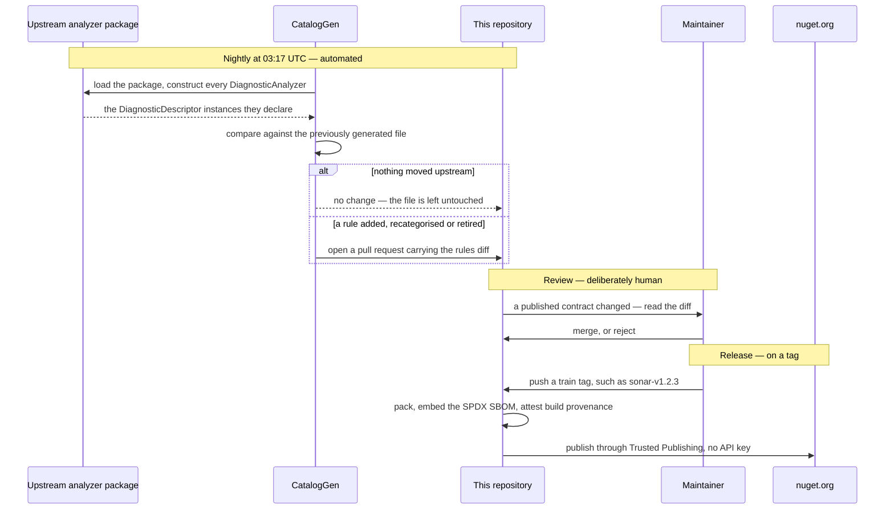

<p align="center">
  
</p>

# DiagnosticCatalog

|  |  |
| :-- | :-- |
| **Build** | [](https://github.com/Reefact/diagnostic-catalog/actions/workflows/ci.yml) |
| **Quality** | [](https://sonarcloud.io/summary/new_code?id=reefact_diagnostic-catalog) [](https://sonarcloud.io/summary/new_code?id=reefact_diagnostic-catalog) |
| **Security** | [](https://github.com/Reefact/diagnostic-catalog/actions/workflows/codeql.yml) [](https://securityscorecards.dev/viewer/?uri=github.com/Reefact/diagnostic-catalog) |
| **Package** | [](https://www.nuget.org/packages/DiagnosticCatalog)  |
| **Project** | [](LICENSE) [](https://www.conventionalcommits.org) |

---

**Stop writing analyzer suppressions as magic 🪄 strings.**

## 🚨 The problem

**Both** arguments of `SuppressMessageAttribute` are magic strings, and nothing validates
either one:

```csharp
[SuppressMessage("Major Code Smell", "S1144", Justification = "...")]
```

They differ only in how they fail.

Get the **id** wrong — a typo, or a rule the vendor later renamed — and the suppression
silently does nothing: the warning simply stays, with nothing pointing at the cause.

Get the **category** wrong and *nothing happens at all, ever*: the .NET platform never
reads that argument, so no compiler, analyzer, test or tool can tell you. And you would
not guess it — `S1144`'s category is `"Major Code Smell"`, not `"Code Smell"` and not
`"Maintainability"`. StyleCop makes the point harder still: `SA1000` lives in
`"StyleCop.CSharp.SpacingRules"`.

## 💡 The approach

Declare each rule once, as a static class of compile-time constants, and reference those
constants everywhere else:

```csharp
// Misspell this and the compiler says so, instead of the suppression going quiet.
[SuppressMessage(SonarRule.S1144.Category, SonarRule.S1144.Id, Justification = "...")]
```

A mistyped reference stops the build, where a mistyped string compiles happily into a
suppression that does nothing. A rule the vendor retires is kept and marked `[Obsolete]`,
so an upgrade warns you to drop the suppression rather than breaking recompilation
([ADR-0010](doc/adr/0010-carry-a-retired-rule-forward-as-obsolete.md)). And the category
has exactly one published source of truth, read from the analyzer's own
`DiagnosticDescriptor` rather than retyped from memory.

## 📦 What is in the box

| Package | What it gives you |
| --- | --- |
| **`DiagnosticCatalog`** | The `[DiagnosticRule]`, `[DiagnosticCategory]` and `[assembly: CatalogSource]` markers. This is what you reference to declare a catalogue **of your own** — for your analyzers, or for an internal ruleset. |
| **`DiagnosticCatalog.Sonar`** | The [SonarAnalyzer.CSharp](https://github.com/SonarSource/sonar-dotnet) rules, ids and categories read from the analyzers' own descriptors. |
| **`DiagnosticCatalog.NetAnalyzers`** | The .NET code analysis (`CAxxxx`) rules, same treatment. |
| **`DiagnosticCatalog.StyleCop`** | The [StyleCop.Analyzers](https://github.com/DotNetAnalyzers/StyleCopAnalyzers) (`SAxxxx`) rules, same treatment. |

The three vendor catalogues are **generated**, never hand-written, and only facts are
redistributed — ids, categories, help links. Rule titles and descriptions are the vendors'
authored prose and are deliberately left out
([ADR-0011](doc/adr/0011-redistribute-rule-facts-only-never-the-vendors-prose.md)). How
that generation works, and what keeps it honest, is the next section.

These catalogues are unofficial. They are not affiliated with, endorsed by, or supported
by SonarSource, Microsoft, or the StyleCop.Analyzers project. "Sonar" and "SonarQube" are
trademarks of SonarSource S.A.

## ⚙️ How a catalogue is built and kept current

No rule in this repository was typed by hand. Every step, from the analyzer's own source of
truth to a signed package, is a script or a workflow you can read.



**Read the descriptors, not the documentation.** `eng/CatalogGen` loads the upstream
analyzer package, constructs every `DiagnosticAnalyzer` it contains, and reads the
`DiagnosticDescriptor` instances they actually declare. Rule metadata published as JSON or
as prose drifts from what the analyzer really does, and since nothing in the platform
validates a category, a value copied from documentation that had gone stale would produce
no symptom anywhere
([ADR-0009](doc/adr/0009-generate-catalog-content-from-analyzer-descriptors.md)).

**Detect drift every night.** A [scheduled workflow](.github/workflows/nightly-catalogs.yml)
regenerates every catalogue at 03:17 UTC and opens a pull request when something actually
moved — a rule added, recategorised, or retired upstream. Nights where upstream has not
moved produce nothing at all: the generator compares its own previous output and leaves the
file untouched, its `generatedOn` stamp included.

**Let a person read the diff.** That workflow publishes nothing, and that is a decision
rather than an omission. An id or a category that moved upstream is a change to a *published
contract*, and because nothing validates a suppression's category, a wrong value merged
unreviewed would stay invisible for as long as it existed. Automation finds the change; a
human accepts it.

**Never delete a constant.** A rule the vendor retires is kept and marked `[Obsolete]`,
naming the release that dropped it. A consumer gets a warning telling them to remove the
suppression, instead of a build broken by a member that vanished — consumers inline constant
values at their own compile time
([ADR-0010](doc/adr/0010-carry-a-retired-rule-forward-as-obsolete.md)).

**Publish on a tag, with receipts.** Each catalogue rides its own
[release train](CONTRIBUTING.md) and versions independently, so following SonarSource's pace
never drags the foundation's version along. Pushing a train tag runs the release workflow,
which packs, embeds an SPDX SBOM, and publishes through
[Trusted Publishing](https://learn.microsoft.com/en-us/nuget/nuget-org/trusted-publishing)
with signed build provenance
([ADR-0006](doc/adr/0006-publish-through-trusted-publishing-with-provenance-and-an-sbom.md)) —
there is no long-lived API key anywhere to leak.

The packaging half of that pipeline — build, pack, SBOM, and the packaging guards — is
[rehearsed on every pull request](.github/workflows/release-dryrun.yml), for every train, so
a release never exercises it for the first time on a tag. What the rehearsal deliberately
skips is everything with a side effect: no provenance is attested, nothing is pushed to
nuget.org, no release is created. A dry run that faked those would prove nothing.

## 🚧 Project status

**Nothing is published on nuget.org yet.** The reference below shows what consuming the
foundation will look like; it does not restore today.

The foundation ships first, on its own: the catalogue packages carry a project reference
to it, and turning that into a package reference requires a published version to point at
([ADR-0007](doc/adr/0007-depend-across-trains-through-published-packages.md)). Until that
first release, the catalogues build and are tested, but publish nothing.

| | Status |
| --- | --- |
| `DiagnosticCatalog` | Built and tested; **first to ship**, on the `lib` train. |
| `DiagnosticCatalog.Sonar` / `.NetAnalyzers` / `.StyleCop` | Built and tested; unblocked by the first `lib` release. |
| `DiagnosticCatalog.Analyzers` | **Specified, not built yet** — the diagnostics that validate declarations and use sites. |

Referencing the foundation alone declares rules; it performs **no checking**. That part is
the analyzer package, and it does not exist yet.

## 🏁 Getting started

**Using a ready-made catalogue** — the common case. Reference the vendor catalogue you
already run:

```xml
<PackageReference Include="DiagnosticCatalog.Sonar" Version="..." />
```

Then suppress against its constants instead of strings:

```csharp
using System.Diagnostics.CodeAnalysis;
using DiagnosticCatalog.Sonar;

public sealed class ReportSerializer
{
    [SuppressMessage(
        SonarRule.S1144.Category,
        SonarRule.S1144.Id,
        Justification = "Invoked by the serializer through reflection.")]
    private ReportSerializer()
    {
    }
}
```

**Declaring a catalogue of your own** — for your analyzers, or an internal ruleset.
Reference the foundation:

```xml
<PackageReference Include="DiagnosticCatalog" Version="0.1.0" />
```

A rule is a static, non-generic class marked `[DiagnosticRule]`, with two mandatory
public constants:

```csharp
using DiagnosticCatalog;

namespace Contoso.Analyzers.Suppressions;

public static class Rules
{
    [DiagnosticRule]
    public static class CT0001
    {
        public const string Id = nameof(CT0001);
        public const string Category = "Usage";
    }
}
```

Both members must be `const`: a property, a `static readonly` field or a `record` cannot
be an attribute argument. That is also why the contract is structural rather than an
interface or a base class — see
[ADR-0008](doc/adr/0008-express-a-rule-as-a-marked-static-class-of-constants.md).

Per-package guides:
[`DiagnosticCatalog`](src/DiagnosticCatalog/README.md) ·
[`.Sonar`](src/DiagnosticCatalog.Sonar/README.md) ·
[`.NetAnalyzers`](src/DiagnosticCatalog.NetAnalyzers/README.md) ·
[`.StyleCop`](src/DiagnosticCatalog.StyleCop/README.md)

## 🎯 When it is a good fit

Reach for this when suppressions are load-bearing rather than incidental:

- a codebase that suppresses analyzer rules routinely, and wants the suppressions to break
  when a rule moves;
- an analyzer author who wants their own rules referenced symbolically by consumers;
- a team standardising on Sonar, the .NET CA rules or StyleCop across several
  repositories;
- an upgrade path where an analyzer package bump must surface renamed and retired rules
  instead of silently voiding suppressions.

A handful of suppressions in one project does not need any of this.

## 🛠️ Supported platforms

The libraries target **`netstandard2.0`** and **`net10.0`**. That floor is more than a
compile-time claim: CI runs the test suite on the real .NET Framework 4.7.2 CLR
([ADR-0001](doc/adr/0001-floor-the-libraries-on-net-framework-4-7-2.md)).

Applying `[DiagnosticRule]` introduces no runtime behaviour. The runtime materialises
custom attributes lazily, so `DiagnosticCatalog.dll` is never actually loaded unless
something reflects over the rule types.

## 🔍 Supply chain

Releases publish through [Trusted Publishing](https://learn.microsoft.com/en-us/nuget/nuget-org/trusted-publishing)
with signed build provenance and an embedded SBOM
([ADR-0006](doc/adr/0006-publish-through-trusted-publishing-with-provenance-and-an-sbom.md)).
Packages are versioned in independent [release trains](CONTRIBUTING.md), so a Sonar
release does not move the foundation's version. Verification details are in
[SECURITY.md](SECURITY.md).

## 📚 Documentation

- **[Specification](doc/specification.en.md)** — the full design: the rule contract, the
  generator, the analyzer diagnostics, packaging, and the platform behaviour it all relies
  on. A courtesy French translation is kept at
  [`specification.fr.md`](doc/specification.fr.md); the English version is canonical.
- **[Architecture decisions](doc/adr/)** — the lasting decisions and why they were taken.
- **[CONTRIBUTING.md](CONTRIBUTING.md)** — commit convention, release trains, the .NET
  Framework floor, and how to add a catalogue.
- **[CHANGELOG.md](CHANGELOG.md)** — user-facing changes to the `lib` train.

## 🐛 Feedback and contributing

Found a bug, or want a catalogue that is not here yet? Open an issue on the
[issue tracker](https://github.com/Reefact/diagnostic-catalog/issues). Contributions are
welcome — start with [CONTRIBUTING.md](CONTRIBUTING.md).

For security vulnerabilities, follow the private process in [SECURITY.md](SECURITY.md).

## 📄 License

[Apache-2.0](LICENSE)
