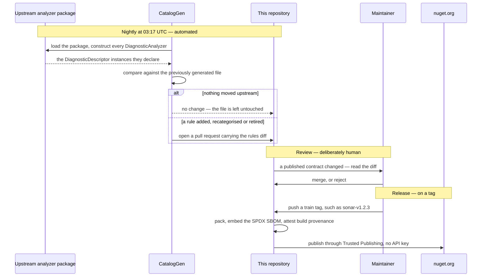

<p align="center">
  
</p>

# DiagnosticCatalog

🌍 **Languages:**  
🇬🇧 English (this file) | 🇫🇷 [Français](doc/README.fr.md)

|  |  |
| :-- | :-- |
| **Build** | [](https://github.com/Reefact/diagnostic-catalog/actions/workflows/ci.yml) |
| **Quality** | [](https://sonarcloud.io/summary/new_code?id=reefact_diagnostic-catalog) [](https://sonarcloud.io/summary/new_code?id=reefact_diagnostic-catalog) |
| **Security** | [](https://github.com/Reefact/diagnostic-catalog/actions/workflows/codeql.yml) [](https://securityscorecards.dev/viewer/?uri=github.com/Reefact/diagnostic-catalog) |
| **Package** | [](https://www.nuget.org/packages/DiagnosticCatalog)  |
| **Project** | [](LICENSE) [](https://www.conventionalcommits.org) |

---

**Stop writing analyzer suppressions as magic 🪄 strings.**

## 🚨 The problem

**Both** arguments of `SuppressMessageAttribute` are magic strings, and nothing validates
either one:

```csharp
[SuppressMessage("Major Code Smell", "S1144", Justification = "...")]
```

They differ only in how they fail.

Get the **id** wrong — a typo, or a rule the vendor later renamed — and the suppression
silently does nothing: the warning simply stays, with nothing pointing at the cause.

Get the **category** wrong and *nothing happens at all, ever*: the .NET platform never
reads that argument, so no compiler, analyzer, test or tool can tell you. And you would
not guess it — `S1144`'s category is `"Major Code Smell"`, not `"Code Smell"` and not
`"Maintainability"`. StyleCop makes the point harder still: `SA1000` lives in
`"StyleCop.CSharp.SpacingRules"`.

## 💡 The approach

Declare each rule once, as a static class of compile-time constants, and reference those
constants everywhere else:

```csharp
// Misspell this and the compiler says so, instead of the suppression going quiet.
[SuppressMessage(SonarRule.S1144.Category, SonarRule.S1144.Id, Justification = "...")]
```

A mistyped reference stops the build, where a mistyped string compiles happily into a
suppression that does nothing. A rule the vendor retires is kept and marked `[Obsolete]`,
so an upgrade warns you to drop the suppression rather than breaking recompilation
([ADR-0010](doc/adr/0010-carry-a-retired-rule-forward-as-obsolete.en.md)). And the category
has exactly one published source of truth, read from the analyzer's own
`DiagnosticDescriptor` rather than retyped from memory.

## 📦 What is in the box

| Package | What it gives you |
| --- | --- |
| **`DiagnosticCatalog`** | The `[DiagnosticRule]`, `[DiagnosticCategory]` and `[assembly: CatalogSource]` markers. This is what you reference to declare a catalogue **of your own** — for your analyzers, or for an internal ruleset. |
| **`DiagnosticCatalog.Sonar`** | The [SonarAnalyzer.CSharp](https://github.com/SonarSource/sonar-dotnet) rules, ids and categories read from the analyzers' own descriptors. |
| **`DiagnosticCatalog.NetAnalyzers`** | The .NET code analysis (`CAxxxx`) rules, same treatment. |
| **`DiagnosticCatalog.StyleCop`** | The [StyleCop.Analyzers](https://github.com/DotNetAnalyzers/StyleCopAnalyzers) (`SAxxxx`) rules, same treatment. |
| **`DiagnosticCatalog.Analyzers`** | The checking. Diagnostics that read a rule declaration against the structural contract and a suppression against the rule it names — a category and an id taken from two different rules, a suppression left half migrated — and the code fixes that turn a literal into a catalogue reference, complete a half-migrated one from the rule it already names, or repair a hand-written rule declaration where the code already says how. A build-time dependency: these assemblies never reach your runtime. |
| **`DiagnosticCatalog.Self`** | The `DCATxxxx` rules the analyzers above report, catalogued the same way — so that suppressing one of *this* library's own diagnostics is a checked reference rather than the magic string everything here exists to remove. |
| **`DiagnosticCatalog.Cli`**, the `dcat` tool | The generator, as a .NET tool. Point it at an analyzer package or at assemblies on disk and it writes a catalogue the same way this repository writes the four above. |

The last three are built here but have no version on nuget.org yet; see **Project status** below.

The three vendor catalogues are **generated**, never hand-written, and carry ids,
categories, help links and the rule's own title — the last as a documentation comment, so
that hovering a constant says what the rule is about. Rule descriptions and message
formats are the vendors' documentation and are deliberately left out
([ADR-0014](doc/adr/0014-ship-the-vendors-rule-title-as-a-catalogues-documentation.en.md)).
How that generation works, and what keeps it honest, is the next section.

`DiagnosticCatalog.Self` comes off the same generator, pointed at this repository's own
analyzers. It is the shortest answer to "does this actually work": the rules the library
reports are catalogued by the library, through the pipeline it asks everyone else to use.

These catalogues are unofficial. They are not affiliated with, endorsed by, or supported
by SonarSource, Microsoft, or the StyleCop.Analyzers project. "Sonar" and "SonarQube" are
trademarks of SonarSource S.A.

## ⚙️ How a catalogue is built and kept current

No rule in this repository was typed by hand. Every step, from the analyzer's own source of
truth to a signed package, is a script or a workflow you can read.



**Read the descriptors, not the documentation.** `eng/CatalogGen` loads the upstream
analyzer package, constructs every `DiagnosticAnalyzer` it contains, and reads the
`DiagnosticDescriptor` instances they actually declare. Rule metadata published as JSON or
as prose drifts from what the analyzer really does, and since nothing in the platform
validates a category, a value copied from documentation that had gone stale would produce
no symptom anywhere
([ADR-0009](doc/adr/0009-generate-catalog-content-from-analyzer-descriptors.en.md)).

**Detect drift every night.** A [scheduled workflow](.github/workflows/nightly-catalogs.yml)
regenerates every catalogue at 03:17 UTC and opens a pull request when something actually
moved — a rule added, recategorised, or retired upstream. Nights where upstream has not
moved produce nothing at all: the generator compares its own previous output and leaves the
file untouched, its `generatedOn` stamp included.

**Let a person read the diff.** That workflow publishes nothing, and that is a decision
rather than an omission. An id or a category that moved upstream is a change to a *published
contract*, and because nothing validates a suppression's category, a wrong value merged
unreviewed would stay invisible for as long as it existed. Automation finds the change; a
human accepts it.

**Never delete a constant.** A rule the vendor retires is kept and marked `[Obsolete]`,
naming the release that dropped it. A consumer gets a warning telling them to remove the
suppression, instead of a build broken by a member that vanished — consumers inline constant
values at their own compile time
([ADR-0010](doc/adr/0010-carry-a-retired-rule-forward-as-obsolete.en.md)).

**Publish on a tag, with receipts.** Each catalogue rides its own
[release train](CONTRIBUTING.md) and versions independently, so following SonarSource's pace
never drags the foundation's version along. Pushing a train tag runs the release workflow,
which packs, embeds an SPDX SBOM, and publishes through
[Trusted Publishing](https://learn.microsoft.com/en-us/nuget/nuget-org/trusted-publishing)
with signed build provenance
([ADR-0006](doc/adr/0006-publish-through-trusted-publishing-with-provenance-and-an-sbom.en.md)) —
there is no long-lived API key anywhere to leak.

The packaging half of that pipeline — build, pack, SBOM, and the packaging guards — is
[rehearsed on every pull request](.github/workflows/release-dryrun.yml), for every train, so
a release never exercises it for the first time on a tag. What the rehearsal deliberately
skips is everything with a side effect: no provenance is attested, nothing is pushed to
nuget.org, no release is created. A dry run that faked those would prove nothing.

## 🚧 Project status

The foundation shipped first, on its own, because it had to: a catalogue cannot depend on
it through a package reference until a version of it exists
([ADR-0007](doc/adr/0007-depend-across-trains-through-published-packages.en.md)). That release
is what unblocked the three vendor catalogues, which now ride their own trains.

| | Status |
| --- | --- |
| `DiagnosticCatalog` | **Published**, on the `lib` train. |
| `DiagnosticCatalog.Sonar` / `.NetAnalyzers` / `.StyleCop` | **Published**, on their own trains, each versioning at its vendor's pace. |
| `DiagnosticCatalog.Analyzers` | **Built, not published yet** — the diagnostics that validate declarations and use sites. It rides the `lib` train, so the next tag there ships it. |
| `DiagnosticCatalog.Self` | **Built, not published yet** — the `DCAT` rules as a catalogue, generated from the analyzers above. It rides the `lib` train with them, on purpose: the two must never describe different rule sets. |
| `DiagnosticCatalog.Cli`, the `dcat` tool | **Built, not published yet** — the generator, packaged as a .NET tool on its own `cli` train ([ADR-0017](doc/adr/0017-publish-the-generator-as-a-cli-on-its-own-release-train.en.md)). |

Referencing the foundation alone declares rules; it performs **no checking**. That part is
the analyzer package, which exists in the repository but has no version on nuget.org yet —
and nothing can point at a package that has none, which is why a catalogue does not carry
the checks along to its own consumers so far. The same ordering that made the foundation
ship first.

## 🏁 Getting started

**Using a ready-made catalogue** — the common case. Reference the vendor catalogue you
already run:

```xml
<PackageReference Include="DiagnosticCatalog.Sonar" Version="..." />
```

Then suppress against its constants instead of strings:

```csharp
using System.Diagnostics.CodeAnalysis;
using DiagnosticCatalog.Sonar;

public sealed class ReportSerializer
{
    [SuppressMessage(
        SonarRule.S1144.Category,
        SonarRule.S1144.Id,
        Justification = "Invoked by the serializer through reflection.")]
    private ReportSerializer()
    {
    }
}
```

**Declaring a catalogue of your own** — for your analyzers, or an internal ruleset.
Reference the foundation:

```xml
<PackageReference Include="DiagnosticCatalog" Version="0.1.0" />
```

A rule is a static, non-generic class marked `[DiagnosticRule]`, with two mandatory
public constants — and the category is reached through a class of its own:

```csharp
using DiagnosticCatalog;

namespace Contoso.Analyzers.Suppressions;

[DiagnosticCategory]
internal static class ContosoCategory
{
    public const string Usage = "Usage";
}

public static class Rules
{
    [DiagnosticRule]
    public static class CT0001
    {
        public const string Id = nameof(CT0001);
        public const string Category = ContosoCategory.Usage;
    }
}
```

Both members must be `const`: a property, a `static readonly` field or a `record` cannot
be an attribute argument. That is also why the contract is structural rather than an
interface or a base class — see
[ADR-0008](doc/adr/0008-express-a-rule-as-a-marked-static-class-of-constants.en.md).

The category class is not decoration. A catalogue repeats very few distinct categories
across very many rules — 456 Sonar rules over 13 values — and declaring each one once
gives every catalogue the same shape, which is what lets tooling offer the named constant
in place of a literal. `DCAT0011` reports a rule that reaches its category any other way
([ADR-0028](doc/adr/0028-require-every-rule-to-reach-its-category-through-a-declared-constant.en.md)).

## 📖 Guides

Twenty-six pages, organised by what you are trying to do rather than by how the code is
arranged. Ten minutes end to end is
[Getting started](doc/guide/getting-started.en.md): reference a catalogue, rewrite one
suppression, break it on purpose and watch the compiler catch it.

| If you… | Start at | Then |
| --- | --- | --- |
| are working out whether this is for you | [Why magic strings fail](doc/guide/the-problem.en.md) | [when *not* to use it](doc/guide/when-not-to-use.en.md), [the alternatives](doc/guide/alternatives.en.md) |
| write `[SuppressMessage(...)]` and want it checked | [Writing suppressions that the compiler checks](doc/guide/writing-suppressions.en.md) | [adopting one on an existing codebase](doc/guide/adopting-a-catalogue.en.md), [configuration](doc/guide/configuration.en.md) |
| ship an analyzer, or own rules nobody else publishes | [Publishing a catalogue](doc/guide/authoring-a-catalogue.en.md) | [versioning](doc/guide/versioning-a-catalogue.en.md), [packaging](doc/guide/packaging-a-catalogue.en.md) |
| would rather generate a catalogue than write one | [The `dcat` tool](doc/guide/dcat.en.md) | [the full reference](doc/guide/dcat-reference.en.md), [keeping it current in CI](doc/guide/ci-integration.en.md) |
| saw a `DCATxxxx` and want to know what it means | [The `DCAT` diagnostics](doc/guide/diagnostics.en.md) | [troubleshooting by symptom](doc/guide/troubleshooting.en.md), [the glossary](doc/guide/glossary.en.md) |
| are contributing here | [Repository architecture](doc/guide/architecture.en.md) | [inside the generator](doc/guide/generator-internals.en.md), [the testing strategy](doc/guide/testing-strategy.en.md) |

The [documentation map](doc/guide/README.en.md) ([français](doc/guide/README.fr.md)) lists all
twenty-six. Every page exists in English and French — the banner at the top switches between
them — and each carries previous/next navigation, so the guide can also be read straight
through.

Per-package guides:
[`DiagnosticCatalog`](src/DiagnosticCatalog/README.md) ·
[`.Analyzers`](src/DiagnosticCatalog.Analyzers/README.md) ·
[`.Self`](src/DiagnosticCatalog.Self/README.md) ·
[`.Sonar`](src/DiagnosticCatalog.Sonar/README.md) ·
[`.NetAnalyzers`](src/DiagnosticCatalog.NetAnalyzers/README.md) ·
[`.StyleCop`](src/DiagnosticCatalog.StyleCop/README.md) ·
[`.Cli`](src/DiagnosticCatalog.Cli/README.md)

## 🎯 When it is a good fit

Reach for this when suppressions are load-bearing rather than incidental:

- a codebase that suppresses analyzer rules routinely, and wants the suppressions to break
  when a rule moves;
- an analyzer author who wants their own rules referenced symbolically by consumers;
- a team standardising on Sonar, the .NET CA rules or StyleCop across several
  repositories;
- an upgrade path where an analyzer package bump must surface renamed and retired rules
  instead of silently voiding suppressions.

A handful of suppressions in one project does not need any of this.

## 🛠️ Supported platforms

The libraries target **`netstandard2.0`** and **`net10.0`**. That floor is more than a
compile-time claim: CI runs the test suite on the real .NET Framework 4.7.2 CLR
([ADR-0001](doc/adr/0001-floor-the-libraries-on-net-framework-4-7-2.en.md)).

Applying `[DiagnosticRule]` introduces no runtime behaviour. The runtime materialises
custom attributes lazily, so `DiagnosticCatalog.dll` is never actually loaded unless
something reflects over the rule types.

## 🔍 Supply chain

Releases publish through [Trusted Publishing](https://learn.microsoft.com/en-us/nuget/nuget-org/trusted-publishing)
with signed build provenance and an embedded SBOM
([ADR-0006](doc/adr/0006-publish-through-trusted-publishing-with-provenance-and-an-sbom.en.md)).
Packages are versioned in independent [release trains](CONTRIBUTING.md), so a Sonar
release does not move the foundation's version. Verification details are in
[SECURITY.md](SECURITY.md).

## 📚 Documentation

Everything lives under [`doc/`](doc/), which holds four kinds of document. They answer
different questions:

| If you want… | Read | Shape |
| --- | --- | --- |
| to *do* something | [**The guide**](doc/guide/README.en.md) | Twenty-six pages, threaded in one order, each with previous/next |
| the exact behaviour, normatively | [**The specification**](doc/specification.en.md) | One long design document |
| to know *why* something is the way it is | [**The decision records**](doc/adr/) | One file per decision, dated, never edited once accepted |
| to add a page there | [**The conventions**](doc/CONVENTIONS.en.md) | The layout, and what the tests check |

**The specification** is the canonical design document: the rule contract, the platform
behaviour it relies on, the generator, the analyzer diagnostics, packaging. Read it when you
need the exact answer rather than the usable one. Its appendix is worth knowing about on its
own — every behavioural claim the design rests on was checked against the platform rather than
assumed, and the appendix records what was checked and how.

**The decision records** carry the reasoning: the context, the alternatives that were rejected
and why, and the consequences accepted. They are a historical log — an accepted record is never
edited, and a decision is revisited by writing a successor that supersedes it. Two are a good
place to start, because most of the rest follow from them:

- [ADR-0008](doc/adr/0008-express-a-rule-as-a-marked-static-class-of-constants.en.md) — why a
  rule is a marked static class of constants, rather than an interface or a base class.
- [ADR-0009](doc/adr/0009-generate-catalog-content-from-analyzer-descriptors.en.md) — why a
  catalogue's content is read from the analyzers' own descriptors and never from their
  documentation.

**Both languages.** Every page under `doc/` exists in English and French, and **English is
canonical**: where the two disagree, the English version wins
([ADR-0022](doc/adr/0022-maintain-every-document-under-doc-in-english-and-french.en.md)). A page
and its translation land in the same commit, and
`tests/DiagnosticCatalog.Documentation.UnitTests` fails a pair that is missing a half, a link
that does not resolve, or a page nothing navigates to.

This page is part of that rule. GitHub composes the repository's landing page from a file called
`README.md` at the root and from nothing else, so the English half cannot sit under `doc/`; its
French half is `doc/README.fr.md` — the banner at the top of this page — and the two are checked as
a pair like any other
([ADR-0029](doc/adr/0029-pair-the-project-readme-across-the-doc-boundary.en.md)). What stays
outside the rule is the package READMEs under [`src/`](src): nuget.org renders one file per
package, offers no language switch and resolves no relative link.

Outside `doc/`:

- **[CONTRIBUTING.md](CONTRIBUTING.md)** — commit convention, release trains, the .NET
  Framework floor, and how to add a catalogue.
- **[CHANGELOG.md](CHANGELOG.md)** — user-facing changes to the `lib` train.

## 🐛 Feedback and contributing

Found a bug, or want a catalogue that is not here yet? Open an issue on the
[issue tracker](https://github.com/Reefact/diagnostic-catalog/issues) — there is a form for
each. Contributions are welcome — start with [CONTRIBUTING.md](CONTRIBUTING.md), and with the
[Code of Conduct](CODE_OF_CONDUCT.md) that everyone taking part here accepts.

For security vulnerabilities, follow the private process in [SECURITY.md](SECURITY.md).

## 📄 License

[Apache-2.0](LICENSE)
