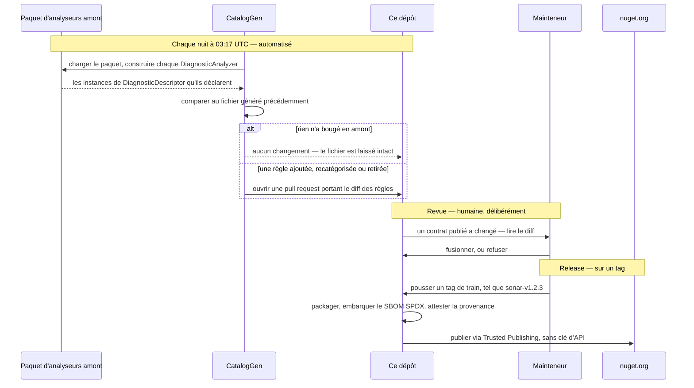

<p align="center">
  
</p>

# DiagnosticCatalog

🌍 **Langues :**  
🇬🇧 [English](../README.md) | 🇫🇷 Français (ce fichier)

|  |  |
| :-- | :-- |
| **Build** | [](https://github.com/Reefact/diagnostic-catalog/actions/workflows/ci.yml) |
| **Qualité** | [](https://sonarcloud.io/summary/new_code?id=reefact_diagnostic-catalog) [](https://sonarcloud.io/summary/new_code?id=reefact_diagnostic-catalog) |
| **Sécurité** | [](https://github.com/Reefact/diagnostic-catalog/actions/workflows/codeql.yml) [](https://securityscorecards.dev/viewer/?uri=github.com/Reefact/diagnostic-catalog) |
| **Paquet** | [](https://www.nuget.org/packages/DiagnosticCatalog)  |
| **Projet** | [](../LICENSE) [](https://www.conventionalcommits.org) |

---

**Arrêtez d'écrire vos suppressions d'analyseur en chaînes 🪄 magiques.**

## 🚨 Le problème

Les **deux** arguments de `SuppressMessageAttribute` sont des chaînes magiques, et rien ne
valide ni l'un ni l'autre :

```csharp
[SuppressMessage("Major Code Smell", "S1144", Justification = "...")]
```

Ils ne diffèrent que par leur façon d'échouer.

Trompez-vous sur l'**identifiant** — une faute de frappe, ou une règle que l'éditeur a
renommée depuis — et la suppression ne fait plus rien, en silence : l'avertissement reste,
sans que rien ne désigne la cause.

Trompez-vous sur la **catégorie** et *il ne se passe rien du tout, jamais* : la plateforme
.NET ne lit jamais cet argument, donc aucun compilateur, analyseur, test ou outil ne peut
vous le dire. Et vous ne l'auriez pas deviné — la catégorie de `S1144` est
`"Major Code Smell"`, pas `"Code Smell"` ni `"Maintainability"`. StyleCop enfonce le clou :
`SA1000` vit dans `"StyleCop.CSharp.SpacingRules"`.

## 💡 L'approche

Déclarez chaque règle une fois, comme une classe statique de constantes de compilation, et
référencez ces constantes partout ailleurs :

```csharp
// Écrivez-le de travers et le compilateur le dit, au lieu d'une suppression qui se tait.
[SuppressMessage(SonarRule.S1144.Category, SonarRule.S1144.Id, Justification = "...")]
```

Une référence mal orthographiée arrête la compilation, là où une chaîne mal orthographiée se
compile sans broncher en une suppression qui ne fait rien. Une règle que l'éditeur retire est
conservée et marquée `[Obsolete]`, si bien qu'une montée de version vous avertit de retirer la
suppression au lieu de casser la recompilation
([ADR-0010](adr/0010-carry-a-retired-rule-forward-as-obsolete.fr.md)). Et la catégorie a
exactement une source de vérité publiée, lue depuis le `DiagnosticDescriptor` de l'analyseur
lui-même plutôt que retapée de mémoire.

## 📦 Ce qu'il y a dans la boîte

### Les catalogues prêts à l'emploi

Référencez celui qui correspond à un analyseur que vous exécutez déjà :

| Paquet | Catalogue les règles de | Identifiants |
| --- | --- | --- |
| **`DiagnosticCatalog.Sonar`** | [SonarAnalyzer.CSharp](https://github.com/SonarSource/sonar-dotnet) | `Sxxxx` |
| **`DiagnosticCatalog.NetAnalyzers`** | L'analyse de code .NET, les règles que le SDK livre | `CAxxxx` |
| **`DiagnosticCatalog.StyleCop`** | [StyleCop.Analyzers](https://github.com/DotNetAnalyzers/StyleCopAnalyzers) | `SAxxxx` |
| **`DiagnosticCatalog.CodeStyle`** | Le style IDE de Roslyn — ce que `.editorconfig` configure et qu'`EnforceCodeStyleInBuild` active | `IDExxxx` |
| **`DiagnosticCatalog.Xunit`** | [xunit.analyzers](https://github.com/xunit/xunit.analyzers), que tout projet de test xUnit exécute déjà puisque `xunit` en dépend | `xUnitxxxx` |
| **`DiagnosticCatalog.NUnit`** | [NUnit.Analyzers](https://github.com/nunit/nunit.analyzers), que `dotnet new nunit` inscrit dans le fichier projet qu'il génère | `NUnitxxxx` |
| **`DiagnosticCatalog.MSTest`** | [MSTest.Analyzers](https://github.com/microsoft/testfx), que tout projet MSTest exécute déjà puisque `MSTest.TestFramework` en dépend | `MSTESTxxxx` |
| **`DiagnosticCatalog.Trimming`** | Les avertissements de trimming, Native AOT et fichier unique, que Blazor WebAssembly, MAUI et `PublishAot` activent à chaque build | `ILxxxx` |
| **`DiagnosticCatalog.AspNetCore`** | ASP.NET Core et Blazor, que tout projet web exécute et qu'aucun ne peut désinstaller puisqu'elles vivent dans le framework partagé | `ASPxxxx`, `BLxxxx` |
| **`DiagnosticCatalog.Syslib`** | Les générateurs de source du runtime .NET — `LibraryImport`, les générateurs COM et regex, la sérialisation JSON | `SYSLIB1xxx` |

Ces dix-là sont **générés**, jamais écrits à la main, et portent les identifiants, les
catégories, les liens d'aide et le titre de la règle — ce dernier en commentaire de
documentation, pour que survoler une constante dise de quoi la règle parle. Les descriptions
de règles et les formats de message sont la documentation des éditeurs et sont délibérément
laissés de côté
([ADR-0014](adr/0014-ship-the-vendors-rule-title-as-a-catalogues-documentation.fr.md)).
Comment cette génération fonctionne, et ce qui la garde honnête, est la section suivante.

Ces catalogues sont non officiels. Ils ne sont ni affiliés à, ni approuvés par, ni supportés
par SonarSource, Microsoft, le projet StyleCop.Analyzers, xUnit.net ou le projet NUnit.
« Sonar » et « SonarQube » sont des marques de SonarSource S.A.

### La boîte à outils

Pour déclarer un catalogue à vous, et pour vérifier les références à un catalogue :

| Paquet | Ce qu'il vous donne |
| --- | --- |
| **`DiagnosticCatalog`** | Les marqueurs `[DiagnosticRule]`, `[DiagnosticCategory]` et `[assembly: CatalogSource]`. C'est ce que vous référencez pour déclarer un catalogue **à vous** — pour vos analyseurs, ou pour un jeu de règles interne. |
| **`DiagnosticCatalog.Analyzers`** | La vérification : des diagnostics qui confrontent une déclaration de règle au contrat structurel, et une suppression à la règle qu'elle nomme, avec les correctifs qui transforment un littéral en référence de catalogue. Une dépendance de compilation — ces assemblages n'atteignent jamais votre exécution. |
| **`DiagnosticCatalog.Self`** | Les règles `DCATxxxx` que ces analyseurs signalent, cataloguées de la même façon — de sorte que supprimer un diagnostic de *cette* bibliothèque soit une référence vérifiée plutôt que la chaîne magique que tout ceci existe pour supprimer. |
| **`DiagnosticCatalog.Cli`**, l'outil `dcat` | Le générateur, en outil .NET. Pointez-le vers un paquet d'analyseurs ou vers des assemblages sur disque et il écrit un catalogue comme ce dépôt écrit les onze ci-dessus. |

`DiagnosticCatalog.Self` sort du même générateur, pointé vers les analyseurs de ce dépôt. C'est
la réponse la plus courte à « est-ce que ça marche vraiment » : les règles que la bibliothèque
signale sont cataloguées par la bibliothèque, à travers le pipeline qu'elle demande à tout le
monde d'utiliser.

Tout n'est pas encore sur nuget.org : `.CodeStyle`, `.Xunit`, `.NUnit`, `.MSTest`,
`.Trimming`, `.AspNetCore` et `.Syslib` côté catalogues, `.Analyzers`, `.Self` et `.Cli` côté outils.
Voir **État du projet** plus bas.

## ⚙️ Comment un catalogue est construit et tenu à jour

Aucune règle de ce dépôt n'a été tapée à la main. Chaque étape, de la source de vérité de
l'analyseur jusqu'à un paquet signé, est un script ou un workflow que vous pouvez lire.



**Lire les descripteurs, pas la documentation.** `eng/CatalogGen` charge le paquet d'analyseurs
amont, construit les analyseurs qu'il marque `[DiagnosticAnalyzer]`, et lit les instances de
`DiagnosticDescriptor` qu'ils déclarent réellement. Les métadonnées de règles publiées en JSON
ou en prose s'écartent de ce que l'analyseur fait vraiment, et puisque rien dans la plateforme
ne valide une catégorie, une valeur copiée depuis une documentation périmée ne produirait aucun
symptôme nulle part
([ADR-0009](adr/0009-generate-catalog-content-from-analyzer-descriptors.fr.md)).

**Détecter la dérive chaque nuit.** Un [workflow planifié](../.github/workflows/nightly-catalogs.yml)
régénère chaque catalogue à 03:17 UTC et ouvre une pull request quand quelque chose a
réellement bougé — une règle ajoutée, recatégorisée ou retirée en amont. Les nuits où l'amont
n'a pas bougé ne produisent rien du tout : le générateur compare sa propre sortie précédente et
laisse le fichier intact, son horodatage `generatedOn` compris.

**Laisser une personne lire le diff.** Ce workflow ne publie rien, et c'est une décision plutôt
qu'un oubli. Un identifiant ou une catégorie qui a bougé en amont est un changement de *contrat
publié*, et parce que rien ne valide la catégorie d'une suppression, une valeur fausse fusionnée
sans revue resterait invisible aussi longtemps qu'elle existerait. L'automatisation trouve le
changement ; un humain l'accepte.

**Ne jamais supprimer une constante.** Une règle que l'éditeur retire est conservée et marquée
`[Obsolete]`, en nommant la version qui l'a abandonnée. Un consommateur reçoit un avertissement
lui disant de retirer la suppression, au lieu d'une compilation cassée par un membre disparu —
les consommateurs inlinent les valeurs de constantes à leur propre compilation
([ADR-0010](adr/0010-carry-a-retired-rule-forward-as-obsolete.fr.md)).

**Publier sur un tag, avec les reçus.** Chaque catalogue roule sur son propre
[train de release](../CONTRIBUTING.md) et se versionne indépendamment, si bien que suivre le
rythme de SonarSource ne tire jamais la version de la fondation avec lui. Pousser un tag de
train déclenche le workflow de release, qui package, embarque un SBOM SPDX et publie via
[Trusted Publishing](https://learn.microsoft.com/en-us/nuget/nuget-org/trusted-publishing)
avec une provenance de build signée
([ADR-0006](adr/0006-publish-through-trusted-publishing-with-provenance-and-an-sbom.fr.md)) —
il n'y a nulle part de clé d'API à longue durée de vie susceptible de fuiter.

La moitié « packaging » de ce pipeline — build, pack, SBOM et les garde-fous d'empaquetage — est
[répétée sur chaque pull request](../.github/workflows/release-dryrun.yml), pour chaque train,
afin qu'une release ne l'exerce jamais pour la première fois sur un tag. Ce que la répétition
saute délibérément, c'est tout ce qui a un effet de bord : aucune provenance n'est attestée,
rien n'est poussé vers nuget.org, aucune release n'est créée. Un essai à blanc qui simulerait
tout cela ne prouverait rien.

## 🚧 État du projet

La fondation a été livrée en premier, seule, parce qu'il le fallait : un catalogue ne peut en
dépendre par référence de paquet tant qu'une version n'en existe pas
([ADR-0007](adr/0007-depend-across-trains-through-published-packages.fr.md)). C'est cette
release qui a débloqué les dix catalogues d'éditeurs, qui roulent désormais sur leurs propres
trains.

| | État |
| --- | --- |
| `DiagnosticCatalog` | **Publié**, sur le train `lib`. |
| `DiagnosticCatalog.Sonar` / `.NetAnalyzers` / `.StyleCop` | **Publiés**, sur leurs propres trains, chacun se versionnant au rythme de son éditeur. |
| `DiagnosticCatalog.CodeStyle` / `.Xunit` / `.NUnit` / `.MSTest` / `.Trimming` / `.AspNetCore` | **Construits, pas encore publiés** — les six catalogues d'éditeurs les plus récents. Chacun roule déjà sur un train à lui (`codestyle`, `xunit`, `nunit`, `mstest`, `trimming`, `aspnetcore`), donc chacun sera livré à son premier tag. |
| `DiagnosticCatalog.Analyzers` | **Construit, pas encore publié** — les diagnostics qui valident les déclarations et les sites d'usage. Il roule sur le train `lib`, donc le prochain tag l'y embarque. |
| `DiagnosticCatalog.Self` | **Construit, pas encore publié** — les règles `DCAT` en catalogue, générées depuis les analyseurs ci-dessus. Il roule sur le train `lib` avec eux, à dessein : les deux ne doivent jamais décrire des jeux de règles différents. |
| `DiagnosticCatalog.Cli`, l'outil `dcat` | **Construit, pas encore publié** — le générateur, empaqueté en outil .NET sur son propre train `cli` ([ADR-0017](adr/0017-publish-the-generator-as-a-cli-on-its-own-release-train.fr.md)). |

Référencer la fondation seule déclare des règles ; elle n'effectue **aucune vérification**. Cette
partie-là est le paquet d'analyseurs, qui existe dans le dépôt mais n'a pas encore de version sur
nuget.org — et rien ne peut pointer vers un paquet qui n'en a pas, ce qui explique qu'un catalogue
n'emporte pas encore les vérifications jusqu'à ses propres consommateurs. Le même ordonnancement
qui a fait livrer la fondation en premier.

## 🏁 Démarrer

**Utiliser un catalogue tout prêt** — le cas courant. Référencez le catalogue d'éditeur que vous
faites déjà tourner :

```xml
<PackageReference Include="DiagnosticCatalog.Sonar" Version="..." />
```

Puis supprimez contre ses constantes au lieu de chaînes :

```csharp
using System.Diagnostics.CodeAnalysis;
using DiagnosticCatalog.Sonar;

public sealed class ReportSerializer
{
    [SuppressMessage(
        SonarRule.S1144.Category,
        SonarRule.S1144.Id,
        Justification = "Invoked by the serializer through reflection.")]
    private ReportSerializer()
    {
    }
}
```

**Déclarer un catalogue à vous** — pour vos analyseurs, ou un jeu de règles interne. Référencez
la fondation :

```xml
<PackageReference Include="DiagnosticCatalog" Version="0.1.0" />
```

Une règle est une classe statique, non générique, marquée `[DiagnosticRule]`, avec deux
constantes publiques obligatoires :

```csharp
using DiagnosticCatalog;

namespace Contoso.Analyzers.Suppressions;

public static class Rules
{
    [DiagnosticRule]
    public static class CT0001
    {
        public const string Id = nameof(CT0001);
        public const string Category = "Usage";
    }
}
```

Les deux membres doivent être `const` : une propriété, un champ `static readonly` ou un `record`
ne peuvent pas être un argument d'attribut. C'est aussi pourquoi le contrat est structurel plutôt
qu'une interface ou une classe de base — voir
[ADR-0008](adr/0008-express-a-rule-as-a-marked-static-class-of-constants.fr.md).

## 📖 Guides

Vingt-six pages, organisées par ce que vous cherchez à faire plutôt que par la façon dont le code
est rangé. Dix minutes de bout en bout, c'est
[Démarrer](guide/getting-started.fr.md) : référencer un catalogue, réécrire une suppression, la
casser exprès et regarder le compilateur l'attraper.

| Si vous… | Commencez par | Puis |
| --- | --- | --- |
| cherchez à savoir si c'est pour vous | [Pourquoi les chaînes magiques échouent](guide/the-problem.fr.md) | [quand *ne pas* l'utiliser](guide/when-not-to-use.fr.md), [les alternatives](guide/alternatives.fr.md) |
| écrivez `[SuppressMessage(...)]` et voulez que ce soit vérifié | [Écrire des suppressions que le compilateur vérifie](guide/writing-suppressions.fr.md) | [l'adopter sur une base existante](guide/adopting-a-catalogue.fr.md), [la configuration](guide/configuration.fr.md) |
| livrez un analyseur, ou possédez des règles que personne d'autre ne publie | [Publier un catalogue](guide/authoring-a-catalogue.fr.md) | [le versionnage](guide/versioning-a-catalogue.fr.md), [l'empaquetage](guide/packaging-a-catalogue.fr.md) |
| préférez générer un catalogue plutôt que l'écrire | [L'outil `dcat`](guide/dcat.fr.md) | [la référence complète](guide/dcat-reference.fr.md), [le tenir à jour en CI](guide/ci-integration.fr.md) |
| avez vu un `DCATxxxx` et voulez savoir ce qu'il signifie | [Les diagnostics `DCAT`](guide/diagnostics.fr.md) | [le dépannage par symptôme](guide/troubleshooting.fr.md), [le glossaire](guide/glossary.fr.md) |
| contribuez ici | [Architecture du dépôt](guide/architecture.fr.md) | [dans le générateur](guide/generator-internals.fr.md), [la stratégie de test](guide/testing-strategy.fr.md) |

La [carte de la documentation](guide/README.fr.md) ([English](guide/README.en.md)) les liste
toutes les vingt-six. Chaque page existe en anglais et en français — la bannière en haut bascule
de l'une à l'autre — et chacune porte une navigation précédent/suivant, de sorte que le guide se
lit aussi d'une traite.

Guides par paquet :
[`DiagnosticCatalog`](../src/DiagnosticCatalog/README.md) ·
[`.Analyzers`](../src/DiagnosticCatalog.Analyzers/README.md) ·
[`.Self`](../src/DiagnosticCatalog.Self/README.md) ·
[`.Sonar`](../src/DiagnosticCatalog.Sonar/README.md) ·
[`.NetAnalyzers`](../src/DiagnosticCatalog.NetAnalyzers/README.md) ·
[`.StyleCop`](../src/DiagnosticCatalog.StyleCop/README.md) ·
[`.CodeStyle`](../src/DiagnosticCatalog.CodeStyle/README.md) ·
[`.Xunit`](../src/DiagnosticCatalog.Xunit/README.md) ·
[`.NUnit`](../src/DiagnosticCatalog.NUnit/README.md) ·
[`.MSTest`](../src/DiagnosticCatalog.MSTest/README.md) ·
[`.Trimming`](../src/DiagnosticCatalog.Trimming/README.md) ·
[`.AspNetCore`](../src/DiagnosticCatalog.AspNetCore/README.md) ·
[`.Syslib`](../src/DiagnosticCatalog.Syslib/README.md) ·
[`.Cli`](../src/DiagnosticCatalog.Cli/README.md)

## 🎯 Quand c'est un bon choix

Sortez ceci quand les suppressions sont porteuses plutôt qu'accessoires :

- une base de code qui supprime des règles d'analyseur couramment, et qui veut que les
  suppressions cassent quand une règle bouge ;
- un auteur d'analyseur qui veut que ses propres règles soient référencées symboliquement par ses
  consommateurs ;
- une équipe qui se standardise sur Sonar, les règles CA de .NET ou StyleCop à travers plusieurs
  dépôts ;
- un chemin de mise à niveau où une montée de version d'un paquet d'analyseurs doit faire
  apparaître les règles renommées et retirées au lieu d'annuler les suppressions en silence.

Une poignée de suppressions dans un seul projet n'a besoin de rien de tout cela.

## 🛠️ Plateformes supportées

Les bibliothèques ciblent **`netstandard2.0`** et **`net10.0`**. Ce plancher est plus qu'une
affirmation de compilation : la CI exécute la suite de tests sur le vrai CLR .NET Framework 4.7.2
([ADR-0001](adr/0001-floor-the-libraries-on-net-framework-4-7-2.fr.md)).

Appliquer `[DiagnosticRule]` n'introduit aucun comportement à l'exécution. Le runtime matérialise
les attributs personnalisés paresseusement, si bien que `DiagnosticCatalog.dll` n'est jamais
réellement chargé à moins que quelque chose ne réfléchisse sur les types de règles.

## 🔍 Chaîne d'approvisionnement

Les releases publient via [Trusted Publishing](https://learn.microsoft.com/en-us/nuget/nuget-org/trusted-publishing)
avec une provenance de build signée et un SBOM embarqué
([ADR-0006](adr/0006-publish-through-trusted-publishing-with-provenance-and-an-sbom.fr.md)).
Les paquets sont versionnés en [trains de release](../CONTRIBUTING.md) indépendants, de sorte
qu'une release Sonar ne déplace pas la version de la fondation. Les détails de vérification sont
dans [SECURITY.md](../SECURITY.md).

## 📚 Documentation

Tout vit sous [`doc/`](.), qui contient quatre sortes de documents. Ils répondent à des questions
différentes :

| Si vous voulez… | Lisez | Forme |
| --- | --- | --- |
| *faire* quelque chose | [**Le guide**](guide/README.fr.md) | Vingt-six pages, enfilées dans un ordre unique, chacune avec précédent/suivant |
| le comportement exact, normativement | [**La spécification**](specification.fr.md) | Un long document de conception |
| savoir *pourquoi* une chose est ainsi | [**Les décisions d'architecture**](adr/) | Un fichier par décision, daté, jamais modifié une fois accepté |
| ajouter une page ici | [**Les conventions**](CONVENTIONS.fr.md) | La mise en page, et ce que les tests vérifient |

**La spécification** est le document de conception canonique : le contrat de règle, le comportement
de plateforme sur lequel il repose, le générateur, les diagnostics de l'analyseur, l'empaquetage.
Lisez-la quand vous avez besoin de la réponse exacte plutôt que de la réponse utilisable. Son annexe
mérite d'être connue pour elle-même — chaque affirmation de comportement sur laquelle la conception
repose a été vérifiée contre la plateforme plutôt que supposée, et l'annexe consigne ce qui a été
vérifié et comment.

**Les décisions d'architecture** portent le raisonnement : le contexte, les alternatives rejetées et
pourquoi, et les conséquences acceptées. C'est un journal historique — un enregistrement accepté
n'est jamais modifié, et une décision est revisitée en écrivant un successeur qui le remplace. Deux
sont un bon point de départ, parce que la plupart des autres en découlent :

- [ADR-0008](adr/0008-express-a-rule-as-a-marked-static-class-of-constants.fr.md) — pourquoi une
  règle est une classe statique marquée de constantes, plutôt qu'une interface ou une classe de
  base.
- [ADR-0009](adr/0009-generate-catalog-content-from-analyzer-descriptors.fr.md) — pourquoi le
  contenu d'un catalogue est lu depuis les descripteurs des analyseurs eux-mêmes et jamais depuis
  leur documentation.

**Les deux langues.** Chaque page sous `doc/` existe en anglais et en français, et **l'anglais fait
foi** : là où les deux divergent, c'est la version anglaise qui l'emporte
([ADR-0022](adr/0022-maintain-every-document-under-doc-in-english-and-french.fr.md)). Une page et sa
traduction atterrissent dans le même commit, et
`tests/DiagnosticCatalog.Documentation.UnitTests` refuse une paire à qui il manque une moitié, un
lien qui ne résout pas, ou une page que rien ne référence.

Cette page fait partie de cette règle. GitHub compose la page d'accueil du dépôt à partir d'un
fichier nommé `README.md` à la racine et d'aucun autre, si bien que la moitié anglaise ne peut pas
siéger sous `doc/` ; sa moitié française est cette page, et les deux sont vérifiées comme une paire
ordinaire ([ADR-0029](adr/0029-pair-the-project-readme-across-the-doc-boundary.fr.md)). Ce qui reste
hors de la règle, ce sont les README de paquets sous [`src/`](../src) : nuget.org rend un fichier par
paquet, n'offre aucun sélecteur de langue et ne résout aucun lien relatif.

Hors de `doc/` :

- **[CONTRIBUTING.md](../CONTRIBUTING.md)** — convention de commit, trains de release, le plancher
  .NET Framework, et comment ajouter un catalogue.
- **[CHANGELOG.md](../CHANGELOG.md)** — les changements visibles pour l'utilisateur sur le train `lib`.

## 🐛 Retours et contributions

Vous avez trouvé un bug, ou vous voulez un catalogue qui n'est pas encore là ? Ouvrez une issue sur
le [gestionnaire d'issues](https://github.com/Reefact/diagnostic-catalog/issues) — il y a un
formulaire pour chaque cas. Les contributions sont bienvenues — commencez par
[CONTRIBUTING.md](../CONTRIBUTING.md), et par le
[Code de conduite](../CODE_OF_CONDUCT.md) que chacun accepte en prenant part ici.

Pour les vulnérabilités de sécurité, suivez le processus privé décrit dans [SECURITY.md](../SECURITY.md).

## 📄 Licence

[Apache-2.0](../LICENSE)
