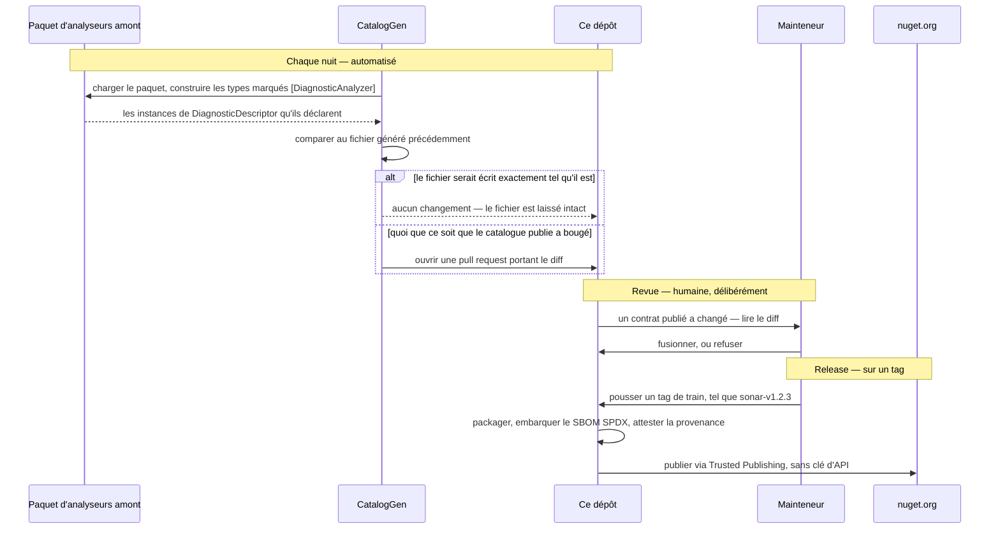

<p align="center">
  
</p>

# DiagnosticCatalog

🌍 **Langues :**  
🇬🇧 [English](../README.md) | 🇫🇷 Français (ce fichier)

<!-- dcat-doc:missing SonarRule.S1145 la référence que le lecteur est invité à casser exprès ; l'erreur de compilation est le propos -->

|  |  |
| :-- | :-- |
| **Build** | [](https://github.com/Reefact/diagnostic-catalog/actions/workflows/ci.yml) |
| **Qualité** | [](https://sonarcloud.io/summary/new_code?id=reefact_diagnostic-catalog) [](https://sonarcloud.io/summary/new_code?id=reefact_diagnostic-catalog) |
| **Sécurité** | [](https://github.com/Reefact/diagnostic-catalog/actions/workflows/codeql.yml) [](https://securityscorecards.dev/viewer/?uri=github.com/Reefact/diagnostic-catalog) |
| **Paquet** | [](https://www.nuget.org/packages/DiagnosticCatalog)  |
| **Projet** | [](../LICENSE) [](https://www.conventionalcommits.org) |

---

**Arrêtez d'écrire vos suppressions d'analyseur en chaînes 🪄 magiques.**

## 🚨 Le problème

Les **deux** arguments de `SuppressMessageAttribute` sont des chaînes magiques, et rien ne
valide ni l'un ni l'autre :

```csharp
[SuppressMessage("Major Code Smell", "S1144", Justification = "...")]
```

Ils ne diffèrent que par leur façon d'échouer.

Trompez-vous sur l'**identifiant** — une faute de frappe, ou une règle que l'éditeur a
renommée depuis — et la suppression ne fait plus rien, en silence : l'avertissement reste,
sans que rien ne désigne la cause.

Trompez-vous sur la **catégorie** et *il ne se passe rien du tout, jamais* : la plateforme
.NET ne lit jamais cet argument, donc aucun compilateur, analyseur, test ou outil ne peut
vous le dire. Et vous ne l'auriez pas deviné — la catégorie de `S1144` est
`"Major Code Smell"`, pas `"Code Smell"` ni `"Maintainability"`. StyleCop enfonce le clou :
`SA1000` vit dans `"StyleCop.CSharp.SpacingRules"`.

## 💡 L'approche

Déclarez chaque règle une fois, comme une classe statique de constantes de compilation, et
référencez ces constantes partout ailleurs :

```csharp
// Écrivez-le de travers et le compilateur le dit, au lieu d'une suppression qui se tait.
[SuppressMessage(SonarRule.S1144.Category, SonarRule.S1144.Id, Justification = "...")]
```

Une référence mal orthographiée arrête la compilation, là où une chaîne mal orthographiée se
compile sans broncher en une suppression qui ne fait rien. Une règle que l'éditeur retire est
conservée et marquée `[Obsolete]`, si bien qu'une montée de version vous avertit de retirer la
suppression au lieu de casser la recompilation
([ADR-0010](adr/0010-carry-a-retired-rule-forward-as-obsolete.fr.md)). Et la catégorie a
exactement une source de vérité publiée, lue depuis le `DiagnosticDescriptor` de l'analyseur
lui-même plutôt que retapée de mémoire.

## 📦 Les catalogues disponibles

Vous n'avez presque certainement pas besoin d'en écrire un. Référencez le catalogue qui
correspond à un analyseur que vous exécutez déjà :

<!-- catalogue-index:begin -->

| Paquet | Catalogue les règles de | Identifiants |
| --- | --- | --- |
| **`DiagnosticCatalog.Sonar`** | [SonarAnalyzer.CSharp](https://github.com/SonarSource/sonar-dotnet) | `Sxxxx` |
| **`DiagnosticCatalog.NetAnalyzers`** | L'analyse de code .NET, les règles que le SDK livre | `CAxxxx` |
| **`DiagnosticCatalog.StyleCop`** | [StyleCop.Analyzers](https://github.com/DotNetAnalyzers/StyleCopAnalyzers) | `SAxxxx` |
| **`DiagnosticCatalog.CodeStyle`** | Le style IDE de Roslyn — ce que `.editorconfig` configure et qu'`EnforceCodeStyleInBuild` active | `IDExxxx` |
| **`DiagnosticCatalog.Xunit`** | [xunit.analyzers](https://github.com/xunit/xunit.analyzers), que tout projet de test xUnit exécute déjà puisque `xunit` en dépend | `xUnitxxxx` |
| **`DiagnosticCatalog.NUnit`** | [NUnit.Analyzers](https://github.com/nunit/nunit.analyzers), que `dotnet new nunit` inscrit dans le fichier projet qu'il génère | `NUnitxxxx` |
| **`DiagnosticCatalog.MSTest`** | [MSTest.Analyzers](https://github.com/microsoft/testfx), que tout projet MSTest exécute déjà puisque `MSTest.TestFramework` en dépend | `MSTESTxxxx` |
| **`DiagnosticCatalog.Trimming`** | Les avertissements de trimming, Native AOT et fichier unique, que Blazor WebAssembly, MAUI et `PublishAot` activent à chaque build | `ILxxxx` |
| **`DiagnosticCatalog.AspNetCore`** | ASP.NET Core et Blazor, que tout projet web exécute et qu'aucun ne peut désinstaller puisqu'elles vivent dans le framework partagé | `ASPxxxx`, `BLxxxx` |
| **`DiagnosticCatalog.Syslib`** | Les générateurs de source du runtime .NET — `LibraryImport`, les générateurs COM et regex, la sérialisation JSON | `SYSLIB1xxx` |
| **`DiagnosticCatalog.Roslyn`** | L'écriture d'analyseurs, qui arrive avec `Microsoft.CodeAnalysis.CSharp` pour quiconque écrit un analyseur ou un correctif | `RS1xxx`, `RS2xxx` |
| **`DiagnosticCatalog.PublicApi`** | [PublicApiAnalyzers](https://github.com/dotnet/roslyn-analyzers), pour une bibliothèque qui suit sa surface dans `PublicAPI.Shipped.txt` | `RS00xx` |
| **`DiagnosticCatalog.BannedApi`** | [BannedApiAnalyzers](https://github.com/dotnet/roslyn-analyzers), pour une base de code qui bannit une API dans `BannedSymbols.txt` | `RS0030`, `RS0031`, `RS0035` |

<!-- catalogue-index:end -->

Chacun d'eux est **généré**, jamais écrit à la main, et porte les identifiants, les catégories,
les liens d'aide et le titre de la règle — ce dernier en commentaire de documentation, pour que
survoler une constante dise de quoi la règle parle. Les descriptions de règles et les formats de
message sont la documentation des éditeurs et sont délibérément laissés de côté
([ADR-0014](adr/0014-ship-the-vendors-rule-title-as-a-catalogues-documentation.fr.md)).
La page de chaque paquet indique quelle version amont il reflète actuellement, combien de règles
il porte, et ce que cet éditeur fait que personne d'autre ne fait.

Ces catalogues sont non officiels. Ils ne sont ni affiliés à, ni approuvés par, ni supportés
par SonarSource, Microsoft, le projet StyleCop.Analyzers, xUnit.net ou le projet NUnit.
« Sonar » et « SonarQube » sont des marques de SonarSource S.A.

## 🏁 En référencer un et réécrire une suppression

Référencez le catalogue d'un analyseur que vous faites déjà tourner :

```xml
<PackageReference Include="DiagnosticCatalog.Sonar" Version="1.0.0" />
```

Puis écrivez la suppression contre ses constantes au lieu de chaînes :

```csharp
using System.Diagnostics.CodeAnalysis;
using DiagnosticCatalog.Sonar;

public sealed class ReportSerializer
{
    [SuppressMessage(
        SonarRule.S1144.Category,
        SonarRule.S1144.Id,
        Justification = "Invoked by the serializer through reflection.")]
    private ReportSerializer()
    {
    }
}
```

C'est tout. Cassez la référence exprès — `SonarRule.S1145` — et la compilation s'arrête, là où
la chaîne qu'elle remplace se serait compilée en une suppression qui ne faisait rien, en silence.

**Une seule référence, vérifications comprises.** Chaque catalogue dépend de `DiagnosticCatalog`,
qui porte les analyseurs `DCAT` et leurs correctifs à côté des attributs marqueurs : référencer un
catalogue est ce qui active la vérification, et il n'y a pas de second paquet à ajouter
([ADR-0037](adr/0037-ship-the-analyzers-inside-the-foundation-package.fr.md)). Référencez
`DiagnosticCatalog` seul si vous voulez les vérifications sans catalogue.

Les analyseurs tournent dans le compilateur et nulle part ailleurs : à l'exécution, un catalogue
reste des constantes et rien d'autre — aucun comportement, et aucun assemblage à charger pour votre
application. `tools/packaging/verify-consumption.sh` restaure le paquet comme le ferait un
consommateur et vérifie que les assemblages d'analyse restent hors du dossier de sortie que
`DiagnosticCatalog.dll`, lui, atteint.
[La garantie d'empreinte nulle](guide/zero-footprint.fr.md) énonce ce qui atteint l'assemblage que
vous livrez, et ce que le test vérifie réellement.

Dix minutes de bout en bout, avec la référence cassée exprès, c'est
[Démarrer](guide/getting-started.fr.md).

## 📈 L'adopter là où des suppressions existent déjà

Une base de code qui supprime déjà des règles ne les réécrit pas à la main — et il n'y a rien de
plus à référencer : le catalogue ci-dessus a emmené les analyseurs avec lui.

`DCAT0006` signale une suppression écrite en littéraux lorsqu'un catalogue de la
compilation déclare cette règle, et propose la correction. *Corriger toutes les occurrences*
l'applique ensuite à un document, un projet ou la solution entière en une passe, en ajoutant le
`using` de chaque règle au passage.

Trois choses de plus rendent la migration tenable :

* **Monter la sévérité par paliers.** `DCAT0006` est livré en erreur
  ([ADR-0027](adr/0027-ship-the-use-site-diagnostics-as-errors.fr.md)), si bien que la compilation
  qui ajoute le catalogue rencontre d'un coup toutes les suppressions littérales qu'il sait
  reconnaître. Descendez-le en suggestion dans `.editorconfig`, puis remontez-le dossier par
  dossier à mesure que vous convertissez —
  [Adopter un catalogue](guide/adopting-a-catalogue.fr.md) donne l'ordre de conversion.
* **Demander ce qu'est une règle.** `dcat explain <catalogue.dll> S1144` affiche la catégorie de
  la règle, son lien d'aide, et la ligne `[SuppressMessage]` exacte à coller — pleinement
  qualifiée, donc elle compile où qu'elle atterrisse.
* **Rien à garder pour vous si vous livrez une bibliothèque.** Un catalogue que vous référencez
  *vous* vérifie et s'arrête là : une application qui référence votre bibliothèque n'est pas
  analysée par un catalogue qu'elle n'a jamais choisi, et vous n'écrivez rien pour cela
  ([ADR-0038](adr/0038-stop-the-analyzers-at-the-project-that-references-a-catalogue.fr.md)).
  Mesuré par `tools/packaging/verify-consumption.sh` sous l'intitulé « the analyzer does NOT reach a
  consumer two hops out ». Un projet qui *veut* les vérifications de plus loin pose
  `EnableDiagnosticCatalogAnalyzers` à `true`.

## 🧭 Ce que cela ne fait pas

* Cela ne peut pas vérifier une règle **qu'aucun catalogue de votre compilation ne déclare**. Une
  suppression nommant un analyseur pour lequel vous n'avez pas de catalogue reste une paire de
  chaînes, et rien ne le signale.
* Cela ne change **rien à quelles règles de vos analyseurs se déclenchent**. Un catalogue, ce sont
  des constantes ; les vérifications `DCAT` qu'il apporte sont les seuls diagnostics ajoutés, et
  toutes les sévérités restent dans `.editorconfig` — voir
  [la configuration](guide/configuration.fr.md).
* Une poignée de suppressions dans un seul projet n'a besoin de rien de tout cela.
  [Quand ne pas l'utiliser](guide/when-not-to-use.fr.md) est écrit pour vous en dissuader là où il
  le faut, et [les alternatives](guide/alternatives.fr.md) couvre ce qui existe par ailleurs.

Quand quelque chose ne se comporte pas comme prévu, [le dépannage](guide/troubleshooting.fr.md)
est organisé par symptôme — rien n'est signalé, `CS0117`, `CS0618`, `DCAT0006` sur tous les
fichiers d'un coup.

## 📖 Guides

Organisés par ce que vous cherchez à faire plutôt que par la façon dont le code est rangé. Chaque
piste est un ordre de lecture court qui lui est propre, et les pages portent précédent/suivant à
l'intérieur de leur piste :

| Si vous… | Piste | Commence à |
| --- | --- | --- |
| écrivez `[SuppressMessage(...)]` et voulez que ce soit vérifié | **Utiliser un catalogue** | [Pourquoi les chaînes magiques échouent](guide/the-problem.fr.md) |
| avez déjà des suppressions et voulez les migrer | **Adopter les analyseurs** | [Adopter un catalogue](guide/adopting-a-catalogue.fr.md) |
| livrez un analyseur, ou possédez des règles que personne d'autre ne publie | **Publier un catalogue** | [Publier un catalogue](guide/authoring-a-catalogue.fr.md) |
| préférez générer un catalogue plutôt que l'écrire | **Générer avec `dcat`** | [L'outil `dcat`](guide/dcat.fr.md) |
| avez besoin d'une réponse exacte, ou butez sur un symptôme | **Référence et dépannage** | [Le contrat de règle](guide/rule-contract.fr.md) |
| contribuez ici | **Contribuer** | [Architecture du dépôt](guide/architecture.fr.md) |

La [carte de la documentation](guide/README.fr.md) ([English](guide/README.en.md)) liste toutes
les pages de toutes les pistes. Chacune existe en anglais et en français — la bannière en haut
d'une page bascule de l'une à l'autre.

Pages par projet :
[`DiagnosticCatalog`](../src/DiagnosticCatalog/README.fr.md) ·
[`.Self`](../src/DiagnosticCatalog.Self/README.fr.md) ·
[`.Sonar`](../src/DiagnosticCatalog.Sonar/README.fr.md) ·
[`.NetAnalyzers`](../src/DiagnosticCatalog.NetAnalyzers/README.fr.md) ·
[`.StyleCop`](../src/DiagnosticCatalog.StyleCop/README.fr.md) ·
[`.CodeStyle`](../src/DiagnosticCatalog.CodeStyle/README.fr.md) ·
[`.Xunit`](../src/DiagnosticCatalog.Xunit/README.fr.md) ·
[`.NUnit`](../src/DiagnosticCatalog.NUnit/README.fr.md) ·
[`.MSTest`](../src/DiagnosticCatalog.MSTest/README.fr.md) ·
[`.Trimming`](../src/DiagnosticCatalog.Trimming/README.fr.md) ·
[`.AspNetCore`](../src/DiagnosticCatalog.AspNetCore/README.fr.md) ·
[`.Syslib`](../src/DiagnosticCatalog.Syslib/README.fr.md) ·
[`.Roslyn`](../src/DiagnosticCatalog.Roslyn/README.fr.md) ·
[`.PublicApi`](../src/DiagnosticCatalog.PublicApi/README.fr.md) ·
[`.BannedApi`](../src/DiagnosticCatalog.BannedApi/README.fr.md) ·
[`.Cli`](../src/DiagnosticCatalog.Cli/README.fr.md)

## 🧰 Les paquets

À côté des catalogues d'éditeurs ci-dessus, trois paquets composent la boîte à outils. Chacun
roule sur un [train de release](../CONTRIBUTING.md) à lui et se versionne à son propre rythme :

| Paquet | À quoi il sert | Train |
| --- | --- | --- |
| **`DiagnosticCatalog`** | Les marqueurs `[DiagnosticRule]`, `[DiagnosticCategory]` et `[assembly: CatalogSource]`, et la vérification qui va avec : des diagnostics qui confrontent une déclaration de règle au contrat structurel, et une suppression à la règle qu'elle nomme, avec les correctifs qui transforment un littéral en référence de catalogue. Référencez-le pour déclarer un catalogue **à vous** — pour vos analyseurs, ou pour un jeu de règles interne — ou seul, pour les vérifications sans catalogue. Chaque catalogue en dépend, donc en référencer un quelconque emmène la vérification avec lui ([ADR-0037](adr/0037-ship-the-analyzers-inside-the-foundation-package.fr.md)). Les assemblages d'analyse sont de compilation seulement et n'atteignent jamais votre exécution. | `lib` |
| **`DiagnosticCatalog.Self`** | Les règles `DCATxxxx` que ces analyseurs signalent, cataloguées de la même façon — de sorte que supprimer un diagnostic de *cette* bibliothèque soit une référence vérifiée plutôt que la chaîne magique que tout ceci existe pour supprimer. | `lib` |
| **`DiagnosticCatalog.Cli`**, l'outil `dcat` | Le générateur, en outil .NET. Pointez-le vers un paquet d'analyseurs ou vers des assemblages sur disque et il écrit un catalogue comme ce dépôt écrit ceux ci-dessus. | `cli` |

`DiagnosticCatalog.Self` sort de ce même générateur, pointé vers les analyseurs de ce dépôt.
C'est la réponse la plus courte à « est-ce que ça marche vraiment » : les règles que la
bibliothèque signale sont cataloguées par la bibliothèque, à travers le pipeline qu'elle demande
à tout le monde d'utiliser.

Chaque catalogue d'éditeur roule sur un train qui porte son nom — `sonar`, `netanalyzers`,
`stylecop`, `codestyle`, `xunit`, `nunit`, `mstest`, `trimming`, `aspnetcore`, `syslib`,
`roslyn`, `publicapi`, `bannedapi` — si bien que suivre le rythme de SonarSource ne tire jamais
la version de la fondation avec lui.

## 🛠️ Plateformes supportées

Les bibliothèques ciblent **`netstandard2.0`** et **`net10.0`**. Ce plancher est plus qu'une
affirmation de compilation : la CI exécute la suite de tests sur le vrai CLR .NET Framework 4.7.2
([ADR-0001](adr/0001-floor-the-libraries-on-net-framework-4-7-2.fr.md)).

Appliquer `[DiagnosticRule]` n'introduit aucun comportement à l'exécution. Le runtime matérialise
les attributs personnalisés paresseusement, si bien que `DiagnosticCatalog.dll` n'est jamais
réellement chargé à moins que quelque chose ne réfléchisse sur les types de règles.

## ⚙️ Comment un catalogue est construit et tenu à jour

Aucune règle de ce dépôt n'a été tapée à la main. Chaque étape, de la source de vérité de
l'analyseur jusqu'à un paquet signé, est un script ou un workflow que vous pouvez lire.



**Lire les descripteurs, pas la documentation.** `eng/CatalogGen` charge le paquet d'analyseurs
amont, construit les types qu'il marque `[DiagnosticAnalyzer]`, et lit les instances de
`DiagnosticDescriptor` qu'ils déclarent réellement. Les métadonnées de règles publiées en JSON
ou en prose s'écartent de ce que l'analyseur fait vraiment, et puisque rien dans la plateforme
ne valide une catégorie, une valeur copiée depuis une documentation périmée ne produirait aucun
symptôme nulle part
([ADR-0009](adr/0009-generate-catalog-content-from-analyzer-descriptors.fr.md)).

**Détecter la dérive chaque nuit.** Un [workflow planifié](../.github/workflows/nightly-catalogs.yml)
régénère chaque catalogue et ouvre une pull request quand quoi que ce soit que le catalogue
publie a bougé. Les nuits où rien n'a bougé ne produisent rien du tout : le générateur rend ce
qu'il écrirait et le compare au fichier déjà présent, si bien qu'un catalogue inchangé garde ses
octets et son horodatage `generatedOn`. C'est la même comparaison que `dcat validate` renvoie, et
c'est pourquoi un pipeline peut demander si un catalogue dit encore vrai sans rien écrire.

**Laisser une personne lire le diff.** Ce workflow ne publie rien, et c'est une décision plutôt
qu'un oubli. Un identifiant ou une catégorie qui a bougé en amont est un changement de *contrat
publié*, et parce que rien ne valide la catégorie d'une suppression, une valeur fausse fusionnée
sans revue resterait invisible aussi longtemps qu'elle existerait. L'automatisation trouve le
changement ; un humain l'accepte.

**Ne jamais supprimer une constante.** Une règle que l'éditeur retire est conservée et marquée
`[Obsolete]`, en nommant la version qui l'a abandonnée. Un consommateur reçoit un avertissement
lui disant de retirer la suppression, au lieu d'une compilation cassée par un membre disparu —
les consommateurs inlinent les valeurs de constantes à leur propre compilation
([ADR-0010](adr/0010-carry-a-retired-rule-forward-as-obsolete.fr.md)).

**Publier sur un tag, avec les reçus.** Pousser un tag de train déclenche le workflow de release,
qui package, embarque un SBOM SPDX et publie via
[Trusted Publishing](https://learn.microsoft.com/en-us/nuget/nuget-org/trusted-publishing)
avec une provenance de build signée
([ADR-0006](adr/0006-publish-through-trusted-publishing-with-provenance-and-an-sbom.fr.md)) —
il n'y a nulle part de clé d'API à longue durée de vie susceptible de fuiter.

La moitié « packaging » de ce pipeline — build, pack, SBOM et les garde-fous d'empaquetage — est
[répétée sur chaque pull request](../.github/workflows/release-dryrun.yml), pour chaque train,
afin qu'une release ne l'exerce jamais pour la première fois sur un tag. Ce que la répétition
saute délibérément, c'est tout ce qui a un effet de bord : aucune provenance n'est attestée,
rien n'est poussé vers nuget.org, aucune release n'est créée. Un essai à blanc qui simulerait
tout cela ne prouverait rien.

## 🔍 Chaîne d'approvisionnement

Les releases publient via [Trusted Publishing](https://learn.microsoft.com/en-us/nuget/nuget-org/trusted-publishing)
avec une provenance de build signée et un SBOM embarqué
([ADR-0006](adr/0006-publish-through-trusted-publishing-with-provenance-and-an-sbom.fr.md)).
Les paquets sont versionnés en [trains de release](../CONTRIBUTING.md) indépendants, de sorte
qu'une release Sonar ne déplace pas la version de la fondation. Les détails de vérification sont
dans [SECURITY.md](../SECURITY.md).

## 🧱 Déclarer un catalogue à vous

Pour vos propres analyseurs, ou pour un jeu de règles interne que personne d'autre ne publie.
Référencez la fondation :

```xml
<PackageReference Include="DiagnosticCatalog" Version="1.0.0" />
```

Cette référence apporte aussi les analyseurs, si bien que les règles que vous déclarez sont
confrontées au contrat à mesure que vous les écrivez.

Une règle est une classe statique, non générique, marquée `[DiagnosticRule]`, avec deux
constantes publiques obligatoires — et la catégorie est atteinte via une classe à elle :

```csharp
using DiagnosticCatalog;

namespace Contoso.Analyzers.Suppressions;

[DiagnosticCategory]
internal static class ContosoCategory
{
    public const string Usage = "Usage";
}

public static class Rules
{
    [DiagnosticRule]
    public static class CT0001
    {
        public const string Id = nameof(CT0001);
        public const string Category = ContosoCategory.Usage;
    }
}
```

Les deux membres doivent être `const` : une propriété, un champ `static readonly` ou un `record`
ne peuvent pas être un argument d'attribut. C'est aussi pourquoi le contrat est structurel plutôt
qu'une interface ou une classe de base — voir
[ADR-0008](adr/0008-express-a-rule-as-a-marked-static-class-of-constants.fr.md).

La classe de catégorie n'est pas de la décoration. Un catalogue répète très peu de catégories
distinctes sur un très grand nombre de règles — 456 règles Sonar pour 13 valeurs — et déclarer
chacune une seule fois donne à tout catalogue la même forme, ce qui est ce qui permet à
l'outillage de proposer la constante nommée à la place d'un littéral. `DCAT0011` signale une
règle qui atteint sa catégorie autrement
([ADR-0028](adr/0028-require-every-rule-to-reach-its-category-through-a-declared-constant.fr.md)).

À l'échelle, générez plutôt que d'écrire : [l'outil `dcat`](guide/dcat.fr.md) est ce qui produit
chaque catalogue du tableau ci-dessus, et [publier un catalogue](guide/authoring-a-catalogue.fr.md)
couvre la forme à livrer.

## 🏗️ Dans le dépôt

[L'architecture du dépôt](guide/architecture.fr.md) explique les projets, les découpages imposés
chacun par quelque chose, et où vit chaque sorte de vérification.
[Dans le générateur](guide/generator-internals.fr.md) suit le chemin que prend une exécution de
`dcat`. [Les trains de release](guide/release-trains.fr.md) expliquent comment un projet en
rejoint un et la règle inter-trains qui en découle.

## 📚 Documentation

Tout vit sous [`doc/`](.), qui contient quatre sortes de documents. Ils répondent à des questions
différentes :

| Si vous voulez… | Lisez | Forme |
| --- | --- | --- |
| *faire* quelque chose | [**Le guide**](guide/README.fr.md) | Des pistes indépendantes, chacune un ordre de lecture court avec précédent/suivant |
| le comportement exact, normativement | [**La spécification**](specification.fr.md) | Un long document de conception |
| savoir *pourquoi* une chose est ainsi | [**Les décisions d'architecture**](adr/) | Un fichier par décision, daté, jamais modifié une fois accepté |
| ajouter une page ici | [**Les conventions**](CONVENTIONS.fr.md) | La mise en page, et ce que les tests vérifient |

**La spécification** est le document de conception canonique : le contrat de règle, le comportement
de plateforme sur lequel il repose, le générateur, les diagnostics de l'analyseur, l'empaquetage.
Lisez-la quand vous avez besoin de la réponse exacte plutôt que de la réponse utilisable. Son annexe
mérite d'être connue pour elle-même — chaque affirmation de comportement sur laquelle la conception
repose a été vérifiée contre la plateforme plutôt que supposée, et l'annexe consigne ce qui a été
vérifié et comment.

**Les décisions d'architecture** portent le raisonnement : le contexte, les alternatives rejetées et
pourquoi, et les conséquences acceptées. C'est un journal historique — un enregistrement accepté
n'est jamais modifié, et une décision est revisitée en écrivant un successeur qui le remplace. Deux
sont un bon point de départ, parce que la plupart des autres en découlent :

- [ADR-0008](adr/0008-express-a-rule-as-a-marked-static-class-of-constants.fr.md) — pourquoi une
  règle est une classe statique marquée de constantes, plutôt qu'une interface ou une classe de
  base.
- [ADR-0009](adr/0009-generate-catalog-content-from-analyzer-descriptors.fr.md) — pourquoi le
  contenu d'un catalogue est lu depuis les descripteurs des analyseurs eux-mêmes et jamais depuis
  leur documentation.

**Les deux langues.** Chaque page sous `doc/` existe en anglais et en français, et **l'anglais fait
foi** : là où les deux divergent, c'est la version anglaise qui l'emporte
([ADR-0022](adr/0022-maintain-every-document-under-doc-in-english-and-french.fr.md)). Une page et sa
traduction atterrissent dans le même commit, et
`tests/DiagnosticCatalog.Documentation.UnitTests` refuse une paire à qui il manque une moitié, un
lien qui ne résout pas, ou une page que rien ne référence.

Cette page fait partie de cette règle. GitHub compose la page d'accueil du dépôt à partir d'un
fichier nommé `README.md` à la racine et d'aucun autre, si bien que la moitié anglaise ne peut pas
siéger sous `doc/` ; sa moitié française est cette page, et les deux sont vérifiées comme une paire
ordinaire ([ADR-0029](adr/0029-pair-the-project-readme-across-the-doc-boundary.fr.md)). Les README
de paquets sous [`src/`](../src) sont dans la règle eux aussi, le moteur de rendu décidant quelle
moitié un paquet emporte plutôt que si une traduction existe : nuget.org montre un fichier par paquet
et ne résout aucun lien relatif, donc `<PackageReadmeFile>` nomme la moitié anglaise et chaque adresse
que ces pages écrivent — bannière offrant la française comprise — est une adresse complète
([ADR-0034](adr/0034-pair-every-package-readme-in-english-and-french.fr.md)).

Hors de `doc/` :

- **[CONTRIBUTING.md](../CONTRIBUTING.md)** — convention de commit, trains de release, le plancher
  .NET Framework, et comment ajouter un catalogue.
- **[CHANGELOG.md](../CHANGELOG.md)** — les changements visibles pour l'utilisateur sur le train `lib`.

## 🐛 Retours et contributions

Vous avez trouvé un bug, ou vous voulez un catalogue qui n'est pas encore là ? Ouvrez une issue sur
le [gestionnaire d'issues](https://github.com/Reefact/diagnostic-catalog/issues) — il y a un
formulaire pour chaque cas. Les contributions sont bienvenues — commencez par
[CONTRIBUTING.md](../CONTRIBUTING.md), et par le
[Code de conduite](../CODE_OF_CONDUCT.md) que chacun accepte en prenant part ici.

Pour les vulnérabilités de sécurité, suivez le processus privé décrit dans [SECURITY.md](../SECURITY.md).

## 📄 Licence

[Apache-2.0](../LICENSE)
