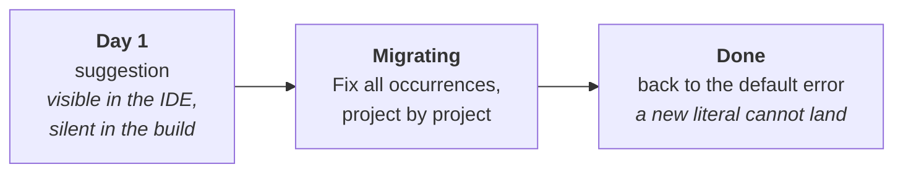

# Adopting a catalogue on an existing codebase

🌍 **Languages:**  
🇬🇧 English (this file) | 🇫🇷 [Français](./adopting-a-catalogue.fr.md)

For anyone with more suppressions than they want to convert by hand. How to go from a few hundred
literals to checked references without a week of red builds.

> **What this page needs.** Nothing beside the catalogue. The bulk conversion described below is the
> `DCAT` analyzers, and they ship inside `DiagnosticCatalog`, which every catalogue depends on and
> none may hide — so the catalogue reference is what switches the checking on
> ([ADR-0037](../adr/0037-ship-the-analyzers-inside-the-foundation-package.en.md)); reference
> `DiagnosticCatalog` on its own if you want the checks and no catalogue. The manual path at the end
> is for a catalogue released before that decision.

## The day-one problem

You reference a catalogue, you build — and `DCAT0006` fires on **every literal suppression that
matches a rule you now have**. Not a sample. All of them, at once. The catalogue is the only
reference involved: it brought the analyzers with it.

That is not a defect. It is the diagnostic doing exactly what it is for: it reports a suppression
that a catalogue reference could replace, and after you add the catalogue, every one of them
qualifies. A version that trickled would be a version that never finished.

And `DCAT0006` ships as an **error**
([ADR-0027](../adr/0027-ship-the-use-site-diagnostics-as-errors.en.md)), so this does not wait for a
`<TreatWarningsAsErrors>` to bite: the build that added the catalogue is the build that failed, with
hundreds of errors, in code nobody touched. Teams reasonably conclude the library is not ready.

Which is why the first line of the ramp below is not optional on an existing codebase. It is the one
deliberate downgrade the default expects you to make.

## The ramp

Three settings over three moments, and the whole adoption fits inside them.



**Day one — make it visible without making it fatal.**

```ini
# .editorconfig
[*.cs]
dotnet_diagnostic.DCAT0006.severity = suggestion
dotnet_diagnostic.DCAT0014.severity = suggestion
```

A suggestion appears in the IDE as a lightbulb and in `dotnet build` as nothing. The build that adds
the catalogue is green, and the migration starts when you decide rather than when the package
arrives.

**While migrating — leave the other three alone.**

`DCAT0001`, `DCAT0007` and `DCAT0009` are errors, and they should stay that way. They mean a
suppression is *not doing what it looks like*: a pair naming two different rules, a half-converted
one, or an `UnconditionalSuppressMessage` the trimmer discards outright. All three are defects you
want reported the moment they appear, and none of them fires in bulk — they only exist where
somebody has already started using references, or where a trimmer suppression was written by hand.

**`DCAT0014` arrives on day one, beside `DCAT0006`.** It asks that a suppression say why it exists,
and it asks it of *every* suppression — a literal one included, whether or not any catalogue
describes the rule it names. So the first build after you reference the package reports every
suppression in your codebase that never carried a `Justification`, converted or not.

It is an error, like `DCAT0006`, and for the same reason: a justification is part of the contract
rather than an ornament on it
([ADR-0040](../adr/0040-grade-every-dcat-diagnostic-by-what-it-says.en.md)). That is why it sits on
the same downgrade line above rather than on one of its own. Two ways to meet it, and the second is
the usual one.

The honest way is to write the reasons as you convert. You are already editing each suppression to
migrate its pair, the code is in front of you, and whoever suppressed it is often still reachable —
which will not be true in six months. A line being converted reports both diagnostics at once, and
applying the `DCAT0006` fix leaves `DCAT0014` standing: converting a suppression does not answer the
question it never answered.

If you already run StyleCop's `SA1404`, you will see both — they ask the same question, and one
`.editorconfig` line silences whichever you do not want.

**When you finish — delete the lines.**

```ini
# gone: dotnet_diagnostic.DCAT0006.severity = suggestion
# gone: dotnet_diagnostic.DCAT0014.severity = suggestion
```

Removing the downgrade restores the default: from then on a new literal suppression cannot merge,
which is what keeps the codebase converted after the person who converted it moves on.

## Converting

Build once with the catalogue referenced and every convertible suppression carries a fix. In Visual
Studio and Rider, *Fix all occurrences* applies it across a **document**, a **project** or the
**solution** in one step.

```csharp
[SuppressMessage("Major Code Smell", "S1144", Justification = "kept for reflection")]
// becomes
[SuppressMessage(SonarRule.S1144.Category, SonarRule.S1144.Id, Justification = "kept for reflection")]
```

Three behaviours are worth knowing before you run it across a solution.

**Everything else in the attribute is left exactly as written.** `Justification`, `Scope`, `Target`
and `MessageId` are yours and are not touched. The fix rewrites two arguments and adds the `using`
the reference needs.

**The friendly-name suffix is dropped.** Visual Studio's *Suppress → In Source* writes
`"S1144:Unused private members should be removed"`; the fix recognises that form and replaces the
whole thing. The prose lived in the suppression only because there was nowhere else to put it — the
catalogue carries the rule's own title as XML documentation, so hovering the constant gives it back.

**Two cases get the diagnostic and no fix**, on purpose:

| Situation | Why no fix |
| --- | --- |
| Two catalogues describe the same rule | Choosing between them is a decision about which package your file depends on. |
| `DCAT0007` where the literal names a *different* rule from the reference beside it | Completing it would silence a different rule than the one silenced today, and let the original warning back in. That is a change of behaviour, not a migration ([ADR-0018](../adr/0018-a-code-fix-never-decides-what-only-the-author-can.en.md)). |

Both are places where a lightbulb would have to guess, and the fix declines rather than guessing
quietly.

## Scoping while you work

`.editorconfig` sections are ordinary paths, so a folder can run ahead of or behind the rest:

```ini
[*.cs]
dotnet_diagnostic.DCAT0006.severity = suggestion

# Converted, and staying converted.
[src/Billing/**.cs]
dotnet_diagnostic.DCAT0006.severity = error

# Legacy, scheduled for deletion rather than conversion.
[src/Legacy.Interop/**.cs]
dotnet_diagnostic.DCAT0006.severity = none
```

This is what makes "convert project by project" a real strategy rather than an intention: each
converted area is locked at `error` as it lands, so the boundary only ever moves forward.

## Generated code is already out of scope

You do not have to exclude it, and this is the one thing about the adoption that is free.

`ConfigureGeneratedCodeAnalysis` is per-**analyzer**, not per-diagnostic, and the checking is
written as two classes precisely so the two groups can differ:

| Analyzer | Diagnostics | Runs on generated code |
| --- | --- | --- |
| `SuppressionUsageAnalyzer` | `DCAT0001`, `DCAT0006`, `DCAT0007`, `DCAT0009`, `DCAT0014` | **no** |
| `DiagnosticRuleDefinitionAnalyzer` | `DCAT0002`–`DCAT0005`, `DCAT0011`–`DCAT0013` | **yes** |

Use-site diagnostics stay out of generated files because a suppression in one is not the author's to
fix, and reporting them would flood every one. Definition diagnostics run *into* them on purpose: a
generated catalogue is generated code, and checking it is the main thing that analyzer is for.

Roslyn decides what counts as generated: a file named `*.g.cs` or `*.generated.cs`, a type marked
`[GeneratedCode]`, or a file you declare yourself:

```ini
[src/Legacy/Interop.cs]
generated_code = true
```

## What order to convert in

There is no mechanism behind this, only experience of what leaves a codebase in a coherent state.

1. **One small project first, by hand.** Not to save time — to see what the diff looks like in review
   before opening one with four hundred files in it.
2. **Then the projects with the most suppressions**, with *Fix all occurrences* per project. The
   review is mechanical and the reviewer needs to be told that: a diff of four hundred identical
   two-argument rewrites is read by spot-checking, not by reading.
3. **Raise `DCAT0006` to `error` for each project as it lands**, in a scoped `.editorconfig` section.
4. **Last, the file that suppresses `DCAT` diagnostics themselves**, if you have one. That is what
   [`DiagnosticCatalog.Self`](../../src/DiagnosticCatalog.Self/README.en.md) is for.

Keep the conversion in its own pull requests, separate from behaviour changes. A rewrite of every
suppression in a project is exactly the diff a real change should not be hiding in.

## What will not convert, and is not meant to

Two forms are permanently out of reach, and neither is reported:

```csharp
#pragma warning disable S1144        // takes a bare identifier; no constant fits
```

```ini
dotnet_diagnostic.S1144.severity = none   # plain text, outside the C# compilation model
```

If a large share of your suppressions are `#pragma`, the conversion will feel thin — see
[when not to use this](when-not-to-use.en.md).

## Without the analyzers

A catalogue carries them, so the mechanised path is normally there. Two cases where it is not: a
catalogue release older than
[ADR-0037](../adr/0037-ship-the-analyzers-inside-the-foundation-package.en.md), whose dependency on
`DiagnosticCatalog` resolves to a version carrying the attributes alone, and a project that has set
`DCAT0006` to `none`. What still works:

* **Convert as you touch.** Rewrite a suppression when you are already editing its file. This reaches
  the code that actually changes, and costs nothing extra.
* **A careful search-and-replace.** `"Major Code Smell", "S1144"` → `SonarRule.S1144.Category,
  SonarRule.S1144.Id`, one rule at a time, adding the `using` per file. The compiler is the check
  here: anything you get wrong is a build error rather than a silent no-op, which is the whole
  premise.
* **Do not automate it against a regex over the whole codebase.** The Visual Studio suffix form, the
  `Scope`/`Target` variants and multi-line attributes will each need a different pattern, and a
  rewrite that half-matches is how a `DCAT0007` gets created rather than fixed.

## Where to go next

* [**Configuration**](configuration.en.md) — every severity key, the category-wide switch, and what
  is deliberately not configurable.
* [**The zero-footprint guarantee**](zero-footprint.en.md) — what the conversion costs your shipped
  assembly, and how that is asserted rather than promised.
* [**The `DCAT` diagnostics**](diagnostics.en.md) — the full reference for each id.

---

<div align="center">
<a href="./README.en.md">↑ Table of contents</a> · <a href="./diagnostics.en.md">The `DCAT` diagnostics →</a>
</div>
