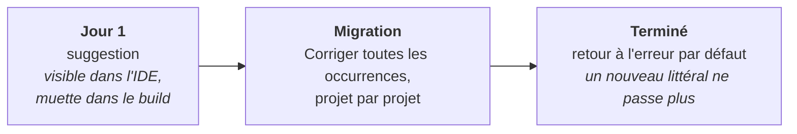

# Adopter un catalogue sur une base de code existante

🌍 **Langues :**  
🇬🇧 [English](./adopting-a-catalogue.en.md) | 🇫🇷 Français (ce fichier)

Pour quiconque a plus de suppressions qu'il ne veut en convertir à la main. Comment passer de
quelques centaines de littéraux à des références vérifiées sans une semaine de builds rouges.

> **Où en est-on aujourd'hui.** La conversion en masse décrite ci-dessous, c'est
> `DiagnosticCatalog.Analyzers`, et ce paquet **n'a pas encore de version sur nuget.org**. Tout ce que
> cette page dit des gravités, du cantonnement et de l'ordre s'appliquera le jour où il sortira ; d'ici
> là, c'est le chemin manuel de la fin qui est disponible.
> [L'état du projet](https://github.com/Reefact/diagnostic-catalog#-project-status) est la réponse à
> jour.

## Le problème du premier jour

Vous référencez un catalogue, vous référencez les analyseurs, vous compilez — et `DCAT0006` se
déclenche sur **chaque suppression littérale qui correspond à une règle que vous avez désormais**.
Pas un échantillon. Toutes, d'un coup.

Ce n'est pas un défaut. C'est le diagnostic qui fait exactement ce pour quoi il existe : il signale
une suppression qu'une référence de catalogue pourrait remplacer, et après l'ajout du catalogue,
toutes remplissent la condition. Une version qui les distillerait serait une version qui ne finirait
jamais.

Et `DCAT0006` est livré en **erreur**
([ADR-0027](../adr/0027-ship-the-use-site-diagnostics-as-errors.fr.md)), donc cela n'attend pas qu'un
`<TreatWarningsAsErrors>` morde : le build qui a ajouté le paquet est le build qui a échoué, avec des
centaines d'erreurs, dans du code que personne n'a touché. Les équipes en concluent raisonnablement
que la bibliothèque n'est pas prête.

C'est pourquoi la première ligne de la rampe ci-dessous n'est pas optionnelle sur une base de code
existante. C'est la seule baisse délibérée que le défaut attend de vous.

## La rampe

Trois réglages sur trois moments, et toute l'adoption tient dedans.



**Jour un — le rendre visible sans le rendre fatal.**

```ini
# .editorconfig
[*.cs]
dotnet_diagnostic.DCAT0006.severity = suggestion
```

Une suggestion apparaît dans l'IDE sous forme d'ampoule et dans `dotnet build` sous forme de rien. Le
build qui ajoute le paquet est vert, et la migration démarre quand vous le décidez plutôt que quand
le paquet arrive.

**Pendant la migration — ne touchez pas aux trois autres.**

`DCAT0001` et `DCAT0007` sont déjà des erreurs, et doivent le rester. Ils signifient qu'une
suppression *ne fait pas ce qu'elle a l'air de faire* : une paire nommant deux règles différentes, ou
une paire à moitié convertie. Ce sont deux défauts que vous voulez voir signalés dès qu'ils
apparaissent, et aucun ne se déclenche en masse — ils n'existent que là où quelqu'un a déjà commencé
à utiliser des références. `DCAT0009` est du même ordre mais reste livré en avertissement, parce
qu'il rate un identifiant atteint via une constante ; relevez-le si un build *trimmé* compte pour
vous.

```ini
dotnet_diagnostic.DCAT0009.severity = error
```

**Quand vous avez fini — supprimez la ligne.**

```ini
# disparue : dotnet_diagnostic.DCAT0006.severity = suggestion
```

Retirer la baisse restaure le défaut : à partir de là, une nouvelle suppression
littérale ne peut plus être fusionnée, et c'est ce qui maintient la base convertie une fois que la
personne qui l'a convertie est passée à autre chose.

## Convertir

Compilez une fois avec les analyseurs référencés et chaque suppression convertible porte un
correctif. Dans Visual Studio et Rider, *Corriger toutes les occurrences* l'applique à un
**document**, un **projet** ou la **solution** en une étape.

```csharp
[SuppressMessage("Major Code Smell", "S1144", Justification = "kept for reflection")]
// devient
[SuppressMessage(SonarRule.S1144.Category, SonarRule.S1144.Id, Justification = "kept for reflection")]
```

Trois comportements méritent d'être connus avant de le lancer sur une solution.

**Tout le reste de l'attribut est laissé exactement tel qu'écrit.** `Justification`, `Scope`, `Target`
et `MessageId` sont à vous et ne sont pas touchés. Le correctif réécrit deux arguments et ajoute le
`using` dont la référence a besoin.

**Le suffixe de nom convivial est abandonné.** Le *Supprimer → Dans la source* de Visual Studio écrit
`"S1144:Unused private members should be removed"` ; le correctif reconnaît cette forme et remplace
le tout. La prose ne vivait dans la suppression que parce qu'il n'y avait nulle part où la mettre —
le catalogue porte le titre de la règle en documentation XML, si bien que survoler la constante le
rend.

**Deux cas obtiennent le diagnostic et aucun correctif**, exprès :

| Situation | Pourquoi aucun correctif |
| --- | --- |
| Deux catalogues décrivent la même règle | Choisir entre eux est une décision sur le paquet dont votre fichier dépend. |
| `DCAT0007` où le littéral nomme une règle *différente* de la référence à côté | Le compléter ferait taire une règle différente de celle qui est tue aujourd'hui, et laisserait revenir l'avertissement d'origine. C'est un changement de comportement, pas une migration ([ADR-0018](../adr/0018-a-code-fix-never-decides-what-only-the-author-can.fr.md)). |

Ce sont deux endroits où une ampoule devrait deviner, et le correctif décline plutôt que de deviner
en silence.

## Cantonner pendant le travail

Les sections d'`.editorconfig` sont des chemins ordinaires : un dossier peut donc prendre de l'avance
ou du retard sur le reste.

```ini
[*.cs]
dotnet_diagnostic.DCAT0006.severity = suggestion

# Converti, et qui le reste.
[src/Billing/**.cs]
dotnet_diagnostic.DCAT0006.severity = error

# Hérité, prévu pour la suppression plutôt que pour la conversion.
[src/Legacy.Interop/**.cs]
dotnet_diagnostic.DCAT0006.severity = none
```

C'est ce qui fait de « convertir projet par projet » une vraie stratégie et non une intention :
chaque zone convertie est verrouillée à `error` au moment où elle atterrit, si bien que la frontière
ne recule jamais.

## Le code généré est déjà hors périmètre

Vous n'avez pas à l'exclure, et c'est la seule chose gratuite de cette adoption.

`ConfigureGeneratedCodeAnalysis` est par **analyseur**, pas par diagnostic, et ce paquet livre deux
classes précisément pour que les deux groupes puissent différer :

| Analyseur | Diagnostics | Tourne sur le code généré |
| --- | --- | --- |
| `SuppressionUsageAnalyzer` | `DCAT0001`, `DCAT0006`, `DCAT0007`, `DCAT0009` | **non** |
| `DiagnosticRuleDefinitionAnalyzer` | `DCAT0002`–`DCAT0005`, `DCAT0011`–`DCAT0013` | **oui** |

Les diagnostics de site d'utilisation restent hors des fichiers générés parce qu'une suppression dans
l'un d'eux n'est pas à l'auteur de la corriger, et que les signaler noierait chacun d'eux. Les
diagnostics de déclaration y entrent exprès : un catalogue généré est du code généré, et le vérifier
est la raison d'être principale de cet analyseur.

C'est Roslyn qui décide de ce qui compte comme généré : un fichier nommé `*.g.cs` ou `*.generated.cs`,
un type marqué `[GeneratedCode]`, ou un fichier que vous déclarez vous-même :

```ini
[src/Legacy/Interop.cs]
generated_code = true
```

## Dans quel ordre convertir

Il n'y a aucun mécanisme derrière ceci, seulement l'expérience de ce qui laisse une base de code dans
un état cohérent.

1. **Un petit projet d'abord, à la main.** Pas pour gagner du temps — pour voir à quoi ressemble le
   diff en revue avant d'en ouvrir un à quatre cents fichiers.
2. **Puis les projets qui ont le plus de suppressions**, avec *Corriger toutes les occurrences* par
   projet. La revue est mécanique et il faut le dire au relecteur : un diff de quatre cents
   réécritures identiques à deux arguments se lit par sondage, pas par lecture.
3. **Montez `DCAT0006` à `error` pour chaque projet au fur et à mesure**, dans une section
   `.editorconfig` cantonnée.
4. **En dernier, le fichier qui supprime les diagnostics `DCAT` eux-mêmes**, si vous en avez un.
   C'est à cela que sert [`DiagnosticCatalog.Self`](../../src/DiagnosticCatalog.Self/README.fr.md).

Gardez la conversion dans ses propres pull requests, séparée des changements de comportement. Une
réécriture de toutes les suppressions d'un projet est exactement le diff dans lequel un vrai
changement ne devrait pas se cacher.

## Ce qui ne se convertira pas, et n'est pas censé le faire

Deux formes sont définitivement hors d'atteinte, et aucune n'est signalée :

```csharp
#pragma warning disable S1144        // prend un identifiant nu ; aucune constante n'y tient
```

```ini
dotnet_diagnostic.S1144.severity = none   # texte brut, hors du modèle de compilation C#
```

Si une grande part de vos suppressions sont des `#pragma`, la conversion vous paraîtra maigre — voyez
[quand ne pas s'en servir](when-not-to-use.fr.md).

## Sans le paquet d'analyseurs

Tant qu'il n'est pas publié, le chemin mécanisé n'est pas disponible. Ce qui fonctionne quand même :

* **Convertir au fil de l'eau.** Réécrivez une suppression quand vous éditez déjà son fichier. Cela
  atteint le code qui change vraiment, et ne coûte rien de plus.
* **Un chercher-remplacer soigneux.** `"Major Code Smell", "S1144"` → `SonarRule.S1144.Category,
  SonarRule.S1144.Id`, une règle à la fois, en ajoutant le `using` par fichier. Le compilateur est la
  vérification ici : tout ce que vous ratez est une erreur de compilation plutôt qu'un no-op
  silencieux, ce qui est toute la prémisse.
* **Ne l'automatisez pas avec une regex sur toute la base.** La forme à suffixe de Visual Studio, les
  variantes `Scope`/`Target` et les attributs multilignes demanderont chacun un motif différent, et
  une réécriture qui ne correspond qu'à moitié est la façon dont on crée un `DCAT0007` au lieu de le
  corriger.

## Où aller ensuite

* [**Configuration**](configuration.fr.md) — chaque clé de gravité, le commutateur par catégorie, et
  ce qui n'est délibérément pas configurable.
* [**La garantie d'empreinte nulle**](zero-footprint.fr.md) — ce que la conversion coûte à votre
  assemblage livré, et comment c'est asserté plutôt que promis.
* [**Les diagnostics `DCAT`**](diagnostics.fr.md) — la référence complète pour chaque identifiant.

---

<div align="center">
<a href="./writing-suppressions.fr.md">← Écrire des suppressions que le compilateur vérifie</a> · <a href="./README.fr.md">↑ Table des matières</a> · <a href="./configuration.fr.md">Configuration →</a>
</div>
