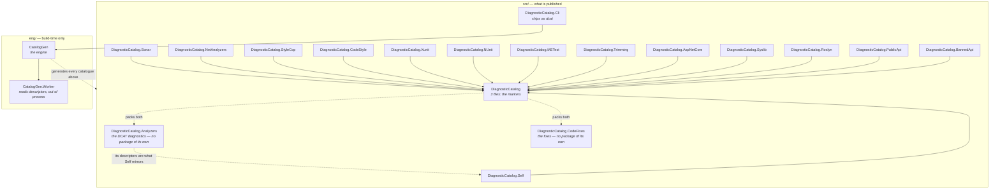

# Repository architecture

🌍 **Languages:**  
🇬🇧 English (this file) | 🇫🇷 [Français](./architecture.fr.md)

For anyone contributing, reviewing, or wondering why there are thirty projects for what sounds
like one idea. Every split here is forced by something; this page says by what.

## The map

`src/` is what reaches a consumer. `eng/` is build-time tooling that never ships as a package of its
own. `tests/` is ten projects: seven that assert, and three that exist to be compiled or read by them.
Which of the seven run on the .NET Framework CLR is a decision per project.

## Four splits, each forced

### The analyzers and the code fixes are two assemblies

Not a style choice. **RS1022 forbids Workspaces types inside an assembly that also declares
analyzers**, and the rule is not decorative: the command-line compiler loads analyzer assemblies
*without* Workspaces present, so an analyzer assembly reaching for `CodeFixProvider` risks failing to
load — and an analyzer that fails to load reports nothing, which reads exactly like a clean codebase.

So `DiagnosticCatalog.CodeFixes` exists to hold the Workspaces dependency, and it declares **no
release train**. Neither does `DiagnosticCatalog.Analyzers`, since
[ADR-0037](../adr/0037-ship-the-analyzers-inside-the-foundation-package.en.md): both assemblies are
packed into the `DiagnosticCatalog` package, under `analyzers/dotnet/cs/`, beside the `lib/` folder
that carries the markers. The projects, the assemblies and the namespaces keep their names — only
the second package identity is gone. Declaring a train on either would make it packable again and
give it a version nobody would ever reference.

Both were already on the `lib` train, so the split bought no independence: one tag shipped both, at
one number, forever. What it cost was a second name a consumer had to find, and thirteen catalogues
shipped with nothing checking their consumers. Folding them in makes *referencing a catalogue means
being checked* a property of the dependency graph that already exists — every catalogue depends on
the foundation and is forbidden from hiding it.

This is the one project shape [ADR-0007](../adr/0007-depend-across-trains-through-published-packages.en.md)
blesses for a `ProjectReference` — `DiagnosticCatalog` orders the build of both and packs their
output.

### The two analyzer classes

`DiagnosticRuleDefinitionAnalyzer` and `SuppressionUsageAnalyzer` are separate for a mechanical
reason: `ConfigureGeneratedCodeAnalysis` is per-**analyzer**, not per-diagnostic, and the two groups
need opposite settings.

| Analyzer | Diagnostics | Generated code |
| --- | --- | --- |
| `DiagnosticRuleDefinitionAnalyzer` | `DCAT0002`–`DCAT0005`, `DCAT0011`–`DCAT0013`, `DCAT0015` | **analysed** — a generated catalogue is what it exists to check |
| `SuppressionUsageAnalyzer` | `DCAT0001`, `DCAT0006`, `DCAT0007`, `DCAT0009`, `DCAT0014` | **skipped** — a suppression in a generated file is not the author's to fix |

Getting the flags backwards fails asymmetrically, which the code says out loud: on the use-site
analyzer it is loud — every generated file lights up — and on the definition analyzer it costs nothing
visible, because the analyzer simply goes quiet on exactly the files it exists for.

### The engine and the shell

`eng/CatalogGen` is the generation engine; `src/DiagnosticCatalog.Cli` is the command line that drives
it. The boundary is one type — `CatalogRun` — and one input record, `Job`.

Everything above the boundary is parsing a command line, reading a manifest, deciding where output
goes. Everything below is acquiring assemblies, reading descriptors, emitting C#. Keeping it that
narrow is what let the command line be replaced without the engine noticing, **which is exactly what
happened** when the hand-rolled parser gave way to Spectre.Console.Cli.

The engine targets `net8.0`, not `net10.0`, because the tool is floored there so one build installs on
.NET 8 and every newer major ([ADR-0017](../adr/0017-publish-the-generator-as-a-cli-on-its-own-release-train.en.md)).
A `net8.0` project cannot reference a `net10.0` one, so the engine sets the floor as much as the shell
does.

### The descriptor worker is a separate process

`CatalogGen.Worker` constructs analyzers and reads their descriptors, and it does so **out of
process**. Three properties follow, and none is available in-process:

* it rolls forward to the **latest installed major**, so the floor that makes `dcat` installable does
  not decide what it can read;
* it runs against **your analyzer's** dependency graph when it has one, so an analyzer compiled
  against a different Roslyn is read through its own;
* an analyzer whose construction **throws** takes the worker down and leaves `dcat` to say which one,
  rather than the whole run vanishing.

Constructing an analyzer is third-party code, and it is the one step here that can hang rather than
fail — which is why both spawned processes carry a budget.

## The self-application loop

`DiagnosticCatalog.Self` is the `DCAT` rules as a catalogue, generated by this repository's own
generator from this repository's own analyzers.

It runs **in one direction only**, and the reason is worth stating: `Self` is generated *from*
`Descriptors.cs`, so the analyzers cannot read their descriptors *from* `Self`. The first run would
have nothing to read, and every new rule would require editing, regenerating and only then compiling.

What replaces the loop is a check. CI regenerates `Self` on every pull request and fails if the
committed file differs — so a new `DCAT` id cannot ship without the catalogue that publishes it. The
guarantee is the same; which direction you can use is decided by which artifact is generated.
[Closing the loop with your own analyzer](first-party-analyzers.en.md) is the same question from a
consumer's side.

## Where each kind of check lives

The repository has four independent layers of verification, and they are separate because each reaches
something the others cannot.

| Layer | Reaches | Runs |
| --- | --- | --- |
| The C# build | Code style (`IDE*`), the Roslyn authoring rules (`RS*`), the public API surface | `dotnet build`; CI turns every warning into an error |
| `dotnet test` | Behaviour, packaging assumptions, the generated catalogues, and the documentation | `dotnet test -c Release` |
| The shell suite | `tools/`, which decides what a release publishes and which `dotnet test` cannot reach | `sh tools/tests/run.sh` |
| The lint workflow | Shell dialect and workflow YAML — the files no compiler reads | CI |

The third one is easy to miss and load-bearing: `tools/trains.sh` answers which projects a release
publishes, a project its discovery misses is silently absent from its own release, and none of that
shows up as a red build.

## The `eng/` layout

| File | What it does |
| --- | --- |
| `CatalogRun` | The engine's entry point, and the whole boundary with the shell |
| `Job` | One catalogue to generate: where its analyzers come from, where the result goes |
| `NuGetPackageSource`, `LocalPackageSource`, `NupkgReader` | Acquiring from a feed or from a `.nupkg` |
| `ProjectSource`, `SolutionSource`, `DotnetCli` | Acquiring from a project or a solution, through MSBuild evaluation |
| `LocalAssemblySource` | Acquiring from assemblies already on disk |
| `AnalyzerAssemblySet` | What the acquisition produced, whichever kind it was |
| `DependencyGraph`, `ChildProcess`, `DescriptorReader`, `DescriptorReadContract` | Handing the set to the worker and reading back what it declares |
| `RuleInfo`, `Naming`, `CatalogEmitter` | Turning descriptors into C# source, deterministically |
| `CatalogParser`, `CatalogueInspector` | Reading a catalogue back — `validate`, `list`, `explain` |
| `CatalogLanguages` | Which language's analyzers a package yields |

[Inside the generator](generator-internals.en.md) walks the path a run takes through them.

## Where to go next

* [**Inside the generator**](generator-internals.en.md) — the pipeline, step by step.
* [**Release trains**](release-trains.en.md) — how a project joins one, and the rule that follows.
* [**The testing strategy**](testing-strategy.en.md) — what each test project asserts,
  and which run on the .NET Framework CLR.

---

<a href="./README.en.md">↑ Table of contents</a> · <a href="./generator-internals.en.md">Inside the generator →</a>

