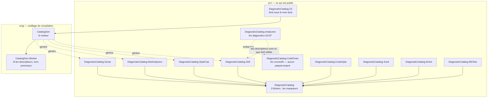

# Architecture du dépôt

🌍 **Langues :**  
🇬🇧 [English](./architecture.en.md) | 🇫🇷 Français (ce fichier)

Pour quiconque contribue, relit, ou se demande pourquoi il y a huit projets pour ce qui ressemble à
une seule idée. Chaque séparation ici est imposée par quelque chose ; cette page dit par quoi.

## La carte

`src/` est ce qui atteint un consommateur. `eng/` est de l'outillage de compilation qui n'est jamais
livré comme paquet. `tests/` compte sept projets, et lesquels tournent sur le CLR .NET Framework est
une décision par projet.

## Quatre séparations, toutes imposées

### Les analyseurs et les correctifs sont deux assemblages

Pas un choix de style. **RS1022 interdit les types Workspaces dans un assemblage qui déclare aussi des
analyseurs**, et la règle n'est pas décorative : le compilateur en ligne de commande charge les
assemblages d'analyseur *sans* Workspaces, si bien qu'un assemblage d'analyseur qui atteint
`CodeFixProvider` risque de ne pas se charger — et un analyseur qui ne se charge pas ne signale rien,
ce qui se lit exactement comme une base de code propre.

`DiagnosticCatalog.CodeFixes` existe donc pour porter la dépendance Workspaces, et il ne déclare
**aucun train de release** : l'assemblage est embarqué dans le paquet de `DiagnosticCatalog.Analyzers`
plutôt que publié seul. Déclarer un train le rendrait empaquetable et lui donnerait une version que
personne ne référencerait jamais.

C'est la seule forme de projet pour laquelle
[ADR-0007](../adr/0007-depend-across-trains-through-published-packages.fr.md) bénit une
`ProjectReference` — le projet analyseur ordonne la compilation et empaquette la sortie.

### Les deux classes d'analyseur

`DiagnosticRuleDefinitionAnalyzer` et `SuppressionUsageAnalyzer` sont séparés pour une raison
mécanique : `ConfigureGeneratedCodeAnalysis` est par **analyseur**, pas par diagnostic, et les deux
groupes ont besoin de réglages opposés.

| Analyseur | Diagnostics | Code généré |
| --- | --- | --- |
| `DiagnosticRuleDefinitionAnalyzer` | `DCAT0002`–`DCAT0005`, `DCAT0011`–`DCAT0013` | **analysé** — un catalogue généré est ce qu'il existe pour vérifier |
| `SuppressionUsageAnalyzer` | `DCAT0001`, `DCAT0006`, `DCAT0007`, `DCAT0009` | **ignoré** — une suppression dans un fichier généré n'est pas à l'auteur de la corriger |

Inverser les drapeaux échoue de façon asymétrique, ce que le code dit à voix haute : sur l'analyseur
de site d'utilisation c'est bruyant — chaque fichier généré s'allume — et sur l'analyseur de
déclaration cela ne coûte rien de visible, puisque l'analyseur se tait simplement sur exactement les
fichiers pour lesquels il existe.

### Le moteur et la coquille

`eng/CatalogGen` est le moteur de génération ; `src/DiagnosticCatalog.Cli` est la ligne de commande
qui le pilote. La frontière est un type — `CatalogRun` — et un enregistrement d'entrée, `Job`.

Tout ce qui est au-dessus de la frontière est analyse d'une ligne de commande, lecture d'un manifeste,
décision de la destination. Tout ce qui est en dessous est acquisition d'assemblages, lecture de
descripteurs, émission de C#. La garder aussi étroite est ce qui a permis de remplacer la ligne de
commande sans que le moteur s'en aperçoive, **ce qui est exactement arrivé** quand l'analyseur
d'arguments écrit à la main a cédé la place à Spectre.Console.Cli.

Le moteur cible `net8.0`, pas `net10.0`, parce que l'outil y est planché pour qu'une seule build
s'installe sur .NET 8 et tous les majeurs suivants
([ADR-0017](../adr/0017-publish-the-generator-as-a-cli-on-its-own-release-train.fr.md)). Un projet
`net8.0` ne peut pas référencer un projet `net10.0` : le moteur fixe donc le plancher autant que la
coquille.

### Le worker de descripteurs est un processus séparé

`CatalogGen.Worker` construit les analyseurs et lit leurs descripteurs, et il le fait **hors
processus**. Trois propriétés en découlent, et aucune n'est disponible en processus :

* il progresse jusqu'au **dernier majeur installé**, si bien que le plancher qui rend `dcat`
  installable ne décide pas de ce qu'il peut lire ;
* il s'exécute contre le graphe de dépendances de **votre analyseur** quand il en a un, si bien qu'un
  analyseur compilé contre un autre Roslyn est lu via le sien ;
* un analyseur dont la construction **lève** emporte le worker et laisse `dcat` dire lequel, plutôt
  que de faire disparaître toute l'exécution.

Construire un analyseur, c'est du code tiers, et c'est la seule étape ici qui peut se figer plutôt
qu'échouer — d'où le budget que portent les deux processus lancés.

## La boucle d'auto-application

`DiagnosticCatalog.Self` est le catalogue des règles `DCAT`, généré par le générateur de ce dépôt
depuis les analyseurs de ce dépôt.

Elle tourne **dans un seul sens**, et la raison mérite d'être dite : `Self` est généré *depuis*
`Descriptors.cs`, donc les analyseurs ne peuvent pas lire leurs descripteurs *dans* `Self`. La
première exécution n'aurait rien à lire, et chaque nouvelle règle exigerait d'éditer, de régénérer, et
seulement ensuite de compiler.

Ce qui remplace la boucle, c'est une vérification. La CI régénère `Self` à chaque pull request et
échoue si le fichier commité diffère — un nouvel identifiant `DCAT` ne peut donc pas sortir sans le
catalogue qui le publie. La garantie est la même ; le sens que l'on peut employer est décidé par
l'artefact qui est généré. [Boucler la boucle avec votre propre analyseur](first-party-analyzers.fr.md)
est la même question du côté d'un consommateur.

## Où vit chaque type de vérification

Le dépôt a quatre couches de vérification indépendantes, séparées parce que chacune atteint ce que les
autres ne peuvent pas.

| Couche | Atteint | Exécution |
| --- | --- | --- |
| La compilation C# | Le style de code (`IDE*`), les règles d'écriture d'analyseurs (`RS*`), la surface d'API publique | `dotnet build` ; la CI transforme chaque warning en erreur |
| `dotnet test` | Le comportement, les hypothèses d'empaquetage, les catalogues générés, et la documentation | `dotnet test -c Release` |
| La suite shell | `tools/`, qui décide de ce qu'une release publie et que `dotnet test` ne peut pas atteindre | `sh tools/tests/run.sh` |
| Le workflow lint | Le dialecte shell et le YAML des workflows — les fichiers qu'aucun compilateur ne lit | CI |

La troisième est facile à oublier et porteuse : `tools/trains.sh` répond aux projets qu'une release
publie, un projet que sa découverte manque est silencieusement absent de sa propre release, et rien de
tout cela n'apparaît en build rouge.

## La disposition de `eng/`

| Fichier | Ce qu'il fait |
| --- | --- |
| `CatalogRun` | Le point d'entrée du moteur, et toute la frontière avec la coquille |
| `Job` | Un catalogue à générer : d'où viennent ses analyseurs, où va le résultat |
| `NuGetPackageSource`, `LocalPackageSource`, `NupkgReader` | Acquérir depuis un flux ou depuis un `.nupkg` |
| `ProjectSource`, `SolutionSource`, `DotnetCli` | Acquérir depuis un projet ou une solution, par évaluation MSBuild |
| `LocalAssemblySource` | Acquérir depuis des assemblages déjà sur disque |
| `AnalyzerAssemblySet` | Ce que l'acquisition a produit, quel qu'en soit le type |
| `DependencyGraph`, `ChildProcess`, `DescriptorReader`, `DescriptorReadContract` | Remettre l'ensemble au worker et relire ce qu'il déclare |
| `RuleInfo`, `Naming`, `CatalogEmitter` | Transformer des descripteurs en source C#, de façon déterministe |
| `CatalogParser`, `CatalogueInspector` | Relire un catalogue — `validate`, `list`, `explain` |
| `CatalogLanguages` | Les analyseurs de quel langage un paquet livre |

[Dans le générateur](generator-internals.fr.md) parcourt le chemin qu'une exécution prend à travers
eux.

## Où aller ensuite

* [**Dans le générateur**](generator-internals.fr.md) — le pipeline, étape par étape.
* [**Les trains de release**](release-trains.fr.md) — comment un projet en rejoint un, et la règle qui
  s'ensuit.
* [**La stratégie de test**](testing-strategy.fr.md) — ce que chacun des sept projets de test asserte,
  et lesquels tournent sur le CLR .NET Framework.

---

<a href="./glossary.fr.md">← Glossaire</a> · <a href="./README.fr.md">↑ Table des matières</a> · <a href="./generator-internals.fr.md">Dans le générateur →</a>

