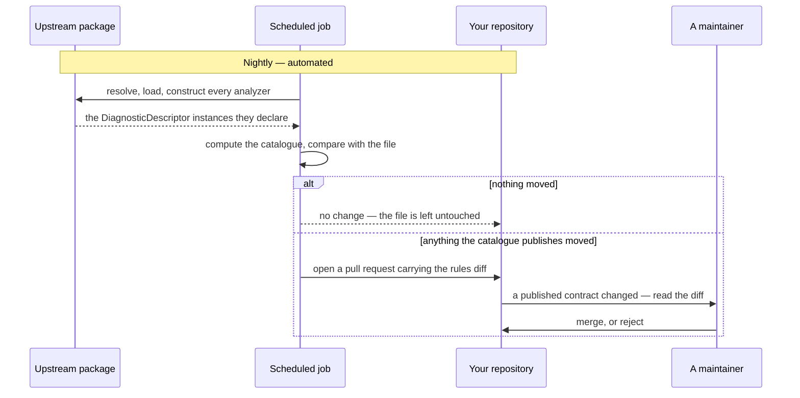

# Keeping a catalogue current

🌍 **Languages:**  
🇬🇧 English (this file) | 🇫🇷 [Français](./ci-integration.fr.md)

For anyone who publishes a catalogue that mirrors somebody else's analyzer. A catalogue is a
snapshot, it goes stale, and staleness is the failure with no symptom — so this is the one part of
the pipeline worth building deliberately.

## The problem this solves

Upstream recategorises a rule. Your catalogue still says the old value. Every consumer inlines it,
every build passes, every suppression keeps working — and every one of them now carries a category
the vendor does not use.

Nothing reports it. Not a compiler, not an analyzer, not a test in your repository or theirs. The
compile-time checks (the `DCAT` diagnostics) verify that a catalogue is well formed and correctly
used; none of them can verify that it is still **true**, because that needs the vendor's package and
a compiler has no business fetching one.

That is what `dcat validate` is for, and why it belongs in a schedule rather than in a build.

## The loop



**The job opens a pull request; it does not merge one.** That is a decision rather than an omission.
An id or a category that moved upstream is a change to a *published contract*, and because nothing
validates a suppression's category, a wrong value merged unreviewed would stay invisible for as long
as it existed. Automation finds the change; a human accepts it.

## Two jobs, two questions

| | Runs | Asks | On failure |
| --- | --- | --- | --- |
| **On every pull request** | `dcat validate --manifest …` against the **pinned** version | "does the committed file match the source it claims?" | The commit changed the catalogue by hand, or forgot to regenerate. |
| **Nightly** | `dcat generate --manifest …` against `latest` | "has upstream moved?" | Nothing — a difference opens a pull request. |

The first is a guard: it makes hand-editing a generated file impossible to merge. The second is a
sensor: its job is to notice, not to fail.

## Reading the exit codes

This is where a pipeline is usually got wrong.

```bash
dcat validate --manifest eng/catalogs.json
case $? in
  0) echo "current" ;;
  2) echo "::error::the catalogue no longer matches its source"; exit 1 ;;
  1) echo "::warning::could not check — the source would not resolve"; exit 0 ;;
  *) exit 1 ;;
esac
```

**`1` and `2` are different failures and must be handled differently.** `2` is a drifted contract and
should be loud. `1` is "I could not tell" — a feed outage, an expired credential, a rate limit — and
treating it as a drift produces a red build nobody can act on, which is how a check stops being read.

Treating `1` as *success* is equally wrong on the pull-request job, where a source that will not
resolve means the guard did not run. Warn, and let the job's own required-status configuration decide.

## The nightly job

Copy-pasteable, for GitHub Actions. The shape matters more than the syntax.

```yaml
name: nightly-catalogs

on:
  schedule:
    - cron: '17 3 * * *'
  workflow_dispatch:

permissions:
  contents: read

jobs:
  regenerate:
    runs-on: ubuntu-latest
    permissions:
      contents: write
      pull-requests: write
    steps:
      - uses: actions/checkout@v4

      - name: Build the projects the manifest reads
        run: dotnet build -c Release

      - name: Regenerate, and report what moved
        run: |
          dotnet tool install --global DiagnosticCatalog.Cli
          dcat generate --manifest eng/catalogs.json --summary "$RUNNER_TEMP/summary.md"

      - name: Open a pull request if anything changed
        uses: peter-evans/create-pull-request@v6
        with:
          branch: catalogs/nightly
          title: 'chore: refresh the catalogues'
          body-path: ${{ runner.temp }}/summary.md
```

Four things in it are load-bearing:

* **`dotnet build` first.** `dcat` reads; it does not build. A manifest entry naming `projects` or
  `solution` needs the output to exist, and the tool will say so rather than build on your behalf.
* **`--summary` into the pull request body.** A diff of four hundred generated lines is not reviewable;
  "three rules recategorised, one retired" is. That report is what makes the human step real rather
  than ceremonial.
* **A stable branch name.** The next night's run updates the same pull request instead of opening a
  second one.
* **A quiet night produces nothing.** The generator compares its own previous output and leaves the
  file untouched when nothing moved, `generatedOn` stamp included — so there is no diff, no pull
  request, and no notification. That is what keeps the ones you do get worth reading.

## The pull-request guard

```yaml
      - name: The committed catalogues match their sources
        run: dcat validate --manifest eng/catalogs.json
```

Short, and worth more than its length. Without it, a generated file is a file somebody can edit — and
a hand-edited catalogue is a catalogue whose next regeneration silently reverts the edit, or keeps it
and diverges from the source forever.

This repository runs the same guard on itself for `DiagnosticCatalog.Self`: CI regenerates it on every
pull request and fails if the result differs from what is committed, so a new `DCAT` id cannot ship
without the catalogue that publishes it.

## What to do with a drift pull request

The summary tells you which kind you have, and they are not equally urgent.

| What moved | What it means for your consumers | Version |
| --- | --- | --- |
| A rule **added** | Nothing breaks. They gain a constant. | minor |
| A rule **retired** | Carried forward as `[Obsolete]`; they get `CS0618` naming the rule. | minor |
| A rule **recategorised** | **Their inlined value is now wrong** until they recompile — and nothing tells them. | minor, and say so in the release notes |
| A rule **retitled** | Documentation only; the XML comment changes. | patch |

The third row is the one to write a release note for. SemVer does not force you to, because nothing
breaks — and "nothing breaks" is precisely the property that makes it invisible.

## Where to go next

* [**The `dcat` reference**](dcat-reference.en.md) — every exit code, and the timeouts a CI job should
  know about.
* [**The catalogue manifest**](catalogs-manifest.en.md) — the file both jobs read.
* [**Versioning a catalogue**](versioning-a-catalogue.en.md) — what each kind of drift does to your
  version number.

---

<div align="center">
<a href="./catalogs-manifest.en.md">← The catalogue manifest</a> · <a href="./README.en.md">↑ Table of contents</a> · <a href="./diagnostics.en.md">The DCAT diagnostics →</a>
</div>
