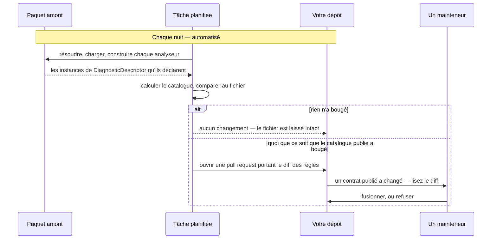

# Tenir un catalogue à jour

🌍 **Langues :**  
🇬🇧 [English](./ci-integration.en.md) | 🇫🇷 Français (ce fichier)

Pour quiconque publie un catalogue qui reflète l'analyseur de quelqu'un d'autre. Un catalogue est un
instantané, il se périme, et la péremption est la défaillance sans symptôme — c'est donc la partie du
pipeline qui vaut d'être construite délibérément.

## Le problème que cela résout

L'amont recatégorise une règle. Votre catalogue affiche encore l'ancienne valeur. Chaque consommateur
l'incorpore, chaque build passe, chaque suppression continue de fonctionner — et chacune porte
désormais une catégorie que l'éditeur n'emploie pas.

Rien ne le signale. Ni un compilateur, ni un analyseur, ni un test chez vous ou chez eux. Les
vérifications de compilation (les diagnostics `DCAT`) attestent qu'un catalogue est bien formé et
correctement employé ; aucune ne peut attester qu'il est encore **vrai**, parce que cela demande le
paquet de l'éditeur et qu'un compilateur n'a pas à en télécharger un.

C'est à cela que sert `dcat validate`, et c'est pourquoi il relève d'une planification plutôt que d'un
build.

## La boucle



**La tâche ouvre une pull request ; elle n'en fusionne pas.** C'est une décision et non un oubli. Un
identifiant ou une catégorie qui a bougé en amont est un changement de *contrat publié*, et comme rien
ne valide la catégorie d'une suppression, une valeur fausse fusionnée sans relecture resterait
invisible aussi longtemps qu'elle existerait. L'automatisation trouve le changement ; un humain
l'accepte.

## Deux tâches, deux questions

| | Exécute | Demande | En cas d'échec |
| --- | --- | --- | --- |
| **À chaque pull request** | `dcat validate --manifest …` contre la version **fixée** | « le fichier commité correspond-il à la source qu'il annonce ? » | Le commit a modifié le catalogue à la main, ou a oublié de régénérer. |
| **Chaque nuit** | `dcat generate --manifest …` contre `latest` | « l'amont a-t-il bougé ? » | Rien — une différence ouvre une pull request. |

La première est un garde-fou : elle rend impossible la fusion d'un fichier généré édité à la main. La
seconde est un capteur : son travail est de remarquer, pas d'échouer.

## Lire les codes de sortie

C'est là qu'un pipeline se rate d'ordinaire.

```bash
dcat validate --manifest eng/catalogs.json
case $? in
  0) echo "current" ;;
  2) echo "::error::the catalogue no longer matches its source"; exit 1 ;;
  1) echo "::warning::could not check — the source would not resolve"; exit 0 ;;
  *) exit 1 ;;
esac
```

**`1` et `2` sont deux échecs différents et doivent être traités différemment.** `2` est un contrat qui
a dérivé et doit être bruyant. `1` signifie « je n'ai pas pu conclure » — panne de flux, identifiant
expiré, limite de débit — et le traiter comme une dérive produit un build rouge sur lequel personne ne
peut agir, ce qui est la façon dont une vérification cesse d'être lue.

Traiter `1` comme un *succès* est tout aussi faux sur la tâche de pull request, où une source qui ne
résout pas signifie que le garde-fou n'a pas tourné. Avertissez, et laissez la configuration des
statuts requis décider.

## La tâche nocturne

Copiable telle quelle, pour GitHub Actions. La forme compte plus que la syntaxe.

```yaml
name: nightly-catalogs

on:
  schedule:
    - cron: '17 3 * * *'
  workflow_dispatch:

permissions:
  contents: read

jobs:
  regenerate:
    runs-on: ubuntu-latest
    permissions:
      contents: write
      pull-requests: write
    steps:
      - uses: actions/checkout@v4

      - name: Build the projects the manifest reads
        run: dotnet build -c Release

      - name: Regenerate, and report what moved
        run: |
          dotnet tool install --global DiagnosticCatalog.Cli
          dcat generate --manifest eng/catalogs.json --summary "$RUNNER_TEMP/summary.md"

      - name: Open a pull request if anything changed
        uses: peter-evans/create-pull-request@v6
        with:
          branch: catalogs/nightly
          title: 'chore: refresh the catalogues'
          body-path: ${{ runner.temp }}/summary.md
```

Quatre choses y sont porteuses :

* **`dotnet build` d'abord.** `dcat` lit ; il ne construit pas. Une entrée de manifeste nommant
  `projects` ou `solution` a besoin que la sortie existe, et l'outil le dira plutôt que de construire
  à votre place.
* **`--summary` dans le corps de la pull request.** Un diff de quatre cents lignes générées n'est pas
  relisible ; « trois règles recatégorisées, une retirée » l'est. Ce rapport est ce qui rend l'étape
  humaine réelle plutôt que cérémonielle.
* **Un nom de branche stable.** L'exécution de la nuit suivante met à jour la même pull request au lieu
  d'en ouvrir une seconde.
* **Une nuit calme ne produit rien.** Le générateur compare sa propre sortie précédente et laisse le
  fichier intact quand rien n'a bougé, estampille `generatedOn` comprise — donc aucun diff, aucune
  pull request, aucune notification. C'est ce qui maintient la valeur de celles que vous recevez.

## Le garde-fou de pull request

```yaml
      - name: The committed catalogues match their sources
        run: dcat validate --manifest eng/catalogs.json
```

Court, et il vaut plus que sa longueur. Sans lui, un fichier généré est un fichier que quelqu'un peut
éditer — et un catalogue édité à la main est un catalogue dont la prochaine régénération annule
silencieusement l'édition, ou la conserve et diverge de la source pour toujours.

Ce dépôt s'applique le même garde-fou pour `DiagnosticCatalog.Self` : la CI le régénère à chaque pull
request et échoue si le résultat diffère de ce qui est commité, si bien qu'un nouvel identifiant
`DCAT` ne peut pas sortir sans le catalogue qui le publie.

## Que faire d'une pull request de dérive

Le résumé vous dit de quel type il s'agit, et ils ne sont pas également urgents.

| Ce qui a bougé | Ce que cela signifie pour vos consommateurs | Version |
| --- | --- | --- |
| Une règle **ajoutée** | Rien ne casse. Ils gagnent une constante. | mineur |
| Une règle **retirée** | Reportée en `[Obsolete]` ; ils obtiennent `CS0618` nommant la règle. | mineur |
| Une règle **recatégorisée** | **Leur valeur incorporée est désormais fausse** jusqu'à recompilation — et rien ne le leur dit. | mineur, et dites-le dans les notes de version |
| Une règle **retitrée** | Documentation seulement ; le commentaire XML change. | correctif |

La troisième ligne est celle qui mérite une note de version. Le SemVer ne vous y oblige pas, parce que
rien ne casse — et « rien ne casse » est précisément la propriété qui la rend invisible.

## Où aller ensuite

* [**La référence `dcat`**](dcat-reference.fr.md) — chaque code de sortie, et les délais qu'une tâche
  de CI doit connaître.
* [**Le manifeste de catalogues**](catalogs-manifest.fr.md) — le fichier que les deux tâches lisent.
* [**Versionner un catalogue**](versioning-a-catalogue.fr.md) — ce que chaque type de dérive fait à
  votre numéro de version.

---

<div align="center">
<a href="./catalogs-manifest.fr.md">← Le manifeste de catalogues</a> · <a href="./README.fr.md">↑ Table des matières</a> · <a href="./diagnostics.fr.md">Les diagnostics DCAT →</a>
</div>
