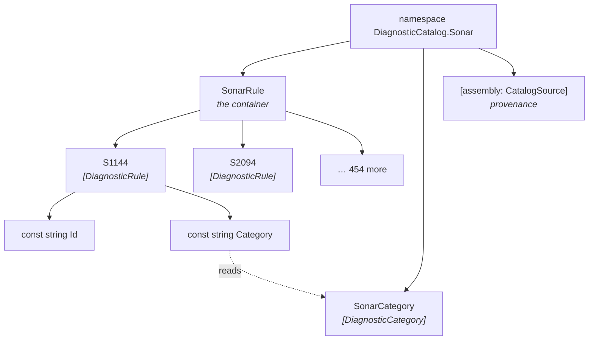
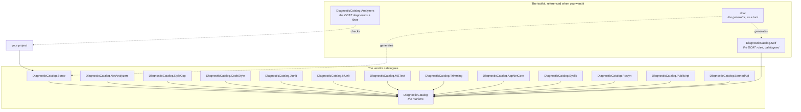

# Core concepts

🌍 **Languages:**  
🇬🇧 English (this file) | 🇫🇷 [Français](./concepts.fr.md)

<!-- dcat-doc:missing SonarRule.S1144Id the naming shape this design declined; shown to be rejected -->

For anyone about to read the rest of the documentation. Five words and one package map; everything
else here builds on them.

## The five words

| Word | What it is |
| --- | --- |
| **rule** | One analyzer diagnostic, expressed as a static class holding `const string Id` and `const string Category`. |
| **catalogue** | An assembly full of rules, describing one analyzer. `DiagnosticCatalog.Sonar` is one. |
| **container** | The class the rules are nested in, and therefore the first word of every use site: `SonarRule.S1144`. |
| **category class** | A class of `const string` category values, so the same category is written once rather than in every rule. |
| **provenance** | An assembly-level record of which upstream release a catalogue mirrors, and when it was generated. |

## A rule is a class, not an entry

The thing that surprises people is that a rule is a **type**, not a row in a table or a key in a
file:

```csharp
[DiagnosticRule]
public static class S1144
{
    public const string Id = nameof(S1144);
    public const string Category = SonarCategory.MajorCodeSmell;
}
```

That shape is forced by what it has to do. An attribute argument must be a **compile-time constant**
— that is a C# rule, not a design choice — so the values have to be `const`. A `const` lives on a
type. Give each rule its own type and `S1144.Id` reads as one thing; put them all on one type and
you get `SonarRule.S1144Id`, a naming convention rather than a structure.

`static` because nothing instantiates a rule. `const` and not `static readonly` because a
`static readonly` field has a value at run time and cannot be an attribute argument — which is the
mistake people make first, and the reason `DCAT0003` exists.

Why the contract is *structural* — a marker attribute and two constants, rather than an interface or
a base class — is [ADR-0008](../adr/0008-express-a-rule-as-a-marked-static-class-of-constants.en.md).
The short version: a `const` cannot be declared by an interface, so there was never an inheritance
answer available.

## How the pieces nest



The container is what your use sites pay for, twice per suppression, so it is named for reading
rather than for filing: `SonarRule.S1144`, singular — one rule, named. Not `SonarRules`, and not
`SonarAnalyzerDiagnosticRuleDefinitions`.

The category class is worth its own line because of scale. The Sonar catalogue spends 456 rule
declarations on **13** distinct categories; writing the literal in each rule would be 456 chances for
one of them to drift. The indirection costs nothing — a `const` initialised from another `const` is
still a compile-time constant, and still folds to `"Major Code Smell"` in the compiled assembly.

## The packages, and what each one is for



**`DiagnosticCatalog`** carries three attributes and nothing else: `[DiagnosticRule]`,
`[DiagnosticCategory]`, `[assembly: CatalogSource]`. You reference it to declare a catalogue of your
own. A catalogue you consume references it for you.

**The vendor catalogues** are constants. Referencing one gives you compile-checked references
to that analyzer's rules — which is the whole guarantee, and it comes from the C# compiler rather
than from anything this library runs.

**`DiagnosticCatalog.Analyzers`** is the extra: diagnostics that find the suppressions you have
*not* migrated, catch a pair naming two different rules, and offer the fixes that rewrite them. It
is genuinely additional rather than foundational — see the next section.

**`DiagnosticCatalog.Self`** is the `DCAT` rules as a catalogue, so that suppressing one of this
library's own diagnostics is a checked reference too.

**`dcat`** is the generator as a .NET tool. It reads an analyzer's assemblies and writes a
catalogue — the same way the thirteen vendor catalogues in this repository are written.

## What you get today, exactly

This is where the documentation has to be precise, because the packages ship on independent trains
and are not all out yet.

| Reference | What you get |
| --- | --- |
| a vendor catalogue | Compile-checked constants. A misspelled rule is `CS0117`. A retired rule is `CS0618`. Rename and *Find All References* work. |
| a vendor catalogue **on its own** | That, and nothing else. A catalogue depends on the foundation and never on `DiagnosticCatalog.Analyzers`: the checking is a choice its consumer makes, not one the catalogue makes for them. |
| `DiagnosticCatalog.Analyzers`, referenced beside it | `DCAT0006` on every literal suppression it can replace, with a fix; `DCAT0001` on a mismatched pair; `DCAT0007` on a half-migrated one; `DCAT0009` on a trimmer suppression the trimmer will discard. |

The distinction matters more than a footnote. **The core guarantee needs no analyzer**: it is the
compiler resolving a member. What the analyzer package adds is *finding the code that has not been
converted yet*, which is a migration aid rather than the mechanism.

[The packages](https://github.com/Reefact/diagnostic-catalog#-the-packages) in the repository README states what each
one is for, and which train carries it.

## Provenance: a catalogue is a snapshot

A catalogue that mirrors somebody else's analyzer describes one release of it. Nothing in a compiled
assembly would otherwise say which, so the generator records it:

```csharp
[assembly: CatalogSource(
    source:        "SonarAnalyzer.CSharp",
    sourceVersion: "10.31.0.145097",
    generatedOn:   "2026-07-31")]
```

The date is a `string` for the same reason everything else here is: an attribute argument must be a
compile-time constant, and no date type can be one.

Two consequences follow, and both shape how catalogues are versioned:

* **A catalogue's version is its own.** It follows the vendor's pace, not the foundation's, which is
  why each rides a separate release train
  ([ADR-0015](../adr/0015-a-catalogues-version-runs-on-its-own-line.en.md)).
* **A rule is never deleted.** Constants are inlined into *your* assembly at *your* compile time, so
  removing one breaks your recompilation with a `CS0117` that names nothing useful. A retired rule is
  kept and marked `[Obsolete]` instead
  ([ADR-0010](../adr/0010-carry-a-retired-rule-forward-as-obsolete.en.md)).

## Where to go next

* [**When not to use this**](when-not-to-use.en.md) — the cases where the ceremony is not worth it.
* [**Writing suppressions that the compiler checks**](writing-suppressions.en.md) — the practical
  guide, including aliases and adoption.
* [**Publishing a catalogue**](authoring-a-catalogue.en.md) — if you own the analyzer, or the rules.

---

<div align="center">
<a href="./the-problem.en.md">← Why magic strings fail</a> · <a href="./README.en.md">↑ Table of contents</a> · <a href="./when-not-to-use.en.md">When not to use this →</a>
</div>
