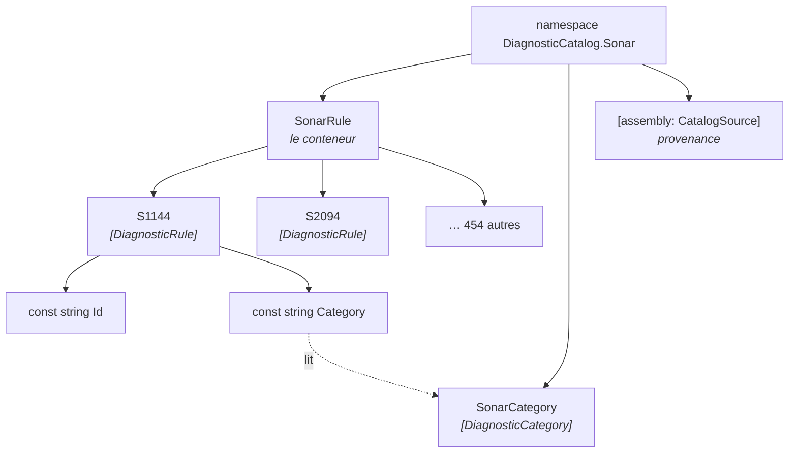
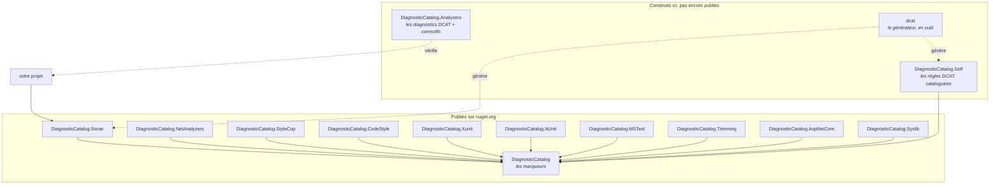

# Concepts

🌍 **Langues :**  
🇬🇧 [English](./concepts.en.md) | 🇫🇷 Français (ce fichier)

<!-- dcat-doc:missing SonarRule.S1144Id la forme de nommage que cette conception a écartée ; montrée pour être rejetée -->

Pour quiconque s'apprête à lire le reste de la documentation. Cinq mots et une carte des paquets ;
tout le reste s'appuie dessus.

## Les cinq mots

| Mot | Ce que c'est |
| --- | --- |
| **règle** | Un diagnostic d'analyseur, exprimé en classe statique portant `const string Id` et `const string Category`. |
| **catalogue** | Un assemblage plein de règles, décrivant un analyseur. `DiagnosticCatalog.Sonar` en est un. |
| **conteneur** | La classe dans laquelle les règles sont imbriquées, et donc le premier mot de chaque site d'utilisation : `SonarRule.S1144`. |
| **classe de catégories** | Une classe de valeurs de catégorie en `const string`, pour qu'une même catégorie s'écrive une fois plutôt que dans chaque règle. |
| **provenance** | Un enregistrement, au niveau de l'assemblage, de la version amont qu'un catalogue reflète et de sa date de génération. |

## Une règle est une classe, pas une entrée

Ce qui surprend, c'est qu'une règle est un **type**, pas une ligne d'un tableau ni une clé d'un
fichier :

```csharp
[DiagnosticRule]
public static class S1144
{
    public const string Id = nameof(S1144);
    public const string Category = SonarCategory.MajorCodeSmell;
}
```

Cette forme est imposée par ce qu'elle doit faire. Un argument d'attribut doit être une **constante
de compilation** — c'est une règle de C#, pas un choix de conception — donc les valeurs doivent être
`const`. Une `const` vit sur un type. Donnez à chaque règle son propre type et `S1144.Id` se lit
comme une seule chose ; mettez-les toutes sur un type et vous obtenez `SonarRule.S1144Id`, une
convention de nommage plutôt qu'une structure.

`static` parce que rien n'instancie une règle. `const` et non `static readonly` parce qu'un champ
`static readonly` a une valeur à l'exécution et ne peut pas être un argument d'attribut — ce qui est
l'erreur que l'on commet en premier, et la raison d'être de `DCAT0003`.

Pourquoi le contrat est *structurel* — un attribut marqueur et deux constantes, plutôt qu'une
interface ou une classe de base — c'est
[ADR-0008](../adr/0008-express-a-rule-as-a-marked-static-class-of-constants.fr.md). En bref : une
`const` ne peut pas être déclarée par une interface, donc il n'y a jamais eu de réponse par héritage
disponible.

## Comment les pièces s'imbriquent



Le conteneur est ce que vos sites d'utilisation paient, deux fois par suppression : il est donc nommé
pour la lecture plutôt que pour le classement. `SonarRule.S1144`, au singulier — une règle, nommée.
Pas `SonarRules`, et pas `SonarAnalyzerDiagnosticRuleDefinitions`.

La classe de catégories mérite sa ligne à cause de l'échelle. Le catalogue Sonar dépense 456
déclarations de règles sur **13** catégories distinctes ; écrire le littéral dans chaque règle, ce
serait 456 occasions pour l'une d'elles de dériver. L'indirection ne coûte rien — une `const`
initialisée depuis une autre `const` reste une constante de compilation, et se replie toujours en
`"Major Code Smell"` dans l'assemblage compilé.

## Les paquets, et à quoi sert chacun



**`DiagnosticCatalog`** porte trois attributs et rien d'autre : `[DiagnosticRule]`,
`[DiagnosticCategory]`, `[assembly: CatalogSource]`. Vous le référencez pour déclarer un catalogue à
vous. Un catalogue que vous consommez le référence pour vous.

**Les dix catalogues d'éditeurs** sont des constantes. En référencer un vous donne des références
vérifiées à la compilation vers les règles de cet analyseur — ce qui est toute la garantie, et elle
vient du compilateur C# plutôt que de quoi que ce soit que cette bibliothèque exécute.

**`DiagnosticCatalog.Analyzers`** est le supplément : des diagnostics qui trouvent les suppressions
que vous n'avez *pas* migrées, attrapent une paire nommant deux règles différentes, et proposent les
correctifs qui les réécrivent. C'est réellement un supplément et non un fondement — voir la section
suivante.

**`DiagnosticCatalog.Self`** est le catalogue des règles `DCAT`, pour que supprimer l'un des
diagnostics de cette bibliothèque soit aussi une référence vérifiée.

**`dcat`** est le générateur en outil .NET. Il lit les assemblages d'un analyseur et écrit un
catalogue — de la même façon que les dix catalogues d'éditeurs de ce dépôt sont écrits.

## Ce que vous obtenez aujourd'hui, exactement

C'est ici que la documentation doit être précise, parce que les paquets partent sur des trains
indépendants et ne sont pas tous sortis.

| Référence | Ce que vous obtenez |
| --- | --- |
| un catalogue d'éditeur | Des constantes vérifiées à la compilation. Une règle mal orthographiée donne `CS0117`. Une règle retirée donne `CS0618`. Le renommage et *Rechercher toutes les références* fonctionnent. |
| un catalogue d'éditeur **aujourd'hui** | Cela, et rien d'autre. Le catalogue n'apporte pas `DiagnosticCatalog.Analyzers`, parce que ce paquet n'a aucune version sur nuget.org vers laquelle pointer ([ADR-0007](../adr/0007-depend-across-trains-through-published-packages.fr.md)). |
| `DiagnosticCatalog.Analyzers`, une fois publié | `DCAT0006` sur chaque suppression littérale qu'il peut remplacer, avec correctif ; `DCAT0001` sur une paire incohérente ; `DCAT0007` sur une paire à moitié migrée ; `DCAT0009` sur une suppression que le *trimmer* jettera. |

La distinction compte plus qu'une note de bas de page. **La garantie de fond n'a besoin d'aucun
analyseur** : c'est le compilateur qui résout un membre. Ce que le paquet d'analyseurs ajoute, c'est
*trouver le code qui n'a pas encore été converti*, ce qui est une aide à la migration plutôt que le
mécanisme.

[L'état du projet](https://github.com/Reefact/diagnostic-catalog#-project-status) dans le README du
dépôt est la réponse à jour, et il bouge quand un train est taggé.

## Provenance : un catalogue est un instantané

Un catalogue qui reflète l'analyseur de quelqu'un d'autre décrit une de ses versions. Rien, dans un
assemblage compilé, ne dirait autrement laquelle ; le générateur l'enregistre donc :

```csharp
[assembly: CatalogSource(
    source:        "SonarAnalyzer.CSharp",
    sourceVersion: "10.31.0.145097",
    generatedOn:   "2026-07-31")]
```

La date est une `string` pour la même raison que tout le reste ici : un argument d'attribut doit être
une constante de compilation, et aucun type de date ne peut en être une.

Deux conséquences en découlent, et toutes deux façonnent le versionnement des catalogues :

* **La version d'un catalogue est la sienne.** Elle suit le rythme de l'éditeur, pas celui de la
  fondation, d'où un train de release séparé pour chacun
  ([ADR-0015](../adr/0015-a-catalogues-version-runs-on-its-own-line.fr.md)).
* **Une règle n'est jamais supprimée.** Les constantes sont incorporées dans *votre* assemblage à
  *votre* compilation : en retirer une casse votre recompilation avec un `CS0117` qui ne nomme rien
  d'utile. Une règle retirée est conservée et marquée `[Obsolete]`
  ([ADR-0010](../adr/0010-carry-a-retired-rule-forward-as-obsolete.fr.md)).

## Où aller ensuite

* [**Quand ne pas s'en servir**](when-not-to-use.fr.md) — les cas où la cérémonie n'en vaut pas la
  peine.
* [**Écrire des suppressions que le compilateur vérifie**](writing-suppressions.fr.md) — le guide
  pratique, alias et adoption compris.
* [**Publier un catalogue**](authoring-a-catalogue.fr.md) — si vous possédez l'analyseur, ou les
  règles.

---

<div align="center">
<a href="./the-problem.fr.md">← Pourquoi les chaînes magiques échouent</a> · <a href="./README.fr.md">↑ Table des matières</a> · <a href="./when-not-to-use.fr.md">Quand ne pas s'en servir →</a>
</div>
