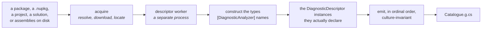
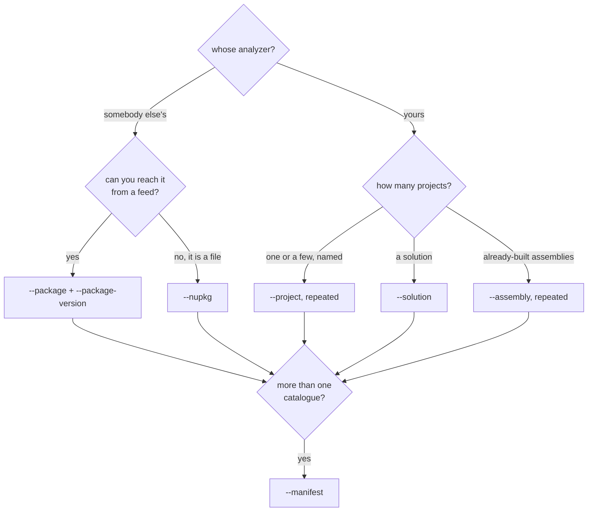

# The `dcat` tool

🌍 **Languages:**  
🇬🇧 English (this file) | 🇫🇷 [Français](./dcat.fr.md)

For anyone generating a catalogue rather than hand-writing one. What the tool does, which source to
point it at, and the one design decision that explains most of its behaviour.

> **From a clone as well.** `dcat` rides the `cli` train of its own
> ([ADR-0017](../adr/0017-publish-the-generator-as-a-cli-on-its-own-release-train.en.md)). Inside
> this repository, `dotnet run --project src/DiagnosticCatalog.Cli -- <args>` runs the same tool
> without installing it.

```bash
dotnet tool install --global DiagnosticCatalog.Cli
```

## Four verbs

| Command | What it does | Writes |
| --- | --- | --- |
| `generate` | Reads a source and writes the catalogue | the `.g.cs` file |
| `validate` | Everything `generate` does, and stops one step short | nothing |
| `list` | The rules a **compiled** catalogue publishes | nothing |
| `explain` | One rule, and the suppression that references it | nothing |

`generate` and `validate` take the same options and do the same work. The difference is the last
step, and it is what makes `validate` safe to run against a working copy: it restores nothing, writes
no `obj/`, and touches no output.

`list` and `explain` read a catalogue from the other end — a compiled assembly, reflection-only.
Nothing in it is executed: a catalogue declares everything it publishes as metadata constants, so
nothing has to run for them to be read, and a tool that loaded a stranger's assembly into its own
process to answer a question about its contents would be taking a licence it does not need.

## It reads descriptors, never documentation

This is the decision the rest follows from
([ADR-0009](../adr/0009-generate-catalog-content-from-analyzer-descriptors.en.md)).

`dcat` reads the analyzer assemblies' metadata for the types they mark with `[DiagnosticAnalyzer]`,
**constructs those**, and reads the `DiagnosticDescriptor` instances they actually declare. Not the
vendor's documentation site, not a rule-metadata JSON shipped beside the package.

Finding them by the attribute is how the compiler finds them, and the catalogue follows it rather
than reading every type the assembly declares
([ADR-0031](../adr/0031-find-analyzers-the-way-the-compiler-finds-them.en.md)). An analyzer the
attribute does not name is loaded by no host and reports in no build.



Rule metadata published as prose or as JSON drifts from what the analyzer does. And because nothing
in the platform validates a category, a value copied from documentation that had gone stale would
produce **no symptom anywhere** — which is the failure this whole library exists to remove, and would
be an odd one to build into its generator.

The same reasoning is why the tool **refuses rather than guesses**. If it cannot construct an
analyzer or load an assembly it was given, it emits nothing and exits non-zero. A catalogue missing a
rule is indistinguishable from one whose vendor retired it, and would publish that rule as
`[Obsolete]` — telling your users something false about somebody else's product.

## Choosing a source



**A package** is the common case for mirroring somebody else's rules. `dcat` resolves through NuGet's
own client, so it reads your `NuGet.config` hierarchy exactly as `dotnet restore` does and honours the
credentials configured there — a package on a private feed works with no extra flag
([ADR-0019](../adr/0019-resolve-packages-through-the-users-own-nuget-configuration.en.md)).

**A project** removes the `bin/Release/net8.0/` path from your manifest — the one part of a
declaration that says nothing about the catalogue and breaks when the project retargets or is renamed.
The source is recorded from what the project declares, not from the numbers stamped into the assembly.

**It reads; it does not build.** The project must already be built, and `dcat` says so — naming the
path it looked at and the `dotnet build` that would produce it — rather than building on your behalf.

## `--solution`, and why it needs a declaration

Point it at a solution and it reads the projects in it **that say they produce diagnostic rules**:

```xml
<PropertyGroup>
  <ProducesDiagnosticRules>true</ProducesDiagnosticRules>
</PropertyGroup>
```

Without that property, `--solution` finds nothing — and it will tell you so rather than emit an empty
catalogue.

The property is the feature, not a hoop. Deciding which of a solution's projects produce analyzers
cannot be inferred from the outside, and the numbers are not close. Measured on **this** repository:

| Heuristic | Projects matched | Actually an analyzer |
| --- | --- | --- |
| references `Microsoft.CodeAnalysis` | 8 | 1 |
| declares a `DiagnosticAnalyzer` subclass | 3 | 1 — the other two are fixtures, one written to *fail* construction, one in an assembly written not to load whole |

Reading the wrong set is not a nuisance here. A project missed means its rules are absent from the
catalogue, an absent rule is indistinguishable from a retired one, and they are published as
`[Obsolete]` — telling that vendor's users something false, with nothing anywhere to report it.

So nothing infers. A project joins by saying so, in its own file, exactly as a project joins a release
train by declaring `<ReleaseTrain>` and never by appearing in a list somewhere else.

**And a solution declaring none is refused, not read as empty.** Finding nothing, generating nothing
and exiting `0` would read to a scheduled job exactly like a catalogue that was current.

## Checking a catalogue is still true

`validate` answers the question no analyzer can answer for you.

```bash
dcat validate --manifest eng/catalogs.json
```

| Exit | Meaning |
| --- | --- |
| `0` | Current. |
| `2` | Out of date — regenerate. |
| `1` | Could not be checked: the source would not resolve. |

`1` and `2` are distinct **on purpose**, so a feed outage is never reported as a drifted contract.
That distinction is the whole value of the command in a pipeline —
[keeping a catalogue current](ci-integration.en.md) is what to do with it.

The `DCAT` diagnostics check that a catalogue is well formed and correctly used, at compile time, which
is the better place for those. None of them can check that it is still *current*: that needs the
vendor's package, and a compiler has no business fetching one.

## Reading a catalogue you did not generate

```bash
dcat list  ~/.nuget/packages/diagnosticcatalog.stylecop/0.2.1/lib/netstandard2.0/DiagnosticCatalog.StyleCop.dll
dcat explain <that same path> SA1000
```

```text
StyleCop.Analyzers.Unstable 1.2.0.556, generated 2026-07-31

id        SA1000
category  StyleCop.CSharp.SpacingRules
help      https://github.com/DotNetAnalyzers/StyleCopAnalyzers/blob/master/documentation/SA1000.md

[SuppressMessage(
    StyleCopRule.SA1000.Category,
    StyleCopRule.SA1000.Id,
    Justification = "…")]
```

The snippet is the point: it is the line to copy, fully qualified as you would write it. Both commands
state which upstream release the catalogue mirrors and when it was generated **before** answering,
because a catalogue is a snapshot and its age decides whether its answer can be trusted.

## Where to go next

* [**The `dcat` reference**](dcat-reference.en.md) — every command, every option, every exit code.
* [**The catalogue manifest**](catalogs-manifest.en.md) — declaring several catalogues in one file.
* [**Keeping a catalogue current**](ci-integration.en.md) — `validate` in a pipeline, and the nightly
  drift pull request.

---

<div align="center">
<a href="./packaging-a-catalogue.en.md">← Packaging a catalogue</a> · <a href="./README.en.md">↑ Table of contents</a> · <a href="./dcat-reference.en.md">The dcat reference →</a>
</div>
