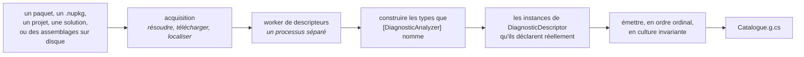
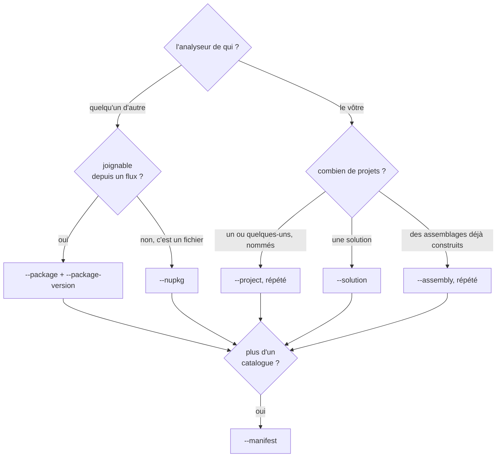

# L'outil `dcat`

🌍 **Langues :**  
🇬🇧 [English](./dcat.en.md) | 🇫🇷 Français (ce fichier)

Pour quiconque génère un catalogue plutôt que de l'écrire à la main. Ce que fait l'outil, quelle
source lui désigner, et la décision de conception qui explique l'essentiel de son comportement.

> **Pas encore sur nuget.org.** `dcat` est construit dans ce dépôt et roule sur le train `cli`
> ([ADR-0017](../adr/0017-publish-the-generator-as-a-cli-on-its-own-release-train.fr.md)) ; le prochain
> tag l'expédiera. D'ici là, `dotnet run --project src/DiagnosticCatalog.Cli -- <args>` exécute le
> même outil depuis un clone.

```bash
dotnet tool install --global DiagnosticCatalog.Cli
```

## Quatre verbes

| Commande | Ce qu'elle fait | Écrit |
| --- | --- | --- |
| `generate` | Lit une source et écrit le catalogue | le fichier `.g.cs` |
| `validate` | Tout ce que fait `generate`, et s'arrête une étape avant | rien |
| `list` | Les règles qu'un catalogue **compilé** publie | rien |
| `explain` | Une règle, et la suppression qui la référence | rien |

`generate` et `validate` prennent les mêmes options et font le même travail. La différence est la
dernière étape, et c'est ce qui rend `validate` sûr sur une copie de travail : il ne restaure rien,
n'écrit aucun `obj/`, et ne touche à aucune sortie.

`list` et `explain` lisent un catalogue par l'autre bout — un assemblage compilé, en réflexion seule.
Rien n'y est exécuté : un catalogue déclare tout ce qu'il publie en constantes de métadonnées, donc
rien n'a besoin de tourner pour qu'on les lise, et un outil qui chargerait l'assemblage d'un inconnu
dans son propre processus pour répondre à une question sur son contenu prendrait une licence dont il
n'a pas besoin.

## Il lit des descripteurs, jamais de la documentation

C'est la décision d'où découle le reste
([ADR-0009](../adr/0009-generate-catalog-content-from-analyzer-descriptors.fr.md)).

`dcat` lit les métadonnées des assemblages d'analyseur pour y trouver les types qu'ils marquent
`[DiagnosticAnalyzer]`, **construit ceux-là**, et lit les instances de `DiagnosticDescriptor` qu'ils
déclarent réellement. Pas le site de documentation de l'éditeur, pas un JSON de métadonnées livré à
côté du paquet.

Les trouver par l'attribut, c'est ainsi que le compilateur les trouve, et le catalogue le suit plutôt
que de lire chaque type que l'assemblage déclare
([ADR-0031](../adr/0031-find-analyzers-the-way-the-compiler-finds-them.fr.md)). Un analyseur que
l'attribut ne nomme pas n'est chargé par aucun hôte et ne signale rien dans aucun build.



Des métadonnées de règles publiées en prose ou en JSON dérivent de ce que l'analyseur fait. Et comme
rien dans la plateforme ne valide une catégorie, une valeur copiée d'une documentation devenue
obsolète ne produirait **aucun symptôme nulle part** — c'est-à-dire la défaillance que toute cette
bibliothèque existe pour éliminer, et qu'il serait étrange d'intégrer à son générateur.

Le même raisonnement fait que l'outil **refuse plutôt que devine**. S'il ne peut pas construire un
analyseur ou charger un assemblage qu'on lui a donné, il n'émet rien et sort en non-zéro. Un catalogue
auquel il manque une règle est indiscernable d'un catalogue dont l'éditeur l'a retirée, et publierait
cette règle en `[Obsolete]` — disant à vos utilisateurs quelque chose de faux sur le produit d'un
autre.

## Choisir une source



**Un paquet** est le cas courant pour refléter les règles d'un autre. `dcat` résout via le client
NuGet lui-même : il lit donc votre hiérarchie `NuGet.config` exactement comme `dotnet restore`, et
honore les identifiants qui y sont configurés — un paquet sur un flux privé fonctionne sans drapeau
supplémentaire
([ADR-0019](../adr/0019-resolve-packages-through-the-users-own-nuget-configuration.fr.md)).

**Un projet** retire de votre manifeste le chemin `bin/Release/net8.0/` — la seule partie d'une
déclaration qui ne dit rien du catalogue et qui casse quand le projet change de cible ou est renommé.
La source est enregistrée depuis ce que le projet déclare, pas depuis les numéros estampés dans
l'assemblage.

**Il lit ; il ne compile pas.** Le projet doit déjà être construit, et `dcat` le dit — en nommant le
chemin qu'il a regardé et le `dotnet build` qui le produirait — plutôt que de compiler à votre place.

## `--solution`, et pourquoi il exige une déclaration

Désignez-lui une solution et il lit les projets **qui disent produire des règles de diagnostic** :

```xml
<PropertyGroup>
  <ProducesDiagnosticRules>true</ProducesDiagnosticRules>
</PropertyGroup>
```

Sans cette propriété, `--solution` ne trouve rien — et il vous le dira plutôt que d'émettre un
catalogue vide.

La propriété est la fonctionnalité, pas une formalité. Décider lesquels des projets d'une solution
produisent des analyseurs ne peut pas s'inférer de l'extérieur, et les chiffres ne sont pas serrés.
Mesuré sur **ce** dépôt :

| Heuristique | Projets correspondants | Réellement un analyseur |
| --- | --- | --- |
| référence `Microsoft.CodeAnalysis` | 8 | 1 |
| déclare une sous-classe de `DiagnosticAnalyzer` | 3 | 1 — les deux autres sont des montages, l'un écrit pour *échouer* à la construction, l'autre dans un assemblage écrit pour ne pas charger en entier |

Lire le mauvais ensemble n'est pas un désagrément ici. Un projet manqué, ce sont ses règles absentes
du catalogue ; une règle absente est indiscernable d'une règle retirée ; et elles sont publiées en
`[Obsolete]` — disant aux utilisateurs de cet éditeur quelque chose de faux, sans que rien nulle part
ne le signale.

Rien n'infère donc. Un projet adhère en le disant, dans son propre fichier, exactement comme un projet
rejoint un train de release en déclarant `<ReleaseTrain>` et jamais en figurant dans une liste
ailleurs.

**Et une solution qui n'en déclare aucun est refusée, pas lue comme vide.** Ne rien trouver, ne rien
générer et sortir en `0` se lirait, pour la tâche planifiée que cela sert, exactement comme un
catalogue à jour.

## Vérifier qu'un catalogue est encore vrai

`validate` répond à la question qu'aucun analyseur ne peut trancher pour vous.

```bash
dcat validate --manifest eng/catalogs.json
```

| Sortie | Signification |
| --- | --- |
| `0` | À jour. |
| `2` | Périmé — régénérez. |
| `1` | Impossible à vérifier : la source n'a pas résolu. |

`1` et `2` sont distincts **exprès**, pour qu'une panne de flux ne soit jamais rapportée comme un
contrat qui a dérivé. Cette distinction est toute la valeur de la commande dans un pipeline —
[tenir un catalogue à jour](ci-integration.fr.md) dit quoi en faire.

Les diagnostics `DCAT` vérifient qu'un catalogue est bien formé et correctement employé, à la
compilation, ce qui est le meilleur endroit pour cela. Aucun d'eux ne peut vérifier qu'il est encore
*à jour* : cela demande le paquet de l'éditeur, et un compilateur n'a pas à en télécharger un.

## Lire un catalogue que vous n'avez pas généré

```bash
dcat list  ~/.nuget/packages/diagnosticcatalog.stylecop/0.2.1/lib/netstandard2.0/DiagnosticCatalog.StyleCop.dll
dcat explain <ce même chemin> SA1000
```

```text
StyleCop.Analyzers.Unstable 1.2.0.556, generated 2026-07-31

id        SA1000
category  StyleCop.CSharp.SpacingRules
help      https://github.com/DotNetAnalyzers/StyleCopAnalyzers/blob/master/documentation/SA1000.md

[SuppressMessage(
    StyleCopRule.SA1000.Category,
    StyleCopRule.SA1000.Id,
    Justification = "…")]
```

L'extrait est l'essentiel : c'est la ligne à copier, pleinement qualifiée comme vous l'écririez. Les
deux commandes annoncent la version amont reflétée et la date de génération **avant** de répondre,
parce qu'un catalogue est un instantané et que son âge décide si sa réponse est digne de confiance.

## Où aller ensuite

* [**La référence `dcat`**](dcat-reference.fr.md) — chaque commande, chaque option, chaque code de
  sortie.
* [**Le manifeste de catalogues**](catalogs-manifest.fr.md) — déclarer plusieurs catalogues dans un
  fichier.
* [**Tenir un catalogue à jour**](ci-integration.fr.md) — `validate` dans un pipeline, et la pull
  request de dérive nocturne.

---

<div align="center">
<a href="./packaging-a-catalogue.fr.md">← Empaqueter un catalogue</a> · <a href="./README.fr.md">↑ Table des matières</a> · <a href="./dcat-reference.fr.md">La référence dcat →</a>
</div>
