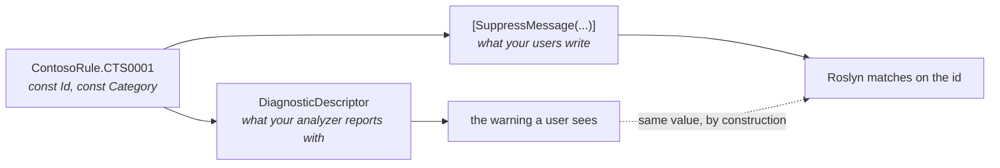

# Closing the loop with your own analyzer

🌍 **Languages:**  
🇬🇧 English (this file) | 🇫🇷 [Français](./first-party-analyzers.fr.md)

For anyone who owns the analyzer **and** the catalogue. The one thing a third-party mirror can never
offer, and the two traps on the way there.

## What a first-party project can do that a mirror cannot

A catalogue that mirrors somebody else's analyzer copies what that analyzer declares *today*. It is a
snapshot, and it is right until the vendor moves.

If you own both, you can do better than accurate — you can make the values **the same object**:

```csharp
private static readonly DiagnosticDescriptor Rule = new(
    id:                 ContosoRule.CTS0001.Id,
    title:              ContosoRule.CTS0001.Title,
    messageFormat:      ContosoRule.CTS0001.MessageFormat,
    category:           ContosoRule.CTS0001.Category,
    defaultSeverity:    DiagnosticSeverity.Warning,
    isEnabledByDefault: true,
    description:        ContosoRule.CTS0001.Description,
    helpLinkUri:        ContosoRule.CTS0001.HelpLinkUri);
```

Now the analyzer that **reports** the rule and every suppression that **silences** it read the same
constants. The category your users write is exact by construction rather than by diligence — and "by
diligence" is precisely what fails, because a category is a string nobody but you publishes and
nothing verifies.



Without the loop, those two paths are two independent transcriptions of the same string, and nothing
in the platform compares them.

## What this repository actually does, and why it is the other way round

Worth stating plainly, because the recommendation above would otherwise look like something nobody
here follows.

`DiagnosticCatalog.Analyzers` does **not** read its descriptors from `DiagnosticCatalog.Self`. It
declares them in `Descriptors.cs`, and `DiagnosticCatalog.Self` is **generated from those
descriptors** by this repository's own generator.

The loop runs the other way because it cannot run this way: a catalogue generated *from* an analyzer
cannot also be the source the analyzer reads from. The first run would have nothing to read, and every
new rule would require editing the descriptors, regenerating, and only then compiling — with the
analyzer unable to build in between.

What replaces the loop here is a check. CI regenerates `DiagnosticCatalog.Self` on every pull request
and fails if the committed file differs, so a new `DCAT` id cannot ship without the catalogue that
publishes it. The two directions end up equivalent in what they guarantee; which one you can use is
decided by which artifact is generated.

**The rule of thumb:** if you write the rule declarations by hand, feed the descriptor from them. If
you generate the catalogue from the descriptors, check the generation instead.

## The trap that reaches every one of your consumers

You will want to put the severity in the catalogue:

```csharp
[DiagnosticRule]
public static class CTS0001
{
    public const string Id = nameof(CTS0001);
    public const string Category = ContosoCategory.Usage;

    public const DiagnosticSeverity Severity = DiagnosticSeverity.Warning;   // ← do not
}
```

An enum **is** constant-capable, so this compiles. The problem is where `DiagnosticSeverity` lives:
`Microsoft.CodeAnalysis.Common`. Declaring that member forces a **Roslyn dependency on every consumer
of your catalogue** — including applications that only ever write suppressions and have no business
resolving a compiler API.

Declare `Severity` in your analyzer project, which already references Roslyn. A standalone catalogue
package stays on plain strings, and stays referenceable by anyone.

The same reasoning rules out `LocalizableString`. Resx-backed titles and messages cannot be `const`
at all, so they fall outside this model entirely — the catalogue covers the id and category axis, and
resource files remain the right tool for translated text.

## The optional metadata, and what it is for

Nothing requires these and nothing validates them:

```csharp
[DiagnosticRule]
public static class CTS0001
{
    public const string Id = nameof(CTS0001);
    public const string Category = ContosoCategory.Usage;

    public const string Title = "Factories should be named with the 'Factory' suffix";
    public const string MessageFormat = "Type '{0}' is registered as a factory but is not named '...Factory'";
    public const string Description = "Factories are discovered by name at start-up, so one that ...";
    public const string HelpLinkUri = "https://contoso.example/rules/CTS0001";
}
```

They exist because they are exactly the arguments of `DiagnosticDescriptor`. For a mirror they are
decoration; for a first-party catalogue they are the loop above, and that is the whole reason they
are in the model.

`Title` earns its place twice over: the generated catalogues carry it as an XML documentation
comment, so hovering `SonarRule.S1144` in an editor says what the rule is about
([ADR-0014](../adr/0014-ship-the-vendors-rule-title-as-a-catalogues-documentation.md)). Give yours a
`Title` and your users get the same.

## Where the catalogue should live

Two projects, not one, and the split is not stylistic.

| Project | References | Ships to |
| --- | --- | --- |
| `Contoso.Rules` — the catalogue | `DiagnosticCatalog`, nothing else | everyone: applications, libraries, anyone writing a suppression |
| `Contoso.Analyzers` — the analyzer | Roslyn, and `Contoso.Rules` | consumers who want the checking, privately |

The analyzer referencing the catalogue is what makes the loop possible. The catalogue referencing
**nothing but the foundation** is what makes it safe to depend on: a package that drags Roslyn into
every consumer is a package teams decline.

If you ship both from one repository at one version, you need no
[provenance](concepts.en.md#provenance-a-catalogue-is-a-snapshot) attribute — `[assembly:
CatalogSource]` records which upstream release a mirror reflects, and a first-party catalogue mirrors
nothing.

## Where to go next

* [**Versioning a catalogue**](versioning-a-catalogue.en.md) — the rule that will bite you: constants
  are inlined into your consumers, so deleting one breaks their build.
* [**Packaging a catalogue**](packaging-a-catalogue.en.md) — how to reference the foundation, and what
  propagates to your consumers whether you meant it or not.
* [**The `DCAT` diagnostics**](diagnostics.en.md) — what your users will be told about their
  suppressions, and what you will be told about your declarations.

---

<div align="center">
<a href="./authoring-a-catalogue.en.md">← Publishing a catalogue</a> · <a href="./README.en.md">↑ Table of contents</a> · <a href="./versioning-a-catalogue.en.md">Versioning a catalogue →</a>
</div>
