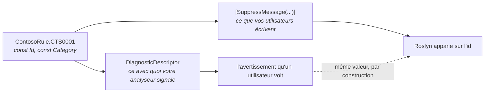

# Boucler la boucle avec votre propre analyseur

🌍 **Langues :**  
🇬🇧 [English](./first-party-analyzers.en.md) | 🇫🇷 Français (ce fichier)

Pour quiconque possède l'analyseur **et** le catalogue. La seule chose qu'un miroir tiers ne pourra
jamais offrir, et les deux pièges sur le chemin.

## Ce qu'un projet de première partie peut faire et qu'un miroir ne peut pas

Un catalogue qui reflète l'analyseur de quelqu'un d'autre copie ce que cet analyseur déclare
*aujourd'hui*. C'est un instantané, et il est juste jusqu'à ce que l'éditeur bouge.

Si vous possédez les deux, vous pouvez faire mieux qu'exact — vous pouvez faire des valeurs **le même
objet** :

```csharp
private static readonly DiagnosticDescriptor Rule = new(
    id:                 ContosoRule.CTS0001.Id,
    title:              ContosoRule.CTS0001.Title,
    messageFormat:      ContosoRule.CTS0001.MessageFormat,
    category:           ContosoRule.CTS0001.Category,
    defaultSeverity:    DiagnosticSeverity.Warning,
    isEnabledByDefault: true,
    description:        ContosoRule.CTS0001.Description,
    helpLinkUri:        ContosoRule.CTS0001.HelpLinkUri);
```

Désormais l'analyseur qui **signale** la règle et chaque suppression qui la **fait taire** lisent les
mêmes constantes. La catégorie que vos utilisateurs écrivent est exacte par construction plutôt que
par diligence — et « par diligence » est précisément ce qui échoue, parce qu'une catégorie est une
chaîne que personne d'autre que vous ne publie et que rien ne vérifie.



Sans la boucle, ces deux chemins sont deux transcriptions indépendantes de la même chaîne, et rien
dans la plateforme ne les compare.

## Ce que ce dépôt fait réellement, et pourquoi c'est dans l'autre sens

Cela vaut d'être dit franchement, sans quoi la recommandation ci-dessus ressemblerait à une consigne
que personne ici ne suit.

`DiagnosticCatalog.Analyzers` ne lit **pas** ses descripteurs dans `DiagnosticCatalog.Self`. Il les
déclare dans `Descriptors.cs`, et `DiagnosticCatalog.Self` est **généré depuis ces descripteurs** par
le générateur de ce dépôt.

La boucle tourne dans l'autre sens parce qu'elle ne peut pas tourner dans celui-ci : un catalogue
généré *depuis* un analyseur ne peut pas être en même temps la source que cet analyseur lit. La
première exécution n'aurait rien à lire, et chaque nouvelle règle exigerait d'éditer les descripteurs,
de régénérer, et seulement ensuite de compiler — l'analyseur étant incompilable entre-temps.

Ce qui remplace la boucle ici, c'est une vérification. La CI régénère `DiagnosticCatalog.Self` à
chaque pull request et échoue si le fichier commité diffère : un nouvel identifiant `DCAT` ne peut
donc pas sortir sans le catalogue qui le publie. Les deux sens finissent par garantir la même chose ;
celui que vous pouvez employer est décidé par l'artefact qui est généré.

**La règle empirique :** si vous écrivez les déclarations de règles à la main, alimentez le
descripteur depuis elles. Si vous générez le catalogue depuis les descripteurs, vérifiez la génération
à la place.

## Le piège qui atteint chacun de vos consommateurs

Vous voudrez mettre la gravité dans le catalogue :

```csharp
[DiagnosticRule]
public static class CTS0001
{
    public const string Id = nameof(CTS0001);
    public const string Category = ContosoCategory.Usage;

    public const DiagnosticSeverity Severity = DiagnosticSeverity.Warning;   // ← surtout pas
}
```

Une énumération **peut** être constante : cela compile donc. Le problème est l'endroit où vit
`DiagnosticSeverity` : `Microsoft.CodeAnalysis.Common`. Déclarer ce membre impose une **dépendance
Roslyn à tous les consommateurs de votre catalogue** — y compris à des applications qui n'écrivent que
des suppressions et n'ont aucune raison de résoudre une API de compilateur.

Déclarez `Severity` dans votre projet d'analyseur, qui référence déjà Roslyn. Un paquet catalogue
autonome reste sur de simples chaînes, et reste référençable par tout le monde.

Le même raisonnement écarte `LocalizableString`. Des titres et messages adossés à des resx ne peuvent
pas être `const` du tout : ils tombent donc entièrement hors de ce modèle — le catalogue couvre l'axe
identifiant et catégorie, et les fichiers de ressources restent le bon outil pour le texte traduit.

## Les métadonnées optionnelles, et à quoi elles servent

Rien ne les exige et rien ne les valide :

```csharp
[DiagnosticRule]
public static class CTS0001
{
    public const string Id = nameof(CTS0001);
    public const string Category = ContosoCategory.Usage;

    public const string Title = "Factories should be named with the 'Factory' suffix";
    public const string MessageFormat = "Type '{0}' is registered as a factory but is not named '...Factory'";
    public const string Description = "Factories are discovered by name at start-up, so one that ...";
    public const string HelpLinkUri = "https://contoso.example/rules/CTS0001";
}
```

Elles existent parce que ce sont exactement les arguments de `DiagnosticDescriptor`. Pour un miroir
c'est de la décoration ; pour un catalogue de première partie c'est la boucle ci-dessus, et c'est
toute la raison de leur présence dans le modèle.

`Title` mérite doublement sa place : les catalogues générés le portent en commentaire de documentation
XML, si bien que survoler `SonarRule.S1144` dans un éditeur dit de quoi parle la règle
([ADR-0014](../adr/0014-ship-the-vendors-rule-title-as-a-catalogues-documentation.md)). Donnez un
`Title` aux vôtres et vos utilisateurs obtiennent la même chose.

## Où le catalogue doit vivre

Deux projets, pas un, et la séparation n'est pas stylistique.

| Projet | Référence | Livré à |
| --- | --- | --- |
| `Contoso.Rules` — le catalogue | `DiagnosticCatalog`, et rien d'autre | tout le monde : applications, bibliothèques, quiconque écrit une suppression |
| `Contoso.Analyzers` — l'analyseur | Roslyn, et `Contoso.Rules` | les consommateurs qui veulent la vérification, en privé |

C'est l'analyseur référençant le catalogue qui rend la boucle possible. C'est le catalogue ne
référençant **rien d'autre que la fondation** qui le rend sûr à prendre en dépendance : un paquet qui
traîne Roslyn chez chaque consommateur est un paquet que les équipes déclinent.

Si vous livrez les deux depuis un dépôt à une version, vous n'avez besoin d'aucun attribut de
[provenance](concepts.fr.md#provenance--un-catalogue-est-un-instantané) — `[assembly: CatalogSource]`
enregistre la version amont qu'un miroir reflète, et un catalogue de première partie ne reflète rien.

## Où aller ensuite

* [**Versionner un catalogue**](versioning-a-catalogue.fr.md) — la règle qui va vous mordre : les
  constantes sont incorporées chez vos consommateurs, donc en supprimer une casse leur build.
* [**Empaqueter un catalogue**](packaging-a-catalogue.fr.md) — comment référencer la fondation, et ce
  qui se propage à vos consommateurs que vous l'ayez voulu ou non.
* [**Les diagnostics `DCAT`**](diagnostics.fr.md) — ce qu'on dira à vos utilisateurs sur leurs
  suppressions, et ce qu'on vous dira sur vos déclarations.

---

<div align="center">
<a href="./authoring-a-catalogue.fr.md">← Publier un catalogue</a> · <a href="./README.fr.md">↑ Table des matières</a> · <a href="./versioning-a-catalogue.fr.md">Versionner un catalogue →</a>
</div>
