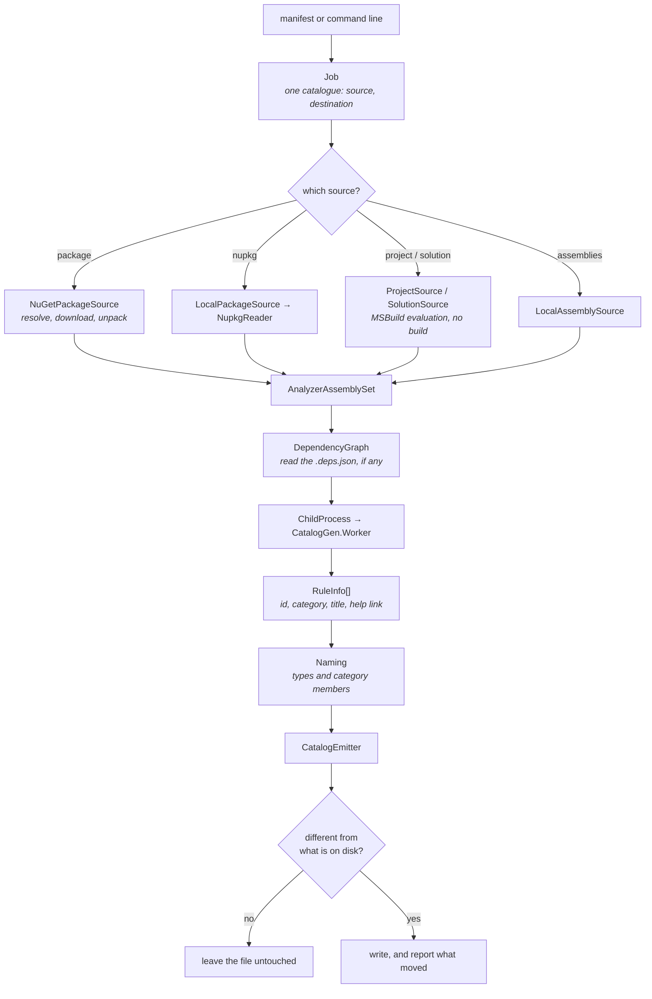

# Inside the generator

🌍 **Languages:**  
🇬🇧 English (this file) | 🇫🇷 [Français](./generator-internals.fr.md)

For anyone changing `eng/CatalogGen`, or debugging a run that did something surprising. The path a
run takes, and what each stage refuses.

The user-facing side is [the `dcat` tool](dcat.en.md); this is the engine underneath it.

## The whole pipeline

Four stages, and each has one thing it will not do.

## 1. Acquisition — five sources, one shape

Every source kind produces an `AnalyzerAssemblySet`: the assemblies to read, plus what to record as
the source's name and release. Everything downstream is identical from there.

| Source | Reads | Refuses |
| --- | --- | --- |
| `NuGetPackageSource` | A feed, through NuGet's own client — the `NuGet.config` hierarchy, credentials included | A package that will not resolve. It does not fall back to a hardcoded feed. |
| `LocalPackageSource` / `NupkgReader` | A `.nupkg` on disk; the id and version come from the `.nuspec` | Reading the version out of the **file name** — a renamed file must not rewrite what a catalogue records |
| `ProjectSource` | An **already-built** project, located by MSBuild evaluation | Building it. `-getProperty` evaluates without restoring, building or writing `obj/` |
| `SolutionSource` | The projects declaring `ProducesDiagnosticRules` | A solution where none does, and guessing which ones might |
| `LocalAssemblySource` | Assemblies on disk | Nothing — but it is why `--source-name`/`--source-version` are worth passing |

**Why `ProjectSource` does not build** is the property that makes `dcat validate --project` safe to
run against a working copy: it restores nothing, writes no `obj/`, and touches no output. It also
means the run fails with a message naming the path it looked at and the `dotnet build` that would
produce it, rather than building on your behalf.

**Why `SolutionSource` refuses** is the sharpest refusal in the engine. Deciding which projects
produce analyzers cannot be inferred: measured on this repository, "references
`Microsoft.CodeAnalysis`" matches nine projects of which one is an analyzer. Guessing short emits a
catalogue whose missing rules read as retired ones — and a solution declaring none returns `null`
rather than an empty set, because generating nothing and exiting `0` would read to a scheduled job as
success.

A multi-targeted project is read through `netstandard2.0` when it builds one, because that is the
build a consumer's compiler actually loads.

## 2. Reading descriptors — out of process, on purpose

`DescriptorReader` hands the set to `CatalogGen.Worker` through `ChildProcess`, and reads back what
`DescriptorReadContract` defines. Three things follow from the process boundary:

**Roll-forward.** The worker rolls forward to the **latest installed major**, not the first it finds.
That stops the floor that makes `dcat` installable from deciding what it can read: an analyzer built
for a newer target still loads, provided that runtime is present.

**Your dependency graph, not ours.** `DependencyGraph` reads the `.deps.json` beside an analyzer when
there is one, and the worker runs against it — so an analyzer compiled against a different Roslyn than
the tool carries is read through its own.

It falls back to the tool's Roslyn in three cases, and the third is the one worth knowing: there is no
graph (analyzers unpacked from a package travel without one), the package cache does not hold what the
graph asks for, or **the graph names no Roslyn at all**. Handing a graph over *replaces* the worker's
own rather than extending it, so a graph without Roslyn leaves the worker with none. A
`netstandard2.0` library's `.deps.json` is exactly that, and the run says so rather than reading it.

**A crash is attributable.** An analyzer whose constructor throws takes the worker down, and `dcat`
survives to say which one. In-process, the whole run would vanish.

Both spawned processes — the worker, and MSBuild for `--project`/`--solution` — carry a budget:
10 minutes for a descriptor read, 2 minutes for a project evaluation, against measured times of
seconds. Constructing an analyzer is third-party code and is the one step that can *hang* rather than
fail. `DCAT_TIMEOUT_SECONDS` raises both.

## 3. Naming — where a catalogue's public contract is decided

`Naming` turns a rule id into a type name and a category value into a member name. It is the smallest
part of the engine and the one with the least room to be wrong, because **every name it produces is a
published contract**.

Two properties matter:

* **A category member's name is derived from its value**, flattened. Two upstream categories can
  therefore collide on one identifier.
* **A name once published is never reassigned.** The collision case that forced
  [ADR-0012](../adr/0012-a-catalogue-never-renames-a-member-it-published.en.md) was not a human mistake:
  a new category arriving upstream, whose flattened identifier collided with an existing one and
  sorted before it, would have taken that name and pushed the incumbent onto a numbered suffix —
  renaming a published member, through an unattended nightly run.

The container's name decides a second one: a container ending in `Rule` names the category class too,
so `SonarRule` gives `SonarCategory`.

## 4. Emission — deterministic by construction

`CatalogEmitter` writes the C#. Same upstream release, same bytes:

* rules and categories in **ordinal** order, so the output is a property of the request rather than of
  the order an assembly happened to enumerate;
* titles read **culture-invariantly**;
* a rule the vendor retired **carried forward as `[Obsolete]`** rather than deleted, because consumers
  inline `const` values ([ADR-0010](../adr/0010-carry-a-retired-rule-forward-as-obsolete.en.md));
* the vendor's rule *prose* deliberately left out — the title ships as XML documentation, the
  description and message format do not
  ([ADR-0011](../adr/0011-redistribute-rule-facts-only-never-the-vendors-prose.en.md),
  [ADR-0014](../adr/0014-ship-the-vendors-rule-title-as-a-catalogues-documentation.en.md)).

Then the step that makes a scheduled run quiet: the emitter **compares its output with the file on
disk**, `generatedOn` stamp included, and leaves it untouched when nothing moved. A night where
upstream did not move produces no diff, no pull request and no notification — which is what keeps the
ones you do get worth reading.

`--date` pins the stamp when two runs of the same inputs must be byte-identical.

## Reading a catalogue back

`CatalogParser` and `CatalogueInspector` are the other direction — `validate`, `list` and `explain`.

`validate` does everything `generate` does and stops before writing, which is why its exit codes
distinguish **`2`** (the catalogue no longer matches its source) from **`1`** (it could not be
checked). A feed outage must never be reported as a drifted contract.

`list` and `explain` read a **compiled** catalogue reflection-only. Nothing is executed: a catalogue
declares everything it publishes as metadata constants, so nothing has to run for them to be read —
and a tool that loaded a stranger's assembly into its own process to answer a question about its
contents would be taking a licence it does not need.

## The boundary with the shell

`CatalogRun` and `Job` are the whole interface. Above them: parsing a command line, reading a
manifest, deciding where output goes. Below: acquisition, descriptors, emission.

`RunOutcome` carries the exit code, whether anything changed, and the Markdown summary — but not where
that summary goes. **The engine says what happened; the shell decides where that goes.** Keeping the
boundary this narrow is what let the command line be replaced without the engine noticing, which is
exactly what happened.

## Where to go next

* [**Repository architecture**](architecture.en.md) — where the generator sits among the other
  projects.
* [**The `dcat` reference**](dcat-reference.en.md) — the same behaviour from the outside.
* [**The testing strategy**](testing-strategy.en.md) — what `CatalogGen.UnitTests` asserts about all
  of this.

---

<a href="./architecture.en.md">← Repository architecture</a> · <a href="./README.en.md">↑ Table of contents</a> · <a href="./release-trains.en.md">Release trains →</a>

