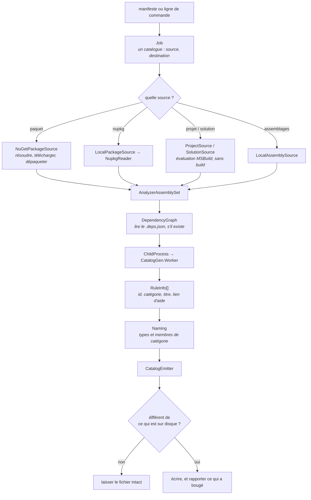

# Dans le générateur

🌍 **Langues :**  
🇬🇧 [English](./generator-internals.en.md) | 🇫🇷 Français (ce fichier)

Pour quiconque modifie `eng/CatalogGen`, ou débogue une exécution qui a fait quelque chose de
surprenant. Le chemin qu'une exécution prend, et ce que chaque étape refuse.

Le côté visible est [l'outil `dcat`](dcat.fr.md) ; ceci est le moteur en dessous.

## Le pipeline en entier

Quatre étapes, et chacune a une chose qu'elle refuse de faire.

## 1. Acquisition — cinq sources, une seule forme

Chaque type de source produit un `AnalyzerAssemblySet` : les assemblages à lire, plus ce qu'il faut
enregistrer comme nom et version de la source. Tout ce qui suit est identique à partir de là.

| Source | Lit | Refuse |
| --- | --- | --- |
| `NuGetPackageSource` | Un flux, via le client NuGet lui-même — la hiérarchie `NuGet.config`, identifiants compris | Un paquet qui ne résout pas. Il ne retombe pas sur un flux codé en dur. |
| `LocalPackageSource` / `NupkgReader` | Un `.nupkg` sur disque ; l'id et la version viennent du `.nuspec` | Lire la version dans le **nom de fichier** — un fichier renommé ne doit pas réécrire ce qu'un catalogue enregistre |
| `ProjectSource` | Un projet **déjà construit**, localisé par évaluation MSBuild | Le construire. `-getProperty` évalue sans restaurer, compiler ni écrire d'`obj/` |
| `SolutionSource` | Les projets déclarant `ProducesDiagnosticRules` | Une solution où aucun ne le fait, et deviner lesquels pourraient |
| `LocalAssemblySource` | Des assemblages sur disque | Rien — mais c'est pourquoi `--source-name`/`--source-version` méritent d'être passés |

**Pourquoi `ProjectSource` ne compile pas** est la propriété qui rend `dcat validate --project` sûr sur
une copie de travail : il ne restaure rien, n'écrit aucun `obj/`, et ne touche à aucune sortie. Cela
veut dire aussi que l'exécution échoue avec un message nommant le chemin regardé et le `dotnet build`
qui le produirait, plutôt que de compiler à votre place.

**Pourquoi `SolutionSource` refuse** est le refus le plus net du moteur. Décider quels projets
produisent des analyseurs ne peut pas s'inférer : mesuré sur ce dépôt, « référence
`Microsoft.CodeAnalysis` » correspond à neuf projets dont un est un analyseur. Deviner trop court émet
un catalogue dont les règles manquantes se lisent comme des règles retirées — et une solution qui n'en
déclare aucun renvoie `null` plutôt qu'un ensemble vide, parce que ne rien générer et sortir en `0` se
lirait, pour une tâche planifiée, comme un succès.

Un projet multi-cible est lu via `netstandard2.0` quand il en produit une, parce que c'est la build
que le compilateur d'un consommateur charge réellement.

## 2. Lire les descripteurs — hors processus, exprès

`DescriptorReader` remet l'ensemble à `CatalogGen.Worker` via `ChildProcess`, et relit ce que
`DescriptorReadContract` définit. Trois choses découlent de la frontière de processus :

**Le roll-forward.** Le worker progresse jusqu'au **dernier majeur installé**, pas le premier trouvé.
Cela empêche le plancher qui rend `dcat` installable de décider de ce qu'il peut lire : un analyseur
construit pour une cible plus récente se charge quand même, à condition que ce runtime soit présent.

**Votre graphe de dépendances, pas le nôtre.** `DependencyGraph` lit le `.deps.json` à côté d'un
analyseur quand il y en a un, et le worker s'exécute contre lui — si bien qu'un analyseur compilé
contre un Roslyn différent de celui que l'outil transporte est lu via le sien.

Il retombe sur le Roslyn de l'outil dans trois cas, et le troisième mérite d'être connu : il n'y a pas
de graphe (les analyseurs dépaquetés d'un paquet voyagent sans), le cache de paquets ne contient pas
ce que le graphe demande, ou **le graphe ne nomme aucun Roslyn**. Fournir un graphe *remplace* celui du
worker au lieu de l'étendre : un graphe sans Roslyn laisse donc le worker sans aucun. Le `.deps.json`
d'une bibliothèque `netstandard2.0` est exactement cela, et l'exécution le dit plutôt que de le lire.

**Un plantage est attribuable.** Un analyseur dont le constructeur lève emporte le worker, et `dcat`
survit pour dire lequel. En processus, toute l'exécution disparaîtrait.

Les deux processus lancés — le worker, et MSBuild pour `--project`/`--solution` — portent un budget :
10 minutes pour une lecture de descripteurs, 2 minutes pour une évaluation de projet, contre des temps
mesurés en secondes. Construire un analyseur, c'est du code tiers, et c'est la seule étape qui peut
*se figer* plutôt qu'échouer. `DCAT_TIMEOUT_SECONDS` relève les deux.

## 3. Nommage — là où le contrat public d'un catalogue se décide

`Naming` transforme un identifiant de règle en nom de type et une valeur de catégorie en nom de
membre. C'est la plus petite partie du moteur et celle qui a le moins de droit à l'erreur, parce que
**chaque nom qu'elle produit est un contrat publié**.

Deux propriétés comptent :

* **Le nom d'un membre de catégorie est dérivé de sa valeur**, aplatie. Deux catégories amont peuvent
  donc entrer en collision sur un identifiant.
* **Un nom une fois publié n'est jamais réattribué.** Le cas de collision qui a forcé
  [ADR-0012](../adr/0012-a-catalogue-never-renames-a-member-it-published.fr.md) n'était pas une erreur
  humaine : une nouvelle catégorie arrivant en amont, dont l'identifiant aplati entrait en collision
  avec un existant et se triait avant lui, aurait pris ce nom et poussé le titulaire sur un suffixe
  numéroté — renommant un membre publié, au cours d'une exécution nocturne sans surveillance.

Le nom du conteneur en décide un second : un conteneur finissant par `Rule` nomme aussi la classe de
catégories, si bien que `SonarRule` donne `SonarCategory`.

## 4. Émission — déterministe par construction

`CatalogEmitter` écrit le C#. Même version amont, mêmes octets :

* règles et catégories en ordre **ordinal**, pour que la sortie soit une propriété de la demande et
  non de l'ordre dans lequel un assemblage s'est trouvé énuméré ;
* titres lus en **culture invariante** ;
* une règle retirée par l'éditeur **reportée en `[Obsolete]`** plutôt que supprimée, parce que les
  consommateurs incorporent les valeurs `const`
  ([ADR-0010](../adr/0010-carry-a-retired-rule-forward-as-obsolete.fr.md)) ;
* la *prose* des règles de l'éditeur délibérément laissée de côté — le titre part en documentation
  XML, la description et le format de message non
  ([ADR-0011](../adr/0011-redistribute-rule-facts-only-never-the-vendors-prose.fr.md),
  [ADR-0014](../adr/0014-ship-the-vendors-rule-title-as-a-catalogues-documentation.fr.md)).

Puis l'étape qui rend une exécution planifiée silencieuse : l'émetteur **compare sa sortie au fichier
sur disque**, estampille `generatedOn` comprise, et le laisse intact quand rien n'a bougé. Une nuit où
l'amont n'a pas bougé ne produit ni diff, ni pull request, ni notification — ce qui maintient la
valeur de celles que vous recevez.

`--date` fixe l'estampille quand deux exécutions des mêmes entrées doivent être identiques octet pour
octet.

## Relire un catalogue

`CatalogParser` et `CatalogueInspector` sont l'autre sens — `validate`, `list` et `explain`.

`validate` fait tout ce que fait `generate` et s'arrête avant d'écrire, ce qui explique que ses codes
de sortie distinguent **`2`** (le catalogue ne correspond plus à sa source) de **`1`** (il n'a pas pu
être vérifié). Une panne de flux ne doit jamais être rapportée comme un contrat qui a dérivé.

`list` et `explain` lisent un catalogue **compilé** en réflexion seule. Rien n'est exécuté : un
catalogue déclare tout ce qu'il publie en constantes de métadonnées, donc rien n'a besoin de tourner
pour qu'on les lise — et un outil qui chargerait l'assemblage d'un inconnu dans son propre processus
pour répondre à une question sur son contenu prendrait une licence dont il n'a pas besoin.

## La frontière avec la coquille

`CatalogRun` et `Job` sont toute l'interface. Au-dessus : analyser une ligne de commande, lire un
manifeste, décider de la destination. En dessous : acquisition, descripteurs, émission.

`RunOutcome` porte le code de sortie, le fait que quelque chose ait changé, et le résumé Markdown —
mais pas la destination de ce résumé. **Le moteur dit ce qui s'est passé ; la coquille décide où cela
va.** Garder la frontière aussi étroite est ce qui a permis de remplacer la ligne de commande sans que
le moteur s'en aperçoive, ce qui est exactement arrivé.

## Où aller ensuite

* [**Architecture du dépôt**](architecture.fr.md) — où le générateur se situe parmi les autres
  projets.
* [**La référence `dcat`**](dcat-reference.fr.md) — le même comportement vu de l'extérieur.
* [**La stratégie de test**](testing-strategy.fr.md) — ce que `CatalogGen.UnitTests` asserte de tout
  ceci.

---

<a href="./architecture.fr.md">← Architecture du dépôt</a> · <a href="./README.fr.md">↑ Table des matières</a> · <a href="./release-trains.fr.md">Les trains de release →</a>

