# Release trains

🌍 **Languages:**  
🇬🇧 English (this file) | 🇫🇷 [Français](./release-trains.fr.md)

For anyone adding a project, cutting a release, or wondering why a commit needs a scope. Fifteen trains,
one declaration, and one rule that follows from both.

## Why not one version

A catalogue follows its vendor's pace. SonarSource ships often; the foundation is deliberately very
stable. Tie them to one number and every Sonar refresh moves the foundation's version — which tells
every consumer of the foundation that something changed when nothing did.

So the repository publishes on **fifteen independent lines**
([ADR-0002](../adr/0002-partition-releases-into-trains-by-commit-scope.en.md),
[ADR-0015](../adr/0015-a-catalogues-version-runs-on-its-own-line.en.md)):

| Train | Tag prefix | Scopes | What it publishes |
| --- | --- | --- | --- |
| `lib` | `lib-v` | `core`, `analyzers` | The foundation, carrying its analyzers, and the catalogue of their own rules |
| `cli` | `cli-v` | `cli`, `cataloggen` | The `dcat` .NET tool |
| `sonar` | `sonar-v` | `sonar` | The SonarQube rule catalogue |
| `netanalyzers` | `netanalyzers-v` | `netanalyzers` | The Microsoft .NET analyzer rule catalogue |
| `stylecop` | `stylecop-v` | `stylecop` | The StyleCop rule catalogue |
| `codestyle` | `codestyle-v` | `codestyle` | The Roslyn IDE code-style rule catalogue |
| `xunit` | `xunit-v` | `xunit` | The xUnit.net analyzer rule catalogue |
| `nunit` | `nunit-v` | `nunit` | The NUnit analyzer rule catalogue |
| `mstest` | `mstest-v` | `mstest` | The MSTest analyzer rule catalogue |
| `trimming` | `trimming-v` | `trimming` | The trimming, Native AOT and single-file rule catalogue |
| `aspnetcore` | `aspnetcore-v` | `aspnetcore` | The ASP.NET Core and Blazor rule catalogue |
| `syslib` | `syslib-v` | `syslib` | The .NET runtime source-generator rule catalogue |
| `roslyn` | `roslyn-v` | `roslyn` | The Roslyn analyzer-authoring rule catalogue |
| `publicapi` | `publicapi-v` | `publicapi` | The public-API tracking rule catalogue |
| `bannedapi` | `bannedapi-v` | `bannedapi` | The banned-API rule catalogue |

That table lives once, in [`tools/trains.sh`](../../tools/trains.sh). The packaging and release-notes
scripts **source** it, so what a release publishes and what its notes describe cannot drift apart.

## Membership is one declaration

A project joins a train by saying so, in its own `.csproj`:

```xml
<PropertyGroup>
  <ReleaseTrain>sonar</ReleaseTrain>
</PropertyGroup>
```

That single line is the **whole** membership. It also makes the project packable and gives it an
embedded SPDX SBOM. Nothing lists the projects a second time, and that is the point: membership lives
in the one file that cannot be forgotten when a project is created, moved or renamed.

The same reasoning as the .NET Framework floor, which is joined by an import rather than by a list in
a workflow. A list somewhere else is a list that goes stale, and a project missing from it is silently
absent from its own release.

A value matching no train fails the pack — on every pull request, rather than at release time.

## Three projects on purpose have none

```mermaid
flowchart TB
    subgraph LIB["lib"]
        F["DiagnosticCatalog"]
        SELF["DiagnosticCatalog.Self"]
    end
    subgraph CLIT["cli"]
        C["DiagnosticCatalog.Cli → dcat"]
    end
    subgraph S["sonar"]
        SO["DiagnosticCatalog.Sonar"]
    end
    subgraph N["netanalyzers"]
        NA["DiagnosticCatalog.NetAnalyzers"]
    end
    subgraph T["stylecop"]
        SC["DiagnosticCatalog.StyleCop"]
    end
    subgraph I["codestyle"]
        CS["DiagnosticCatalog.CodeStyle"]
    end
    subgraph X["xunit"]
        XU["DiagnosticCatalog.Xunit"]
    end
    subgraph NU["nunit"]
        NUC["DiagnosticCatalog.NUnit"]
    end
    subgraph MS["mstest"]
        MST["DiagnosticCatalog.MSTest"]
    end
    subgraph TR["trimming"]
        TRC["DiagnosticCatalog.Trimming"]
    end
    subgraph AS["aspnetcore"]
        ASC["DiagnosticCatalog.AspNetCore"]
    end
    subgraph SY["syslib"]
        SYC["DiagnosticCatalog.Syslib"]
    end
    subgraph RO["roslyn"]
        ROC["DiagnosticCatalog.Roslyn"]
    end
    subgraph PA["publicapi"]
        PAC["DiagnosticCatalog.PublicApi"]
    end
    subgraph BA["bannedapi"]
        BAC["DiagnosticCatalog.BannedApi"]
    end
    A["DiagnosticCatalog.Analyzers<br/><i>no train — bundled into the foundation's package</i>"]
    CF["DiagnosticCatalog.CodeFixes<br/><i>no train — bundled into the same one</i>"]
    GEN["eng/CatalogGen<br/><i>no train — bundled into dcat</i>"]
    F -. "packs" .-> A
    F -. "packs" .-> CF
    C -. "packs" .-> GEN
    SO -- "PackageReference" --> F
    NA -- "PackageReference" --> F
    SC -- "PackageReference" --> F
    CS -- "PackageReference" --> F
    XU -- "PackageReference" --> F
    NUC -- "PackageReference" --> F
    MST -- "PackageReference" --> F
    TRC -- "PackageReference" --> F
    ASC -- "PackageReference" --> F
    SYC -- "PackageReference" --> F
    ROC -- "PackageReference" --> F
    PAC -- "PackageReference" --> F
    BAC -- "PackageReference" --> F
    SELF -- "PackageReference" --> F
```



`DiagnosticCatalog.Analyzers`, `DiagnosticCatalog.CodeFixes` and `eng/CatalogGen` declare no train
**deliberately**. Each is bundled into another project's package rather than published on its own,
and declaring a train would make each packable with a version nobody would ever reference.
`tools/trains.sh` leaves an untrained project alone by design.

The analyzers joined that shape rather than starting in it. They were on `lib` beside the
foundation, which meant one tag, one version and no independence to buy — so the second package
identity bought nothing and cost a second name every catalogue author had to remember. Folding them
in makes *referencing a catalogue means being checked* a property of the dependency graph
([ADR-0037](../adr/0037-ship-the-analyzers-inside-the-foundation-package.en.md)). The project, the
assembly and the `analyzers` commit scope are unchanged; only the package identity is gone.

## The rule that follows

**A project on one train MUST NOT carry a `<ProjectReference>` to a project on another.**

`dotnet pack` stamps a `ProjectReference` at the version being packed. Across trains, that version was
never published — so the package would declare a dependency that does not exist, and be unresolvable
for every consumer.

Depend on another train through a `PackageReference` to a version actually on nuget.org
([ADR-0007](../adr/0007-depend-across-trains-through-published-packages.en.md)). It is why the catalogues
here take the foundation as a package even though its source sits in the same repository — and why the
foundation had to ship first, before any catalogue could depend on it.

The one shape the rule blesses is the untrained project above: `DiagnosticCatalog` reaches the
analyzers and the code fixes by `ProjectReference` precisely because neither publishes anything of
its own.

The rule is checked on every pack, which the release rehearsal runs on every pull request.

## Why a scope is required on `feat` and `fix`

Commits are partitioned into trains **by scope**. An unscoped `feat` or `fix` matches no train and is
silently dropped from the release notes and the changelog — so `commit-lint` requires one.

```
feat(sonar): carry the rule's help link into the catalogue
fix(cataloggen): read the version from the .nuspec, not the file name
docs: add the reference track to the guide
```

`docs`, `chore`, `ci`, `build`, `test`, `refactor`, `style`, `perf` and `revert` need no scope: they
drive no version.

The scope list and the train table name the same set, in both directions. `cataloggen` joined the
`cli` train when the generator was published inside `dcat`
([ADR-0017](../adr/0017-publish-the-generator-as-a-cli-on-its-own-release-train.en.md)), and `testing`
was dropped once it was clear it named a test-support package nobody was going to build. So there is
neither a scope reaching no release note nor a train promising a package that does not exist.

## Cutting one

Push a train-prefixed SemVer tag — `lib-v1.2.3`, `sonar-v4.0.0`. The release workflow resolves the
train from the prefix, builds and tests, packs **only that train**, attests the artifacts, publishes
through OIDC trusted publishing, and creates a release whose notes contain only that train's commits
([ADR-0006](../adr/0006-publish-through-trusted-publishing-with-provenance-and-an-sbom.en.md)).

Two things to know before the first one:

* **It is rehearsed.** `release-dryrun` packs every train on every pull request, and the release
  workflow itself can be dispatched with `dry_run` ticked — running everything up to and including the
  OIDC login and the provenance attestation, and skipping only the two steps that publish. What the
  rehearsal deliberately skips is everything with a side effect: a dry run that faked those would
  prove nothing.
* **Build metadata is rejected.** `lib-v1.2.3+build5` is valid SemVer, but NuGet drops the `+…` from
  the package identity — so the push would silently become a no-op against an already-published
  `1.2.3`. The workflow fails on it instead.

A tag whose prefix is unknown to `tools/trains.sh` is rejected, so a train added without its row fails
the release rather than publishing something unrouted.

## Adding a train

Four edits, and three of them exist because GitHub requires a literal:

1. one row in [`tools/trains.sh`](../../tools/trains.sh);
2. its scope in `tools/commit-lint/lint-commit-message.sh` and in the tables in
   [`CONTRIBUTING.md`](../../CONTRIBUTING.md);
3. its tag pattern in `on: push: tags:` and its id in the `workflow_dispatch` choice, in
   `.github/workflows/release.yml`;
4. its line in the "Release train" checklist in `.github/pull_request_template.md`.

Step 4 has been missed once already: a train can exist, route and publish while every pull request
describing it still has to tick "None".

## Where to go next

* [**Versioning a catalogue**](versioning-a-catalogue.en.md) — what each kind of change does to a
  train's version number.
* [**The testing strategy**](testing-strategy.en.md) — including the shell suite that tests the train
  discovery itself.
* [**CONTRIBUTING.md**](../../CONTRIBUTING.md) — the full scope table and the commit convention.

---

<div align="center">
<a href="./generator-internals.en.md">← Inside the generator</a> · <a href="./README.en.md">↑ Table of contents</a> · <a href="./testing-strategy.en.md">The testing strategy →</a>
</div>
