# Les trains de release

🌍 **Langues :**  
🇬🇧 [English](./release-trains.en.md) | 🇫🇷 Français (ce fichier)

Pour quiconque ajoute un projet, coupe une release, ou se demande pourquoi un commit exige un scope.
Quinze trains, une déclaration, et une règle qui découle des deux.

## Pourquoi pas une seule version

Un catalogue suit le rythme de son éditeur. SonarSource livre souvent ; la fondation est délibérément
très stable. Liez-les à un seul numéro et chaque rafraîchissement Sonar fait bouger la version de la
fondation — ce qui annonce à tous ses consommateurs que quelque chose a changé alors que rien n'a
bougé.

Le dépôt publie donc sur **quinze lignes indépendantes**
([ADR-0002](../adr/0002-partition-releases-into-trains-by-commit-scope.fr.md),
[ADR-0015](../adr/0015-a-catalogues-version-runs-on-its-own-line.fr.md)) :

| Train | Préfixe de tag | Scopes | Ce qu'il publie |
| --- | --- | --- | --- |
| `lib` | `lib-v` | `core`, `analyzers` | La fondation, qui porte ses analyseurs, et le catalogue de leurs propres règles |
| `cli` | `cli-v` | `cli`, `cataloggen` | L'outil .NET `dcat` |
| `sonar` | `sonar-v` | `sonar` | Le catalogue de règles SonarQube |
| `netanalyzers` | `netanalyzers-v` | `netanalyzers` | Le catalogue de règles des analyseurs .NET de Microsoft |
| `stylecop` | `stylecop-v` | `stylecop` | Le catalogue de règles StyleCop |
| `codestyle` | `codestyle-v` | `codestyle` | Le catalogue de règles de style IDE de Roslyn |
| `xunit` | `xunit-v` | `xunit` | Le catalogue de règles des analyseurs xUnit.net |
| `nunit` | `nunit-v` | `nunit` | Le catalogue de règles des analyseurs NUnit |
| `mstest` | `mstest-v` | `mstest` | Le catalogue de règles des analyseurs MSTest |
| `trimming` | `trimming-v` | `trimming` | Le catalogue de règles de trimming, Native AOT et fichier unique |
| `aspnetcore` | `aspnetcore-v` | `aspnetcore` | Le catalogue de règles ASP.NET Core et Blazor |
| `syslib` | `syslib-v` | `syslib` | Le catalogue de règles des générateurs de source du runtime .NET |
| `roslyn` | `roslyn-v` | `roslyn` | Le catalogue de règles d'écriture d'analyseurs Roslyn |
| `publicapi` | `publicapi-v` | `publicapi` | Le catalogue de règles de suivi d'API publique |
| `bannedapi` | `bannedapi-v` | `bannedapi` | Le catalogue de règles d'API bannies |

Ce tableau vit une seule fois, dans [`tools/trains.sh`](../../tools/trains.sh). Les scripts
d'empaquetage et de notes de version le **sourcent** : ce qu'une release publie et ce que ses notes
décrivent ne peuvent donc pas diverger.

## L'appartenance tient en une déclaration

Un projet rejoint un train en le disant, dans son propre `.csproj` :

```xml
<PropertyGroup>
  <ReleaseTrain>sonar</ReleaseTrain>
</PropertyGroup>
```

Cette unique ligne est **toute** l'appartenance. Elle rend aussi le projet empaquetable et lui donne
un SBOM SPDX embarqué. Rien ne liste les projets une seconde fois, et c'est tout l'objet :
l'appartenance vit dans le seul fichier qu'on ne peut pas oublier quand un projet est créé, déplacé ou
renommé.

Le même raisonnement que le plancher .NET Framework, qu'on rejoint par un import plutôt que par une
liste dans un workflow. Une liste ailleurs est une liste qui se périme, et un projet qui en manque est
silencieusement absent de sa propre release.

Une valeur ne correspondant à aucun train fait échouer l'empaquetage — à chaque pull request, plutôt
qu'au moment de la release.

## Trois projets n'en ont aucun, exprès

```mermaid
flowchart TB
    subgraph LIB["lib"]
        F["DiagnosticCatalog"]
        SELF["DiagnosticCatalog.Self"]
    end
    subgraph CLIT["cli"]
        C["DiagnosticCatalog.Cli → dcat"]
    end
    subgraph S["sonar"]
        SO["DiagnosticCatalog.Sonar"]
    end
    subgraph N["netanalyzers"]
        NA["DiagnosticCatalog.NetAnalyzers"]
    end
    subgraph T["stylecop"]
        SC["DiagnosticCatalog.StyleCop"]
    end
    subgraph I["codestyle"]
        CS["DiagnosticCatalog.CodeStyle"]
    end
    subgraph X["xunit"]
        XU["DiagnosticCatalog.Xunit"]
    end
    subgraph NU["nunit"]
        NUC["DiagnosticCatalog.NUnit"]
    end
    subgraph MS["mstest"]
        MST["DiagnosticCatalog.MSTest"]
    end
    subgraph TR["trimming"]
        TRC["DiagnosticCatalog.Trimming"]
    end
    subgraph AS["aspnetcore"]
        ASC["DiagnosticCatalog.AspNetCore"]
    end
    subgraph SY["syslib"]
        SYC["DiagnosticCatalog.Syslib"]
    end
    subgraph RO["roslyn"]
        ROC["DiagnosticCatalog.Roslyn"]
    end
    subgraph PA["publicapi"]
        PAC["DiagnosticCatalog.PublicApi"]
    end
    subgraph BA["bannedapi"]
        BAC["DiagnosticCatalog.BannedApi"]
    end
    A["DiagnosticCatalog.Analyzers<br/><i>aucun train — embarqué dans le paquet de la fondation</i>"]
    CF["DiagnosticCatalog.CodeFixes<br/><i>aucun train — embarqué dans le même</i>"]
    GEN["eng/CatalogGen<br/><i>aucun train — embarqué dans dcat</i>"]
    F -. "empaquette" .-> A
    F -. "empaquette" .-> CF
    C -. "empaquette" .-> GEN
    SO -- "PackageReference" --> F
    NA -- "PackageReference" --> F
    SC -- "PackageReference" --> F
    CS -- "PackageReference" --> F
    XU -- "PackageReference" --> F
    NUC -- "PackageReference" --> F
    MST -- "PackageReference" --> F
    TRC -- "PackageReference" --> F
    ASC -- "PackageReference" --> F
    SYC -- "PackageReference" --> F
    ROC -- "PackageReference" --> F
    PAC -- "PackageReference" --> F
    BAC -- "PackageReference" --> F
    SELF -- "PackageReference" --> F
```



`DiagnosticCatalog.Analyzers`, `DiagnosticCatalog.CodeFixes` et `eng/CatalogGen` ne déclarent
**délibérément** aucun train. Chacun est embarqué dans le paquet d'un autre projet plutôt que publié
seul, et déclarer un train les rendrait empaquetables avec une version que personne ne référencerait
jamais. `tools/trains.sh` laisse un projet sans train tranquille, par conception.

Les analyseurs ont rejoint cette forme plutôt que d'y naître. Ils étaient sur `lib` à côté de la
fondation, soit un seul tag, une seule version et aucune indépendance à acheter — la seconde
identité de paquet n'achetait donc rien et coûtait un second nom que chaque auteur de catalogue
devait retenir. Les y replier fait de *référencer un catalogue, c'est être vérifié* une propriété du
graphe de dépendances
([ADR-0037](../adr/0037-ship-the-analyzers-inside-the-foundation-package.fr.md)). Le projet,
l'assemblage et le scope de commit `analyzers` sont inchangés ; seule l'identité de paquet a
disparu.

## La règle qui s'ensuit

**Un projet d'un train NE DOIT PAS porter de `<ProjectReference>` vers un projet d'un autre.**

`dotnet pack` estampe une `ProjectReference` à la version en cours d'empaquetage. D'un train à
l'autre, cette version n'a jamais été publiée — le paquet déclarerait donc une dépendance qui n'existe
pas, et serait irrésoluble pour tous ses consommateurs.

Dépendez d'un autre train par une `PackageReference` vers une version réellement sur nuget.org
([ADR-0007](../adr/0007-depend-across-trains-through-published-packages.fr.md)). C'est pourquoi les
catalogues d'ici prennent la fondation en paquet alors même que sa source est dans le même dépôt — et
pourquoi la fondation a dû sortir en premier, avant qu'aucun catalogue puisse en dépendre.

La seule forme que la règle bénit est le projet sans train ci-dessus : `DiagnosticCatalog` atteint
les analyseurs et les correctifs par `ProjectReference` précisément parce que ni l'un ni l'autre ne
publie quoi que ce soit en propre.

La règle est vérifiée à chaque empaquetage, que la répétition de release exécute à chaque pull request.

## Pourquoi un scope est exigé sur `feat` et `fix`

Les commits sont partitionnés en trains **par scope**. Un `feat` ou un `fix` sans scope ne correspond
à aucun train et disparaît silencieusement des notes de version et du changelog — d'où l'exigence de
`commit-lint`.

```
feat(sonar): carry the rule's help link into the catalogue
fix(cataloggen): read the version from the .nuspec, not the file name
docs: add the reference track to the guide
```

`docs`, `chore`, `ci`, `build`, `test`, `refactor`, `style`, `perf` et `revert` n'ont besoin d'aucun
scope : ils ne pilotent aucune version.

La liste des scopes et le tableau des trains nomment le même ensemble, dans les deux sens.
`cataloggen` a rejoint le train `cli` quand le générateur a été publié dans `dcat`
([ADR-0017](../adr/0017-publish-the-generator-as-a-cli-on-its-own-release-train.fr.md)), et `testing` a
été retiré une fois clair qu'il nommait un paquet de support de test que personne n'allait construire.
Il n'y a donc ni scope n'atteignant aucune note de version, ni train promettant un paquet qui n'existe
pas.

## En couper une

Poussez un tag SemVer préfixé du train — `lib-v1.2.3`, `sonar-v4.0.0`. Le workflow de release résout
le train depuis le préfixe, compile et teste, empaquette **ce train seulement**, atteste les
artefacts, publie via OIDC trusted publishing, et crée une release dont les notes ne contiennent que
les commits de ce train
([ADR-0006](../adr/0006-publish-through-trusted-publishing-with-provenance-and-an-sbom.fr.md)).

Trois choses à savoir avant la première :

* **Le changelog est un préalable.** Le `CHANGELOG.md` du train doit déjà porter un titre daté
  `## [1.2.3] - AAAA-MM-JJ` pour la version publiée, sinon le run s'arrête avant même de restaurer
  quoi que ce soit — `tools/packaging/check-changelog.sh`, que vous pouvez lancer vous-même. Écrivez
  l'entrée et fusionnez-la *avant* de pousser le tag. Ce garde existe parce que quatorze paquets sont
  un jour sortis en 1.0.0 contre des changelogs qui disaient le contraire, et que chacune de ces
  releases était verte : rien d'autre dans la chaîne ne lit un changelog. Le garde prouve qu'une
  entrée existe et qu'elle est datée ; il ne peut pas prouver qu'elle est vraie, et cela, seul un
  lecteur l'attrape.
* **C'est répété.** `release-dryrun` empaquette chaque train à chaque pull request, et le workflow de
  release lui-même peut être déclenché avec `dry_run` coché — exécutant tout jusqu'à la connexion OIDC
  et l'attestation de provenance comprises, et ne sautant que les deux étapes qui publient. Ce que la
  répétition saute délibérément, c'est tout ce qui a un effet de bord : une répétition qui les
  simulerait ne prouverait rien.
* **Les métadonnées de build sont rejetées.** `lib-v1.2.3+build5` est du SemVer valide, mais NuGet
  retire le `+…` de l'identité du paquet — la publication deviendrait donc silencieusement un no-op
  contre un `1.2.3` déjà publié. Le workflow échoue dessus à la place.

Un tag dont le préfixe est inconnu de `tools/trains.sh` est rejeté : un train ajouté sans sa ligne
fait donc échouer la release plutôt que de publier quelque chose de non routé.

## Ajouter un train

Quatre modifications, dont trois existent parce que GitHub exige un littéral :

1. une ligne dans [`tools/trains.sh`](../../tools/trains.sh) ;
2. son scope dans `tools/commit-lint/lint-commit-message.sh` et dans les tableaux de
   [`CONTRIBUTING.md`](../../CONTRIBUTING.md) ;
3. son motif de tag dans `on: push: tags:` et son identifiant dans le choix `workflow_dispatch`, dans
   `.github/workflows/release.yml` ;
4. sa ligne dans la liste « Release train » de `.github/pull_request_template.md`.

L'étape 4 a déjà été manquée une fois : un train peut exister, router et publier pendant que chaque
pull request qui le décrit doit encore cocher « None ».

## Où aller ensuite

* [**Versionner un catalogue**](versioning-a-catalogue.fr.md) — ce que chaque type de changement fait
  au numéro de version d'un train.
* [**La stratégie de test**](testing-strategy.fr.md) — y compris la suite shell qui teste la découverte
  des trains elle-même.
* [**CONTRIBUTING.md**](../../CONTRIBUTING.md) — le tableau complet des scopes et la convention de
  commit.

---

<div align="center">
<a href="./generator-internals.fr.md">← Dans le générateur</a> · <a href="./README.fr.md">↑ Table des matières</a> · <a href="./testing-strategy.fr.md">La stratégie de test →</a>
</div>
