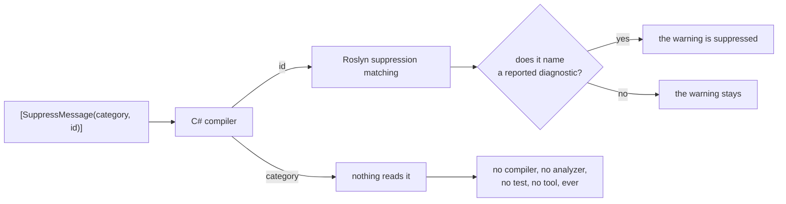
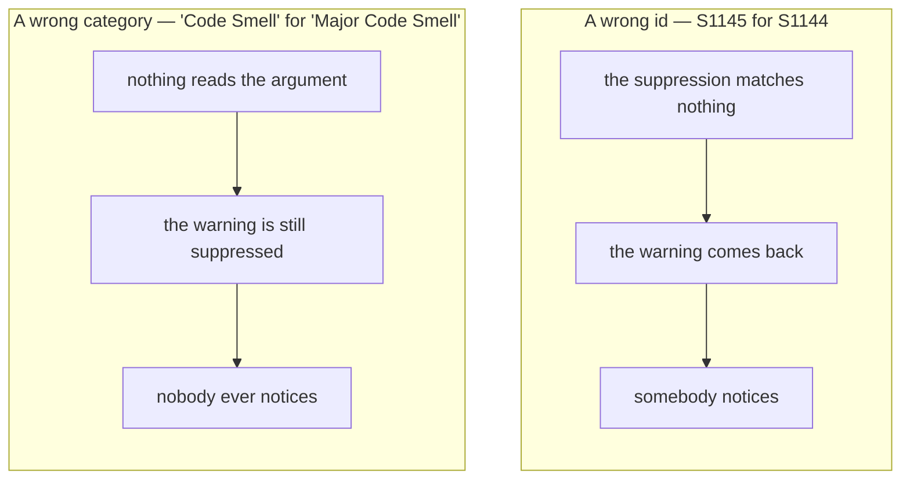

# Why magic strings fail

🌍 **Languages:**  
🇬🇧 English (this file) | 🇫🇷 [Français](./the-problem.fr.md)

For anyone who wants to know why this library exists before adopting it. No knowledge of Roslyn
required; everything asserted here is behaviour you can reproduce.

A suppression takes two strings:

```csharp
[SuppressMessage("Major Code Smell", "S1144", Justification = "Called by the serializer.")]
```

Both are magic strings. Neither is checked. They are usually described as the same problem, and they
are not: they fail in different ways, and the second way is the one worth the library.

## Where each argument actually goes

The compiler treats both as text. What happens after that is not symmetrical.



**Roslyn matches a suppression on the identifier alone.** The category argument is carried into
metadata — when it is carried at all — and read by nothing in the pipeline. That is not an oversight
to be worked around; it is the documented shape of `SuppressMessageAttribute`, and the specification
records how it was verified ([§3.2](../specification.en.md)).

## Two mistakes, two fates



**A wrong identifier is loud, eventually.** The suppression stops matching and the warning it was
hiding returns. That is a real defect — the code shipped with a suppression that never worked — but
it has a symptom, and a symptom is something a build, a review or a Sonar dashboard can surface.

Unless the code that raised the warning has since been deleted. Then the suppression is dead, it
matches nothing, nothing warns, and it stays in the file for as long as the file exists.

**A wrong category has no fate at all.** The line compiles. The warning is suppressed exactly as
intended, because the identifier was right. Nothing is wrong today. What is wrong is *the record*:
the file now claims a category the vendor does not use, and the first person to trust it — grepping
for every `"Major Code Smell"` suppression before an upgrade, say — gets an answer that is quietly
short.

There is no build that fails, no test that reddens, no analyzer that reports, and no runtime
behaviour that differs. A mistake with no symptom is not a small mistake. It is a mistake that
cannot be found.

## You would not guess the category

This is the part people are surprised by, and it is worth three examples:

| Rule | Its category | What people write |
| --- | --- | --- |
| `S1144` | `Major Code Smell` | `Code Smell`, `Maintainability` |
| `CA1822` | `Performance` | `Usage`, `Design` |
| `SA1000` | `StyleCop.CSharp.SpacingRules` | `Spacing`, `StyleCop`, `Readability` |

StyleCop's is the one that settles the argument. `SA1000` lives in
`StyleCop.CSharp.SpacingRules` — a namespace-shaped string nobody types from memory, that appears in
no error message a developer meets, and that has exactly one authoritative source: the
`DiagnosticDescriptor` the analyzer itself declares.

So the value is copied. From a blog post, from another file, from an IDE's *Suppress → In Source*,
or from whatever the last person wrote. Each of those is a snapshot, and a snapshot of a value that
nothing validates drifts without anyone finding out.

## Why the fix is a constant and not a check

An analyzer could compare the two strings against a list of known rules. This library ships one that
does, and it is deliberately the smaller half of the answer.

A check on a string can only judge strings it recognises. `[SuppressMessage("Usage", "S1144")]`
matches no rule any catalogue describes — so is it a wrong category, or a rule from an analyzer you
have not catalogued? Nothing can tell, and an analyzer that guessed would report a false positive
against every analyzer nobody has mirrored. So it stays quiet, which is right and is also not a
solution.

A **constant** does not have that problem, because there is nothing to recognise:

```csharp
[SuppressMessage(SonarRule.S1144.Category, SonarRule.S1144.Id)]
```

`SonarRule.S1144.Category` is either a member that exists or a compile error. There is no
in-between, no heuristic, and nothing to configure. The compiler was always able to check this —
what was missing was something to reference.

That is why the diagnostics in this library are described as getting you *to* the constants and
keeping you there, rather than as validating your strings. The validation is the C# compiler's, and
it has been there all along.

## What the constant buys, beyond the typo

Once the value is a reference rather than text:

* **Rename follows.** The IDE's rename reaches every use site, because they are use sites.
* **"Where is this rule suppressed?" has an answer.** *Find All References* on the constant, instead
  of a text search that also finds the id in comments, in `.editorconfig` and in a changelog.
* **Retirement warns instead of breaking.** A rule the vendor drops is kept in the catalogue and
  marked `[Obsolete]`, naming the release that dropped it. You get `CS0618`, which says what
  happened, rather than a build that still passes with a suppression that no longer means anything
  ([ADR-0010](../adr/0010-carry-a-retired-rule-forward-as-obsolete.en.md)).
* **The category has one source.** It is read from the analyzer's own `DiagnosticDescriptor`, never
  from documentation about it ([ADR-0009](../adr/0009-generate-catalog-content-from-analyzer-descriptors.en.md)).

## The honest limits

Two forms cannot be reached, ever, and no version of this library will change that:

| What you write | Why |
| --- | --- |
| `#pragma warning disable S1144` | The directive takes a bare identifier token, not an expression. There is no place a constant could go. |
| `dotnet_diagnostic.S1144.severity = none` | An `.editorconfig` key is plain text read outside the C# compilation model entirely. |

And one boundary that is a choice rather than a limit: none of this judges whether suppressing a
rule *there* was reasonable. That stays a human question, and `Justification` is where the answer
goes.

## Where to go next

* [**Core concepts**](concepts.en.md) — what a rule, a catalogue, a container and a category
  actually are, and which package carries which.
* [**Getting started**](getting-started.en.md) — if you skipped it, step 3 is this page in two
  builds.
* [**The specification**](../specification.en.md) — §3 records every claim made here about the
  platform, with how it was verified.

---

<div align="center">
<a href="./getting-started.en.md">← Getting started</a> · <a href="./README.en.md">↑ Table of contents</a> · <a href="./concepts.en.md">Core concepts →</a>
</div>
