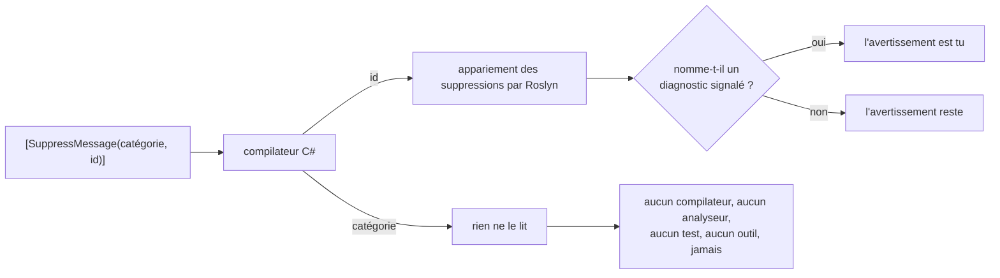
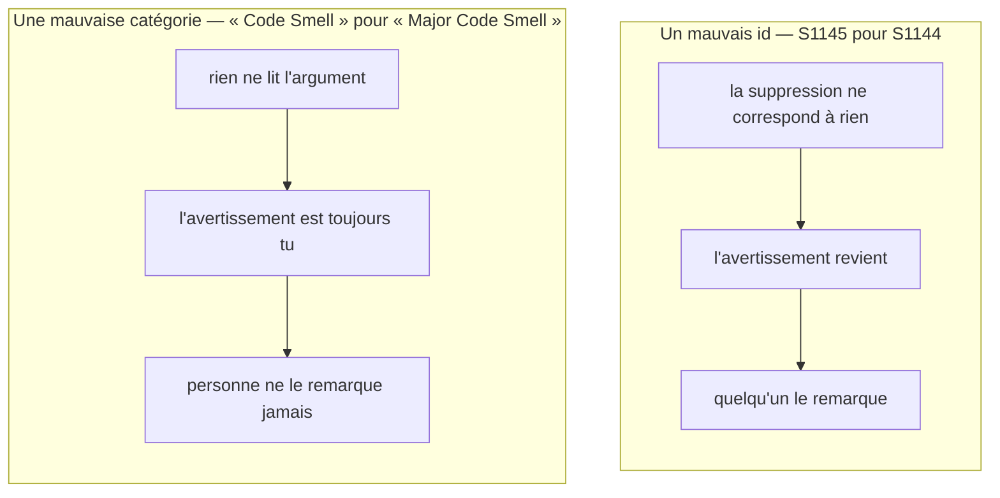

# Pourquoi les chaînes magiques échouent

🌍 **Langues :**  
🇬🇧 [English](./the-problem.en.md) | 🇫🇷 Français (ce fichier)

Pour quiconque veut savoir pourquoi cette bibliothèque existe avant de l'adopter. Aucune
connaissance de Roslyn n'est requise ; tout ce qui est affirmé ici est un comportement que vous
pouvez reproduire.

Une suppression prend deux chaînes :

```csharp
[SuppressMessage("Major Code Smell", "S1144", Justification = "Called by the serializer.")]
```

Les deux sont des chaînes magiques. Aucune n'est vérifiée. On les décrit d'ordinaire comme un seul
et même problème, et elles n'en sont pas un : elles échouent de façons différentes, et la seconde
façon est celle qui justifie la bibliothèque.

## Où va réellement chaque argument

Le compilateur traite les deux comme du texte. Ce qui se passe ensuite n'est pas symétrique.



**Roslyn apparie une suppression sur l'identifiant seul.** L'argument de catégorie est porté dans les
métadonnées — quand il l'est — et lu par rien du tout dans la chaîne. Ce n'est pas un oubli à
contourner : c'est la forme documentée de `SuppressMessageAttribute`, et la spécification consigne
comment cela a été vérifié ([§3.2](../specification.fr.md)).

## Deux erreurs, deux destins



**Un identifiant faux est bruyant, à terme.** La suppression cesse de correspondre et l'avertissement
qu'elle masquait revient. C'est un vrai défaut — le code est parti en production avec une suppression
qui n'a jamais fonctionné — mais il a un symptôme, et un symptôme, c'est quelque chose qu'un build,
une revue ou un tableau de bord Sonar peut faire remonter.

Sauf si le code qui levait l'avertissement a entre-temps été effacé. Alors la suppression est morte,
elle ne correspond à rien, rien n'avertit, et elle reste dans le fichier aussi longtemps que le
fichier existe.

**Une mauvaise catégorie n'a aucun destin.** La ligne compile. L'avertissement est tu exactement
comme prévu, puisque l'identifiant était bon. Rien n'est faux aujourd'hui. Ce qui est faux, c'est *le
registre* : le fichier prétend désormais une catégorie que l'éditeur n'emploie pas, et la première
personne à s'y fier — cherchant toutes les suppressions `"Major Code Smell"` avant une montée de
version, par exemple — obtient une réponse silencieusement incomplète.

Il n'y a aucun build qui échoue, aucun test qui rougit, aucun analyseur qui signale, et aucun
comportement à l'exécution qui diffère. Une erreur sans symptôme n'est pas une petite erreur. C'est
une erreur qu'on ne peut pas trouver.

## Vous ne devineriez pas la catégorie

C'est la partie qui surprend, et elle vaut trois exemples :

| Règle | Sa catégorie | Ce que les gens écrivent |
| --- | --- | --- |
| `S1144` | `Major Code Smell` | `Code Smell`, `Maintainability` |
| `CA1822` | `Performance` | `Usage`, `Design` |
| `SA1000` | `StyleCop.CSharp.SpacingRules` | `Spacing`, `StyleCop`, `Readability` |

Celle de StyleCop tranche le débat. `SA1000` vit dans `StyleCop.CSharp.SpacingRules` — une chaîne en
forme d'espace de noms que personne ne tape de mémoire, qui n'apparaît dans aucun message d'erreur
qu'un développeur rencontre, et qui a exactement une source faisant autorité : le
`DiagnosticDescriptor` que l'analyseur déclare lui-même.

Alors la valeur est copiée. D'un billet de blog, d'un autre fichier, du *Supprimer → Dans la source*
d'un IDE, ou de ce que la dernière personne a écrit. Chacun de ces gestes est un instantané, et
l'instantané d'une valeur que rien ne valide dérive sans que personne ne l'apprenne.

## Pourquoi la solution est une constante et pas une vérification

Un analyseur pourrait comparer les deux chaînes à une liste de règles connues. Cette bibliothèque en
livre un qui le fait, et c'est délibérément la plus petite moitié de la réponse.

Une vérification sur une chaîne ne peut juger que les chaînes qu'elle reconnaît.
`[SuppressMessage("Usage", "S1144")]` ne correspond à aucune règle décrite par un catalogue —
alors, mauvaise catégorie, ou règle d'un analyseur que vous n'avez pas catalogué ? Rien ne peut le
dire, et un analyseur qui devinerait signalerait un faux positif pour chaque analyseur que personne
n'a reflété. Il se tait donc, ce qui est correct et n'est pas non plus une solution.

Une **constante** n'a pas ce problème, parce qu'il n'y a rien à reconnaître :

```csharp
[SuppressMessage(SonarRule.S1144.Category, SonarRule.S1144.Id)]
```

`SonarRule.S1144.Category` est soit un membre qui existe, soit une erreur de compilation. Il n'y a
pas d'entre-deux, pas d'heuristique, et rien à configurer. Le compilateur a toujours su vérifier
cela — ce qui manquait, c'était quelque chose à référencer.

C'est pourquoi les diagnostics de cette bibliothèque sont décrits comme vous amenant *aux* constantes
et vous y maintenant, plutôt que comme validant vos chaînes. La validation est celle du compilateur
C#, et elle a toujours été là.

## Ce que la constante achète, au-delà de la faute de frappe

Une fois que la valeur est une référence et non du texte :

* **Le renommage suit.** Le renommage de l'IDE atteint chaque site d'utilisation, parce que ce sont
  des sites d'utilisation.
* **« Où cette règle est-elle supprimée ? » a une réponse.** *Rechercher toutes les références* sur
  la constante, au lieu d'une recherche textuelle qui trouve aussi l'identifiant dans les
  commentaires, dans `.editorconfig` et dans un changelog.
* **Le retrait avertit au lieu de casser.** Une règle que l'éditeur abandonne est conservée dans le
  catalogue et marquée `[Obsolete]`, en nommant la version qui l'a abandonnée. Vous obtenez
  `CS0618`, qui dit ce qui s'est passé, plutôt qu'un build qui passe encore avec une suppression qui
  ne signifie plus rien
  ([ADR-0010](../adr/0010-carry-a-retired-rule-forward-as-obsolete.md)).
* **La catégorie a une seule source.** Elle est lue dans le `DiagnosticDescriptor` de l'analyseur
  lui-même, jamais dans la documentation à son sujet
  ([ADR-0009](../adr/0009-generate-catalog-content-from-analyzer-descriptors.md)).

## Les limites, dites franchement

Deux formes sont hors d'atteinte, définitivement, et aucune version de cette bibliothèque n'y
changera rien :

| Ce que vous écrivez | Pourquoi |
| --- | --- |
| `#pragma warning disable S1144` | La directive prend un jeton identifiant nu, pas une expression. Il n'y a aucun endroit où une constante pourrait aller. |
| `dotnet_diagnostic.S1144.severity = none` | Une clé `.editorconfig` est du texte brut lu entièrement hors du modèle de compilation C#. |

Et une frontière qui est un choix plutôt qu'une limite : rien de tout ceci ne juge si supprimer une
règle *à cet endroit* était raisonnable. Cela reste une question humaine, et `Justification` est
l'endroit où va la réponse.

## Où aller ensuite

* [**Concepts**](concepts.fr.md) — ce que sont réellement une règle, un catalogue, un conteneur et
  une catégorie, et quel paquet porte quoi.
* [**Démarrer**](getting-started.fr.md) — si vous l'avez sauté, l'étape 3 est cette page en deux
  compilations.
* [**La spécification**](../specification.fr.md) — le §3 consigne chaque affirmation faite ici au
  sujet de la plateforme, avec la façon dont elle a été vérifiée.

---

<div align="center">
<a href="./getting-started.fr.md">← Démarrer</a> · <a href="./README.fr.md">↑ Table des matières</a> · <a href="./concepts.fr.md">Concepts →</a>
</div>
