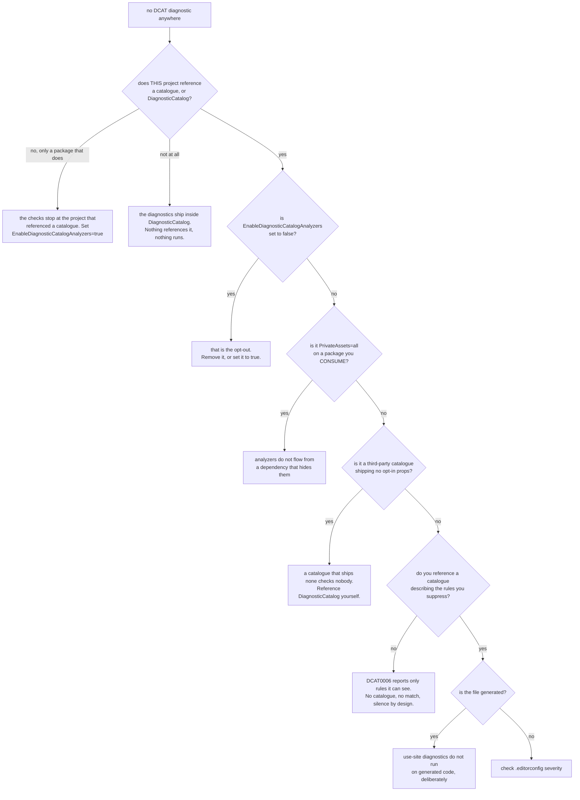

# Troubleshooting

🌍 **Languages:**  
🇬🇧 English (this file) | 🇫🇷 [Français](./troubleshooting.fr.md)

For anyone whose build is telling them something unexpected — or, more often, telling them nothing.
Symptoms first, cause second.

## Nothing is reported at all

The commonest report, and it has six causes with the same appearance.



**The analyzers are not a package you add.** Referencing `DiagnosticCatalog.Sonar` gives you
constants, and a misspelled rule is a compile error — that is the whole guarantee and it needs no
analyzer. What finds the suppressions you have *not* converted rides inside `DiagnosticCatalog`,
which every catalogue depends on and none may hide
([ADR-0037](../adr/0037-ship-the-analyzers-inside-the-foundation-package.en.md)), so a catalogue
reference is enough. Where neither is in the graph, no analyzer is loaded and nothing reports.

**The checks stop at the project that referenced a catalogue.** A project that reaches one only
through another package — a library that took a catalogue for its own suppressions — is deliberately
not analysed by it, because it chose neither
([ADR-0038](../adr/0038-stop-the-analyzers-at-the-project-that-references-a-catalogue.en.md)). This
is the answer when a solution has diagnostics in one project and silence in the next. Reference the
catalogue where you want the checks, or ask for them without a reference:

```xml
<PropertyGroup>
  <EnableDiagnosticCatalogAnalyzers>true</EnableDiagnosticCatalogAnalyzers>
</PropertyGroup>
```

**The same property is the opt-out**, so a `false` anywhere it reaches — a `Directory.Build.props`
two folders up included — is silence with no other symptom. Worth grepping for before anything else
on this list.

**A third-party catalogue may ship no opt-in at all.** A catalogue delivers the analyzers by packing
`build/<its own package id>.props`; one that does not is silent for its consumers, and looks exactly
like a codebase with nothing to report. Reference `DiagnosticCatalog` yourself to get the checks
back, and tell its author —
[Packaging a catalogue](packaging-a-catalogue.en.md#ship-the-opt-in-that-checks-your-consumers) is
the three lines they are missing.

**A dependency that hides the foundation hides the analyzers with it.** They arrive through
`DiagnosticCatalog`, so `PrivateAssets="all"` on a reference to it — or to a catalogue, one hop
further out — withholds both. On a catalogue that is a defect, because the same lever takes
`[DiagnosticRule]` away as well and
[`CS0246`](#cs0246-the-type-or-namespace-name-diagnosticrule-could-not-be-found) is what its
consumers get instead.

**`DCAT0006` is silent by design when it knows nothing.** It reports a literal pair only when a rule
the compilation can see matches it. A codebase with no catalogue stays completely quiet — which is
correct, and looks identical to a broken installation.

**Generated code is excluded on purpose**, for use-site diagnostics only. A suppression inside a
generated file is not the author's to fix. `DCAT0002`–`DCAT0004` do run there, because a generated
catalogue is exactly what they exist to check. [Configuration](configuration.en.md#generated-code)
has the table.

## My rule declaration is not recognised

You wrote `[DiagnosticRule]` and no `DCAT0002`/`0003`/`0004` appears, and neither does your rule in
anyone's `DCAT0006`.

| Check | Why |
| --- | --- |
| Is the attribute's full name `DiagnosticCatalog.DiagnosticRuleAttribute`? | Matching is by fully qualified metadata name. An attribute of the same short name in another namespace is not this one. |
| If you declared the marker yourself, is it in the `DiagnosticCatalog` namespace? | The dependency-free copy is supported — but only at that exact name. |
| Is the class `static` and non-generic? | A generic type has no constant members to offer. |
| Are `Id` and `Category` `const`, not `static readonly`? | This is the mistake people make first. |

The last one is worth expanding, because the code looks right:

```csharp
public static readonly string Id = "JD0007";   // has a value at run time…
                                               // …and cannot be an attribute argument
```

`static readonly` is initialised at run time. An attribute argument must be known at **compile** time.
That is a C# rule, and it is the reason the whole model is built on `const`.

## `CS0117: 'SonarRule' does not contain a definition for 'S1145'`

Working as intended. That is the library doing the one thing it exists to do — the reference does not
resolve, so the build stops, where a literal would have compiled and silently suppressed nothing.

Check the id against the vendor's, or run `dcat explain <catalogue.dll> S1145` to see whether the
catalogue knows it under a different spelling.

If the rule **used to exist**, see the next entry.

## `CS0618: 'SonarRule.S1144' is obsolete`

The vendor retired the rule, and the catalogue carried it forward rather than deleting it
([ADR-0010](../adr/0010-carry-a-retired-rule-forward-as-obsolete.en.md)).

The message names the release that dropped it. What to do:

* **the suppressed warning no longer exists** — delete the suppression;
* **it was replaced** — the obsolete message says by what, when the vendor said so;
* **you are not ready** — suppress `CS0618` at that site, and leave a note. You are choosing to keep a
  suppression that no longer matches anything, which is worth writing down.

The alternative — deleting the constant — would have given you `CS0117` naming nothing useful, on an
upgrade, with no clue that a rule had been retired at all.

## `CS0246: The type or namespace name 'DiagnosticRule' could not be found`

You are declaring rules of your own, and the foundation is not resolvable in your compilation.

Usually because a catalogue you reference hid it:

```xml
<!-- inside a catalogue package you consume -->
<PackageReference Include="DiagnosticCatalog" PrivateAssets="all" />
```

Add `DiagnosticCatalog` yourself, and — if it is your catalogue — stop hiding it. See
[packaging a catalogue](packaging-a-catalogue.en.md#reference-the-foundation-the-ordinary-way).

Hiding it costs more than the attribute: the `DCAT` analyzers ride in the same package, so that
catalogue's consumers are unchecked as well as unable to declare rules. One package, one lever.

## `DCAT0006` fires on hundreds of files at once

Expected, on the day you add a catalogue to an existing codebase — the reference brings the
analyzers with it. It reports every literal suppression a catalogue reference could replace, and
after you add the catalogue, all of them qualify.

Under `TreatWarningsAsErrors` that fails the build immediately. Lower it to `suggestion`, migrate,
then raise it — [adopting a catalogue](adopting-a-catalogue.en.md) is the whole procedure.

## `DCAT0006` appears but offers no fix

Two catalogues describe the same rule. Choosing between them is a decision about which package that
file depends on, and a lightbulb has no basis for it.

Reference one catalogue, or write the reference by hand.

## `DCAT0007` appears and offers no fix

The literal names a **different** rule from the reference beside it:

```csharp
[SuppressMessage(SonarRule.S1144.Category, "S9999")]
```

Completing it from `S1144` would silence a different rule than the one silenced today, and let the
original warning back in. That is a change of behaviour, not a migration
([ADR-0018](../adr/0018-a-code-fix-never-decides-what-only-the-author-can.en.md)).

Decide which rule you meant, and write it.

## `Category` and `Id` became ambiguous

```csharp
using static DiagnosticCatalog.Sonar.SonarRule.S1144;
using static DiagnosticCatalog.Sonar.SonarRule.S2094;   // now Category and Id are ambiguous
```

`using static` works for exactly one rule per file. Use an alias instead — it scales and is checked
identically:

```csharp
using Unused = DiagnosticCatalog.Sonar.SonarRule.S1144;
using Dead   = DiagnosticCatalog.Sonar.SonarRule.S2094;
```

## `dcat` says the project must already be built

It reads; it does not build. Run `dotnet build -c Release` first — the message names the path it
looked at and the command that would produce it.

This is what keeps `dcat validate --project` safe against a working copy: it restores nothing, writes
no `obj/`, and touches no output.

## `dcat` says a `.deps.json` names no Roslyn

```text
MyLib.deps.json names no Roslyn — reading through this tool's
```

Not an error. Handing a dependency graph to the descriptor worker **replaces** its own rather than
extending it, so a graph that names no Roslyn would leave the worker with none at all. A
`netstandard2.0` library's `.deps.json` is exactly that, and `dcat` says so rather than reading it.

Your analyzer is read through the tool's Roslyn instead. That is only a problem if it was compiled
against a newer one and uses APIs the tool's does not have.

## `dcat validate` exits `1` and I expected `2`

Different failures, deliberately distinct:

* **`2`** — the catalogue no longer matches its source. A drifted contract.
* **`1`** — it could not be checked: the source would not resolve. A feed outage, an expired
  credential, a rate limit.

A pipeline that treats them alike either retries a real drift or opens a pull request for a network
blip. [Keeping a catalogue current](ci-integration.en.md#reading-the-exit-codes) has the shape.

## A suppression compiles but the warning is still there

Check whether `Scope` and `Target` are involved. This library checks that a suppression names one real
rule, **coherently** — it has no opinion on whether the attribute is placed or scoped correctly, and
never will.

Also check the id itself: Roslyn matches on the **identifier alone** and never on the category, so a
suppression whose category is wrong still suppresses, and one whose id is wrong never does.

## Where to go next

* [**The `DCAT` diagnostics**](diagnostics.en.md) — every id, and what triggers it.
* [**The rule contract**](rule-contract.en.md) — the exact shape a declaration must have.
* [**FAQ**](faq.en.md) — the questions that are not symptoms.

---

<div align="center">
<a href="./rule-contract.en.md">← The rule contract</a> · <a href="./README.en.md">↑ Table of contents</a> · <a href="./faq.en.md">FAQ →</a>
</div>
