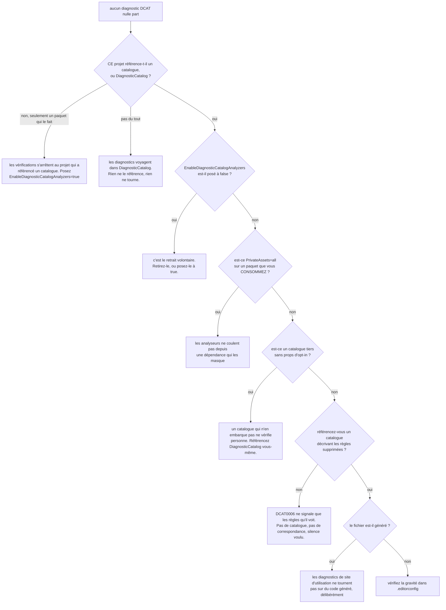

# Dépannage

🌍 **Langues :**  
🇬🇧 [English](./troubleshooting.en.md) | 🇫🇷 Français (ce fichier)

Pour quiconque a un build qui dit quelque chose d'inattendu — ou, plus souvent, qui ne dit rien. Les
symptômes d'abord, la cause ensuite.

## Rien n'est signalé du tout

Le signalement le plus fréquent, et il a six causes de même apparence.



**Les analyseurs ne sont pas un paquet à ajouter.** Référencer `DiagnosticCatalog.Sonar` vous donne
des constantes, et une règle mal orthographiée est une erreur de compilation — c'est toute la
garantie et elle n'a besoin d'aucun analyseur. Ce qui trouve les suppressions que vous n'avez *pas*
converties voyage dans `DiagnosticCatalog`, dont chaque catalogue dépend et qu'aucun n'a le droit de
masquer ([ADR-0037](../adr/0037-ship-the-analyzers-inside-the-foundation-package.fr.md)) : une
référence de catalogue suffit donc. Là où ni l'un ni l'autre n'est dans le graphe, aucun analyseur
n'est chargé et rien ne signale.

**Les vérifications s'arrêtent au projet qui a référencé un catalogue.** Un projet qui n'en atteint
un qu'à travers un autre paquet — une bibliothèque ayant pris un catalogue pour ses propres
suppressions — n'est délibérément pas analysé par lui, puisqu'il n'a choisi ni l'un ni l'autre
([ADR-0038](../adr/0038-stop-the-analyzers-at-the-project-that-references-a-catalogue.fr.md)). C'est
la réponse quand une solution a des diagnostics dans un projet et le silence dans le suivant.
Référencez le catalogue là où vous voulez les vérifications, ou réclamez-les sans référence :

```xml
<PropertyGroup>
  <EnableDiagnosticCatalogAnalyzers>true</EnableDiagnosticCatalogAnalyzers>
</PropertyGroup>
```

**La même propriété est le retrait volontaire** : un `false` posé n'importe où sur son chemin — y
compris dans un `Directory.Build.props` deux dossiers plus haut — produit un silence sans autre
symptôme. Cela vaut la peine de le chercher avant tout le reste de cette liste.

**Un catalogue tiers peut n'embarquer aucun opt-in.** Un catalogue livre les analyseurs en
embarquant `build/<son propre identifiant de paquet>.props` ; celui qui ne le fait pas est muet pour
ses consommateurs, et ressemble en tout point à une base de code sans rien à signaler. Référencez
`DiagnosticCatalog` vous-même pour récupérer les vérifications, et signalez-le à son auteur —
[Empaqueter un catalogue](packaging-a-catalogue.fr.md#embarquez-lopt-in-qui-fait-vérifier-vos-consommateurs)
donne les trois lignes qui lui manquent.

**Une dépendance qui masque la fondation masque les analyseurs avec elle.** Ils arrivent par
`DiagnosticCatalog` : `PrivateAssets="all"` sur une référence vers lui — ou vers un catalogue, un
saut plus loin — retient donc les deux. Sur un catalogue c'est un défaut, car le même levier retire
aussi `[DiagnosticRule]` et
[`CS0246`](#cs0246-the-type-or-namespace-name-diagnosticrule-could-not-be-found) est ce que ses
consommateurs obtiennent à la place.

**`DCAT0006` est muet par conception quand il ne sait rien.** Il ne signale une paire littérale que
lorsqu'une règle visible par la compilation lui correspond. Une base de code sans catalogue reste
complètement silencieuse — ce qui est correct, et ressemble en tout point à une installation cassée.

**Le code généré est exclu exprès**, pour les diagnostics de site d'utilisation seulement. Une
suppression dans un fichier généré n'est pas à l'auteur de la corriger. `DCAT0002`–`DCAT0004` y
tournent, eux, parce qu'un catalogue généré est précisément ce qu'ils existent pour vérifier.
[Configuration](configuration.fr.md#code-généré) en donne le tableau.

## Ma déclaration de règle n'est pas reconnue

Vous avez écrit `[DiagnosticRule]` et aucun `DCAT0002`/`0003`/`0004` n'apparaît, et votre règle
n'apparaît dans le `DCAT0006` de personne.

| À vérifier | Pourquoi |
| --- | --- |
| Le nom complet de l'attribut est-il `DiagnosticCatalog.DiagnosticRuleAttribute` ? | L'appariement se fait par nom de métadonnée pleinement qualifié. Un attribut du même nom court dans un autre espace de noms n'est pas celui-ci. |
| Si vous avez déclaré le marqueur vous-même, est-il dans l'espace de noms `DiagnosticCatalog` ? | La copie sans dépendance est supportée — mais à ce nom exact seulement. |
| La classe est-elle `static` et non générique ? | Un type générique n'a aucun membre constant à offrir. |
| `Id` et `Category` sont-ils `const`, et non `static readonly` ? | C'est l'erreur que l'on commet en premier. |

La dernière mérite un développement, parce que le code a l'air juste :

```csharp
public static readonly string Id = "JD0007";   // a une valeur à l'exécution…
                                               // …et ne peut pas être un argument d'attribut
```

`static readonly` est initialisé à l'exécution. Un argument d'attribut doit être connu à la
**compilation**. C'est une règle de C#, et c'est la raison pour laquelle tout le modèle est bâti sur
`const`.

## `CS0117: 'SonarRule' does not contain a definition for 'S1145'`

Fonctionnement nominal. C'est la bibliothèque faisant la seule chose pour laquelle elle existe — la
référence ne résout pas, donc le build s'arrête, là où un littéral aurait compilé en ne supprimant
silencieusement rien.

Vérifiez l'identifiant contre celui de l'éditeur, ou lancez `dcat explain <catalogue.dll> S1145` pour
voir si le catalogue le connaît sous une autre orthographe.

Si la règle **existait auparavant**, voyez l'entrée suivante.

## `CS0618: 'SonarRule.S1144' is obsolete`

L'éditeur a retiré la règle, et le catalogue l'a reportée plutôt que supprimée
([ADR-0010](../adr/0010-carry-a-retired-rule-forward-as-obsolete.fr.md)).

Le message nomme la version qui l'a abandonnée. Que faire :

* **l'avertissement supprimé n'existe plus** — effacez la suppression ;
* **elle a été remplacée** — le message d'obsolescence dit par quoi, quand l'éditeur l'a dit ;
* **vous n'êtes pas prêt** — supprimez `CS0618` à cet endroit, et laissez une note. Vous choisissez de
  garder une suppression qui ne correspond plus à rien, ce qui mérite d'être écrit.

L'alternative — supprimer la constante — vous aurait donné un `CS0117` ne nommant rien d'utile, lors
d'une montée de version, sans le moindre indice qu'une règle avait été retirée.

## `CS0246: The type or namespace name 'DiagnosticRule' could not be found`

Vous déclarez vos propres règles, et la fondation n'est pas résoluble dans votre compilation.

Généralement parce qu'un catalogue que vous référencez l'a masquée :

```xml
<!-- dans un paquet catalogue que vous consommez -->
<PackageReference Include="DiagnosticCatalog" PrivateAssets="all" />
```

Ajoutez `DiagnosticCatalog` vous-même, et — si c'est votre catalogue — cessez de la masquer. Voyez
[empaqueter un catalogue](packaging-a-catalogue.fr.md#référencez-la-fondation-de-la-façon-ordinaire).

La masquer coûte plus que l'attribut : les analyseurs `DCAT` voyagent dans le même paquet, si bien
que les consommateurs de ce catalogue sont non vérifiés en plus d'être incapables de déclarer des
règles. Un seul paquet, un seul levier.

## `DCAT0006` se déclenche sur des centaines de fichiers d'un coup

Attendu, le jour où vous ajoutez un catalogue à une base existante — la référence amène les
analyseurs avec elle. Il signale chaque suppression littérale qu'une référence de catalogue pourrait
remplacer, et après l'ajout du catalogue, toutes remplissent la condition.

Sous `TreatWarningsAsErrors`, cela casse le build immédiatement. Descendez-le à `suggestion`, migrez,
puis remontez-le — [adopter un catalogue](adopting-a-catalogue.fr.md) donne toute la procédure.

## `DCAT0014` se déclenche sur des centaines de fichiers d'un coup

Attendu aussi, sur ce même premier build, et pour une raison plus large que `DCAT0006` : il demande à
toute suppression pourquoi elle existe, littérale comprise, et n'attend donc pas qu'un catalogue
reconnaisse la règle. Une base de code qui n'a jamais écrit de justifications les rencontre toutes
d'un coup.

C'est un **avertissement**, le build reste donc vert là où `DCAT0006` l'aurait fait tomber.
Abaissez-le à `suggestion` le temps de traiter l'arriéré, et écrivez les raisons au fil de la
conversion — vous éditez déjà chaque suppression pour migrer sa paire, et la personne qui a supprimé
est souvent encore joignable, ce qui ne sera plus vrai dans six mois.

```ini
dotnet_diagnostic.DCAT0014.severity = suggestion
```

Si vous faites déjà tourner `SA1404` de StyleCop, vous verrez les deux : elles posent la même
question, et une ligne d'`.editorconfig` fait taire celle dont vous ne voulez pas.

## `DCAT0006` apparaît mais ne propose aucun correctif

Deux catalogues décrivent la même règle. Choisir entre eux est une décision sur le paquet dont ce
fichier dépend, et une ampoule n'a aucune base pour la prendre.

Référencez un seul catalogue, ou écrivez la référence à la main.

## `DCAT0007` apparaît et ne propose aucun correctif

Le littéral nomme une règle **différente** de la référence à côté :

```csharp
[SuppressMessage(SonarRule.S1144.Category, "S9999", Justification = "…")]
```

Le compléter depuis `S1144` ferait taire une règle différente de celle qui est tue aujourd'hui, et
laisserait revenir l'avertissement d'origine. C'est un changement de comportement, pas une migration
([ADR-0018](../adr/0018-a-code-fix-never-decides-what-only-the-author-can.fr.md)).

Décidez de la règle que vous vouliez, et écrivez-la.

## `Category` et `Id` sont devenus ambigus

```csharp
using static DiagnosticCatalog.Sonar.SonarRule.S1144;
using static DiagnosticCatalog.Sonar.SonarRule.S2094;   // Category et Id sont maintenant ambigus
```

`using static` marche pour exactement une règle par fichier. Utilisez un alias : il passe à l'échelle
et est vérifié à l'identique.

```csharp
using Unused = DiagnosticCatalog.Sonar.SonarRule.S1144;
using Dead   = DiagnosticCatalog.Sonar.SonarRule.S2094;
```

## `dcat` dit que le projet doit déjà être construit

Il lit ; il ne construit pas. Lancez `dotnet build -c Release` d'abord — le message nomme le chemin
qu'il a regardé et la commande qui le produirait.

C'est ce qui garde `dcat validate --project` sûr sur une copie de travail : il ne restaure rien,
n'écrit aucun `obj/`, et ne touche à aucune sortie.

## `dcat` dit qu'un `.deps.json` ne nomme aucun Roslyn

```text
MyLib.deps.json names no Roslyn — reading through this tool's
```

Ce n'est pas une erreur. Fournir un graphe de dépendances au worker de descripteurs **remplace** le
sien au lieu de l'étendre : un graphe qui ne nomme aucun Roslyn laisserait donc le worker sans aucun.
Le `.deps.json` d'une bibliothèque `netstandard2.0` est exactement cela, et `dcat` le dit plutôt que
de le lire.

Votre analyseur est lu via le Roslyn de l'outil à la place. Ce n'est un problème que s'il a été
compilé contre un plus récent et emploie des API que celui de l'outil n'a pas.

## `dcat validate` sort en `1` et j'attendais `2`

Deux échecs différents, délibérément distincts :

* **`2`** — le catalogue ne correspond plus à sa source. Un contrat qui a dérivé.
* **`1`** — il n'a pas pu être vérifié : la source n'a pas résolu. Panne de flux, identifiant expiré,
  limite de débit.

Un pipeline qui les traite pareil relance une vraie dérive ou ouvre une pull request pour un incident
réseau. [Tenir un catalogue à jour](ci-integration.fr.md#lire-les-codes-de-sortie) en donne la forme.

## Une suppression compile mais l'avertissement est toujours là

Regardez si `Scope` et `Target` sont en jeu. Cette bibliothèque vérifie qu'une suppression nomme une
vraie règle, **de façon cohérente** — elle n'a aucune opinion sur le fait que l'attribut soit placé ou
cantonné correctement, et n'en aura jamais.

Vérifiez aussi l'identifiant lui-même : Roslyn apparie sur **l'identifiant seul** et jamais sur la
catégorie, si bien qu'une suppression à la mauvaise catégorie supprime quand même, et qu'une
suppression au mauvais identifiant ne supprime jamais.

## Où aller ensuite

* [**Les diagnostics `DCAT`**](diagnostics.fr.md) — chaque identifiant, et ce qui le déclenche.
* [**Le contrat de règle**](rule-contract.fr.md) — la forme exacte qu'une déclaration doit avoir.
* [**FAQ**](faq.fr.md) — les questions qui ne sont pas des symptômes.

---

<div align="center">
<a href="./rule-contract.fr.md">← Le contrat de règle</a> · <a href="./README.fr.md">↑ Table des matières</a> · <a href="./faq.fr.md">FAQ →</a>
</div>
