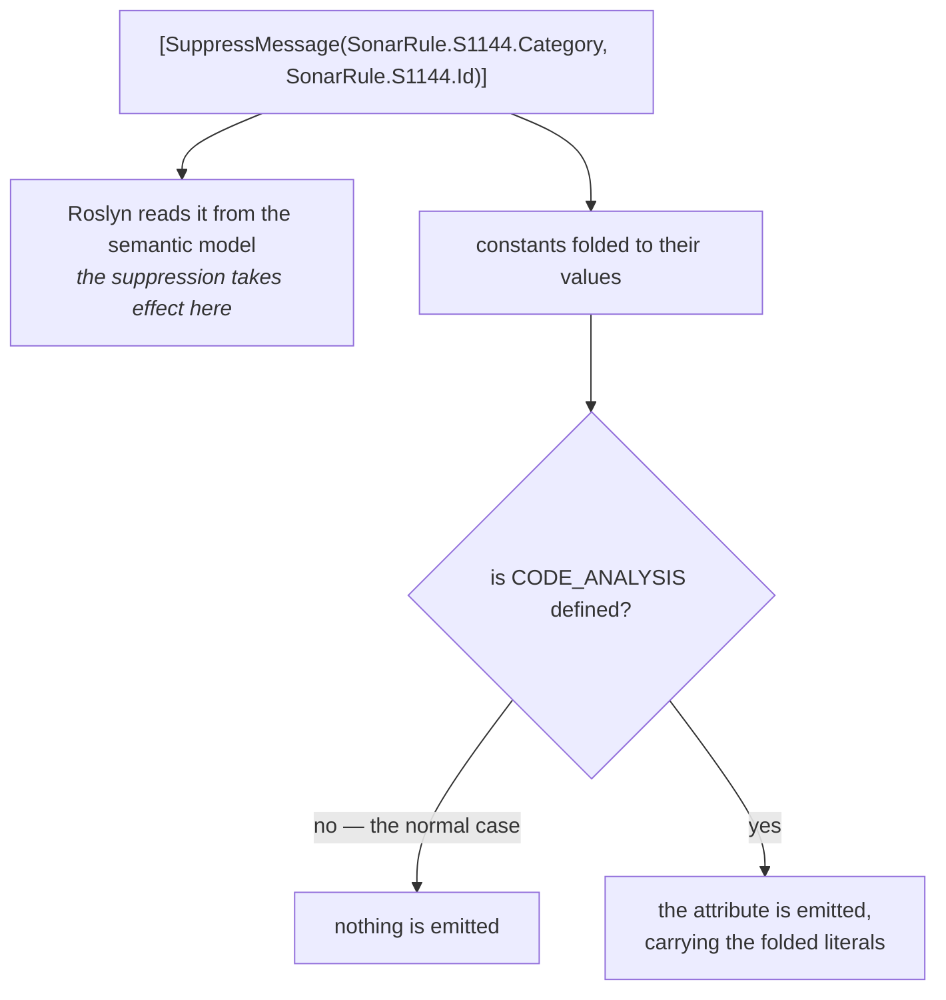

# The zero-footprint guarantee

🌍 **Languages:**  
🇬🇧 English (this file) | 🇫🇷 [Français](./zero-footprint.fr.md)

For anyone who has to answer "what does this add to the binary we ship?" — to a security review, to
an architect, or to themselves. The answer is nothing, and this page is why, plus what is actually
asserted rather than claimed.

## The claim

Converting a suppression to catalogue constants changes **nothing** in the assembly you ship. No
attribute, no retained string, no assembly reference, no type loaded at start-up, no code that runs.

```csharp
// This
[SuppressMessage("Major Code Smell", "S1144", Justification = "Called by the serializer.")]

// and this
[SuppressMessage(SonarRule.S1144.Category, SonarRule.S1144.Id, Justification = "Called by the serializer.")]

// compile to the same thing: nothing at all.
```

That is stronger than "cheap". It is not a small runtime cost — there is no runtime involvement of
any kind.

## Why: the attribute is conditional

`SuppressMessageAttribute` is declared by the platform as:

```csharp
[Conditional("CODE_ANALYSIS")]
public sealed class SuppressMessageAttribute : Attribute
```

`[Conditional]` on an attribute class means the compiler **omits the application entirely** unless
the symbol is defined. Almost no project defines `CODE_ANALYSIS`, so almost no assembly in the .NET
ecosystem carries a `SuppressMessageAttribute` at all — including yours today, before any of this.

Roslyn still reads the suppression: it comes from the *syntax and semantic model* during compilation,
not from emitted metadata. The analyzer sees it, applies it, and then the compiler declines to write
it down.

## Why: constants fold before that

A `const` is not a field read at run time. The compiler substitutes its value at every use site, so
`SonarRule.S1144.Category` becomes the literal `"Major Code Smell"` in the syntax the emitter sees —
and then the emitter drops the whole attribute anyway.



Two consequences follow, and the second is the one people miss:

* **The catalogue is a compile-time dependency.** Nothing from it survives into IL, so there is
  nothing to load, and the C# compiler does not emit an assembly reference that the output does not
  use.
* **The rule type stays perfectly usable.** It was not removed — it was simply never referenced by
  anything that survived. Reflect over it, read `SonarRule.S1144.Id` at run time, and it answers.
  Nothing is stripped from the catalogue itself.

## The one exception, and it is deliberate

`UnconditionalSuppressMessageAttribute` carries **no** `[Conditional]`, precisely so that ILLink — the
trimmer — can read it out of your compiled assembly long after the compiler has finished:

```csharp
[UnconditionalSuppressMessage(TrimRule.IL2026.Category, TrimRule.IL2026.Id, Justification = "...")]
```

Here the attribute *is* emitted, with the catalogue's values folded in as plain strings. That is what
the trimmer matches on, and it is what the trimmer wanted anyway — it has no access to your
catalogue, only to the metadata.

This is also why `DCAT0009` exists. The trimmer's decoder accepts only identifiers shaped like
`IL####` and **discards everything else outright**, so an `UnconditionalSuppressMessage` naming a
Sonar or StyleCop rule is a no-op that nothing else in the toolchain reports.

## What is asserted, exactly

The repository does not ask you to take the above on trust. `tests/DiagnosticCatalog.ZeroFootprint.UnitTests`
compiles a subject **without** defining `CODE_ANALYSIS` — the way your build does — and asserts four
things by reflection:

| Assertion | What it establishes |
| --- | --- |
| The subject carries a marker attribute of the test's own | **The control.** Every other assertion here is about something being absent, and absence proves nothing until the member is known to have reached metadata with attributes at all. |
| `GetCustomAttribute<SuppressMessageAttribute>()` returns `null` | The suppression left no trace: no attribute, no retained string, no reference to the rule type. |
| The rule type's constants still read back | The catalogue is a compile-time construct, not a runtime one. Folding removed the *use*, not the *declaration*. |
| `UnconditionalSuppressMessage` **is** present, carrying the folded literals | The exception above, on the same member, so the difference is per-attribute rather than per-library. |

The control test is the part worth pointing at. A negative test without one passes forever after the
day the subject stops being compiled at all — the characteristic way this kind of assertion rots.

Two honest boundaries on what that proves:

* The rules in that test are declared **in the test assembly itself**, so it establishes the
  fold-and-omit behaviour rather than the cross-assembly reference case. The absent assembly
  reference is a documented property of the C# compiler — it does not emit references the output does
  not use — rather than something this suite asserts.
* It runs on `net10.0` and, through the .NET Framework floor, on the real .NET Framework 4.7.2 CLR
  ([ADR-0001](../adr/0001-floor-the-libraries-on-net-framework-4-7-2.en.md)). The
  `UnconditionalSuppressMessage` half is `net`-only, because that attribute does not exist on .NET
  Framework.

## What this does not mean

Precision matters here, because "zero footprint" is easy to over-read.

* **The package is still restored and still downloaded.** It is a `PackageReference` like any other
  at build time. What costs nothing is the *shipped assembly*, not your `obj/` folder or your restore.
* **A catalogue is not free to publish.** If you *are* the catalogue, your assembly is real: it holds
  the constants and their XML documentation, and consumers download it. This page is about what
  reaches a consumer's **output**.
* **The analyzers do cost build time.** Not much, and only where there is something to find — the rule
  index is built lazily, so a project whose suppressions are already references never pays for the
  metadata sweep ([configuration](configuration.en.md#what-it-costs-to-have-the-analyzers-on)).

## Why this is worth a page

Because it removes the objection that usually kills adoption in the room where it matters. "We are
not adding a dependency to the production binary for a code-style convenience" is a reasonable
position, and it does not apply here — not because the cost is small, but because there is no
mechanism by which a cost could exist.

Trimming, AOT, single-file publishing, a security review that inventories every assembly in the
output: none of them see the catalogue, because it is not there.

## Where to go next

* [**Publishing a catalogue**](authoring-a-catalogue.en.md) — the other side: what your own catalogue
  has to carry, and the one member that would force a Roslyn dependency on every consumer.
* [**Configuration**](configuration.en.md) — what the analyzers cost during a build, and how to scope
  them.
* [**The specification**](../specification.en.md) — §3.4 records the platform behaviour this rests
  on, with how it was verified.

---

<div align="center">
<a href="./configuration.en.md">← Configuration</a> · <a href="./README.en.md">↑ Table of contents</a> · <a href="./when-not-to-use.en.md">When not to use this →</a>
</div>
