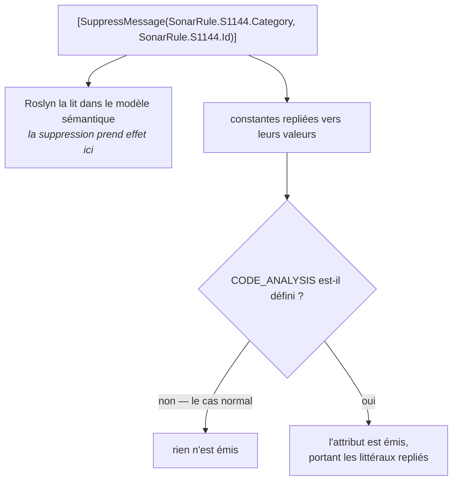

# La garantie d'empreinte nulle

🌍 **Langues :**  
🇬🇧 [English](./zero-footprint.en.md) | 🇫🇷 Français (ce fichier)

Pour quiconque doit répondre à « qu'est-ce que ça ajoute au binaire qu'on livre ? » — à une revue de
sécurité, à un architecte, ou à soi-même. La réponse est rien, et cette page dit pourquoi, plus ce
qui est réellement asserté et non simplement affirmé.

## L'affirmation

Convertir une suppression en constantes de catalogue ne change **rien** dans l'assemblage que vous
livrez. Pas d'attribut, pas de chaîne conservée, pas de référence d'assemblage, aucun type chargé au
démarrage, aucun code qui s'exécute.

```csharp
// Ceci
[SuppressMessage("Major Code Smell", "S1144", Justification = "Called by the serializer.")]

// et ceci
[SuppressMessage(SonarRule.S1144.Category, SonarRule.S1144.Id, Justification = "Called by the serializer.")]

// compilent vers la même chose : rien du tout.
```

C'est plus fort que « peu coûteux ». Ce n'est pas un petit coût à l'exécution — il n'y a aucune
implication de l'exécution, d'aucune sorte.

## Pourquoi : l'attribut est conditionnel

`SuppressMessageAttribute` est déclaré par la plateforme ainsi :

```csharp
[Conditional("CODE_ANALYSIS")]
public sealed class SuppressMessageAttribute : Attribute
```

`[Conditional]` sur une classe d'attribut signifie que le compilateur **omet entièrement
l'application** à moins que le symbole ne soit défini. Presque aucun projet ne définit
`CODE_ANALYSIS` : presque aucun assemblage de l'écosystème .NET ne porte donc de
`SuppressMessageAttribute` — y compris le vôtre aujourd'hui, avant tout ceci.

Roslyn lit quand même la suppression : elle vient du *modèle syntaxique et sémantique* pendant la
compilation, pas de métadonnées émises. L'analyseur la voit, l'applique, puis le compilateur refuse
de l'écrire.

## Pourquoi : les constantes se replient avant cela

Une `const` n'est pas un champ lu à l'exécution. Le compilateur substitue sa valeur à chaque site
d'utilisation : `SonarRule.S1144.Category` devient donc le littéral `"Major Code Smell"` dans la
syntaxe que l'émetteur voit — et l'émetteur abandonne ensuite l'attribut entier de toute façon.



Deux conséquences en découlent, et c'est la seconde qu'on rate :

* **Le catalogue est une dépendance de compilation.** Rien de lui ne survit dans l'IL : il n'y a donc
  rien à charger, et le compilateur C# n'émet pas une référence d'assemblage que la sortie n'utilise
  pas.
* **Le type de la règle reste parfaitement utilisable.** Il n'a pas été retiré — il n'a simplement
  jamais été référencé par quoi que ce soit qui ait survécu. Réfléchissez dessus, lisez
  `SonarRule.S1144.Id` à l'exécution, il répond. Rien n'est rogné du catalogue lui-même.

## L'unique exception, et elle est délibérée

`UnconditionalSuppressMessageAttribute` ne porte **aucun** `[Conditional]`, précisément pour
qu'ILLink — le *trimmer* — puisse le lire dans votre assemblage compilé bien après que le compilateur
a fini :

```csharp
[UnconditionalSuppressMessage(TrimRule.IL2026.Category, TrimRule.IL2026.Id, Justification = "...")]
```

Ici l'attribut *est* émis, avec les valeurs du catalogue repliées dedans comme de simples chaînes.
C'est là-dessus que le *trimmer* apparie, et c'est ce qu'il voulait de toute façon — il n'a aucun
accès à votre catalogue, seulement aux métadonnées.

C'est aussi la raison d'être de `DCAT0009`. Le décodeur du *trimmer* n'accepte que les identifiants
de la forme `IL####` et **jette purement et simplement tout le reste** : un
`UnconditionalSuppressMessage` nommant une règle Sonar ou StyleCop est donc un no-op que rien d'autre
dans la chaîne d'outils ne signale.

## Ce qui est asserté, exactement

Le dépôt ne vous demande pas de croire ce qui précède sur parole.
`tests/DiagnosticCatalog.ZeroFootprint.UnitTests` compile un sujet **sans** définir `CODE_ANALYSIS` —
comme le fait votre build — et asserte quatre choses par réflexion :

| Assertion | Ce qu'elle établit |
| --- | --- |
| Le sujet porte un attribut marqueur propre au test | **Le contrôle.** Toutes les autres assertions ici portent sur une absence, et une absence ne prouve rien tant qu'on ne sait pas que le membre a atteint les métadonnées avec des attributs. |
| `GetCustomAttribute<SuppressMessageAttribute>()` renvoie `null` | La suppression n'a laissé aucune trace : pas d'attribut, pas de chaîne conservée, pas de référence au type de la règle. |
| Les constantes du type de la règle se relisent | Le catalogue est une construction de compilation, pas d'exécution. Le repliement a retiré l'*usage*, pas la *déclaration*. |
| `UnconditionalSuppressMessage` **est** présent, portant les littéraux repliés | L'exception ci-dessus, sur le même membre, pour que la différence soit par attribut et non par bibliothèque. |

Le test de contrôle est la partie à montrer du doigt. Un test négatif sans contrôle passe pour
toujours dès le jour où le sujet cesse d'être compilé du tout — la façon caractéristique dont ce
genre d'assertion pourrit.

Deux frontières honnêtes sur ce que cela prouve :

* Les règles de ce test sont déclarées **dans l'assemblage de test lui-même** : il établit donc le
  comportement replier-puis-omettre, et non le cas de la référence entre assemblages. La référence
  d'assemblage absente est une propriété documentée du compilateur C# — il n'émet pas de références
  que la sortie n'utilise pas — plutôt que quelque chose que cette suite asserte.
* Il tourne sur `net10.0` et, via le plancher .NET Framework, sur le vrai CLR .NET Framework 4.7.2
  ([ADR-0001](../adr/0001-floor-the-libraries-on-net-framework-4-7-2.fr.md)). La moitié
  `UnconditionalSuppressMessage` est réservée à `net`, parce que cet attribut n'existe pas sur .NET
  Framework.

## Ce que cela ne veut pas dire

La précision compte ici, parce que « empreinte nulle » se sur-interprète facilement.

* **Le paquet est quand même restauré et quand même téléchargé.** C'est une `PackageReference` comme
  une autre à la compilation. Ce qui ne coûte rien, c'est l'*assemblage livré*, pas votre dossier
  `obj/` ni votre restauration.
* **Publier un catalogue n'est pas gratuit.** Si vous *êtes* le catalogue, votre assemblage est bien
  réel : il porte les constantes et leur documentation XML, et les consommateurs le téléchargent.
  Cette page parle de ce qui atteint la **sortie** d'un consommateur.
* **Les analyseurs coûtent du temps de build.** Pas beaucoup, et seulement là où il y a quelque chose
  à trouver — l'index des règles est construit paresseusement, si bien qu'un projet dont les
  suppressions sont déjà des références ne paie jamais le balayage des métadonnées
  ([configuration](configuration.fr.md#ce-que-coûte-le-fait-davoir-les-analyseurs-activés)).

## Pourquoi cela mérite une page

Parce que cela lève l'objection qui d'ordinaire tue l'adoption dans la pièce où cela se décide. « On
n'ajoute pas une dépendance au binaire de production pour une commodité de style » est une position
raisonnable, et elle ne s'applique pas ici — non parce que le coût est faible, mais parce qu'il
n'existe aucun mécanisme par lequel un coût pourrait exister.

Le *trimming*, l'AOT, la publication en fichier unique, une revue de sécurité qui inventorie chaque
assemblage de la sortie : aucun ne voit le catalogue, parce qu'il n'y est pas.

## Où aller ensuite

* [**Publier un catalogue**](authoring-a-catalogue.fr.md) — l'autre côté : ce que votre propre
  catalogue doit porter, et le seul membre qui imposerait une dépendance Roslyn à tous vos
  consommateurs.
* [**Configuration**](configuration.fr.md) — ce que les analyseurs coûtent pendant un build, et
  comment les cantonner.
* [**La spécification**](../specification.fr.md) — le §3.4 consigne le comportement de la plateforme
  sur lequel ceci repose, avec la façon dont il a été vérifié.

---

<div align="center">
<a href="./configuration.fr.md">← Configuration</a> · <a href="./README.fr.md">↑ Table des matières</a> · <a href="./authoring-a-catalogue.fr.md">Publier un catalogue →</a>
</div>
